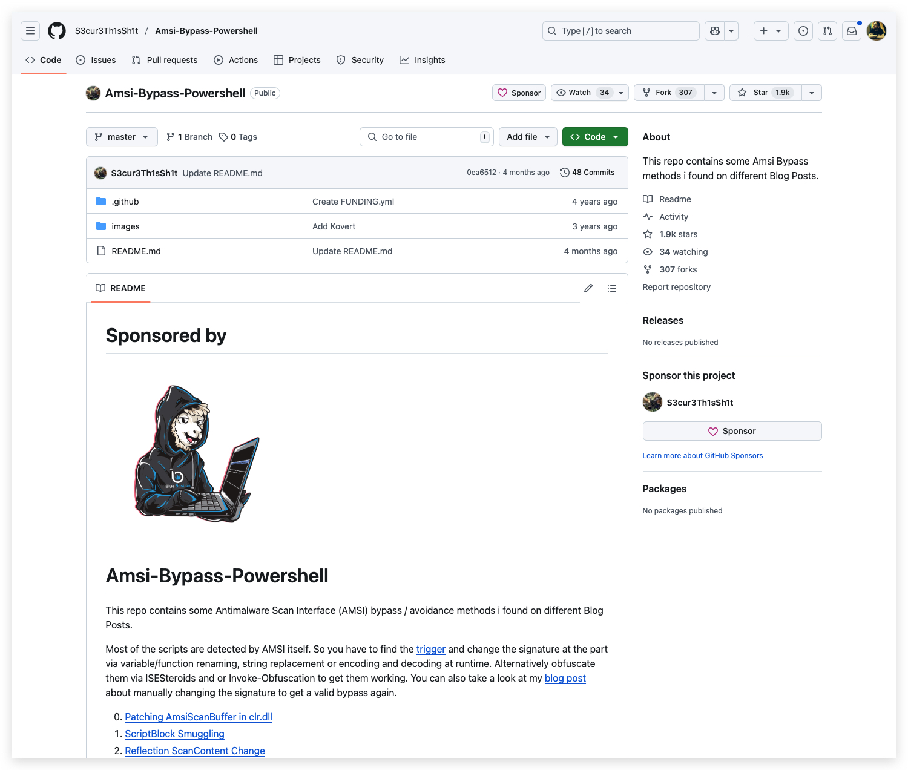
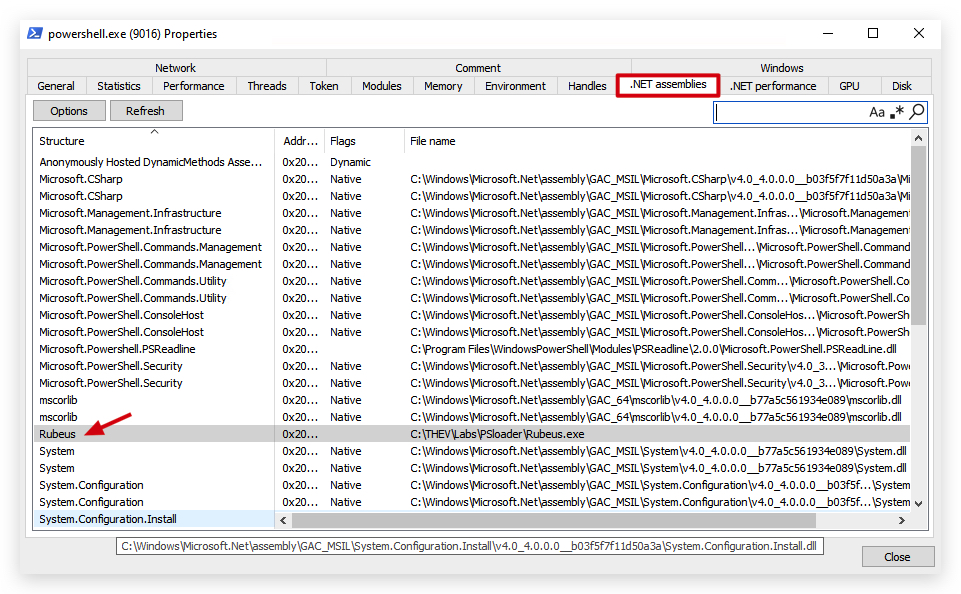

# AMSI (Anti-Malware Scanning Interface)


Introduced in June 2015.

The Windows Antimalware Scan Interface (AMSI) is a versatile interface standard that allows your applications and services to integrate with any antimalware product that's present on a machine. AMSI provides enhanced malware protection for your end-users and their data, applications, and workloads.  

AMSI is agnostic of antimalware vendor; it's designed to allow for the most common malware scanning and protection techniques provided by today's antimalware products that can be integrated into applications. It supports a calling structure allowing for file and memory or stream scanning, content source URL/IP reputation checks, and other techniques.

The AMSI feature is integrated into these components of `Windows 10`:
- User Account Control, or UAC (elevation of EXE, COM, MSI, or ActiveX installation)
- PowerShell `v5` (scripts, interactive use, and dynamic code evaluation)
- Windows Script Host (Wscript.exe and Cscript.exe) (scripts and dynamic 
- Office365 (JavaScript/VBA)  
- Windows Management Instrumentation (WMI)
- .Net Framework 4.8 (Scanning for all assemblies) - ***NEW***

> **Runtime – Antimalware Scanning for All Assemblies** : In previous versions of .NET Framework, Windows Defender or third-party antimalware software would automatically scan all assemblies loaded from disk for malware. However, assemblies loaded from elsewhere, such as by using Assembly.Load(byte[]), would not be scanned and could potentially carry viruses undetected.

[https://devblogs.microsoft.com/dotnet/announcing-net-framework-4-8-early-access-build-3694/](https://devblogs.microsoft.com/dotnet/announcing-net-framework-4-8-early-access-build-3694/)

.NET Framework 4.8 on Windows 10 triggers scans for those assemblies by Windows Defender and many other antimalware solutions that implement the Antimalware Scan Interface. We expect that this will make it harder for malware to disguise itself in .NET programs.

In its default configuration, macros are scanned at runtime via AMSI except in the following scenarios:

- Documents opened while macro security settings are set to “Enable All Macros”
- Documents opened from trusted locations
- Documents that are trusted documents
- Documents that contain VBA that is digitally signed by a trusted publisher

[https://docs.microsoft.com/en-us/windows/win32/amsi/how-amsi-helps](https://docs.microsoft.com/en-us/windows/win32/amsi/how-amsi-helps)

>Runtime – Antimalware Scanning for All Assemblies
>In previous versions of .NET Framework, Windows Defender or third-party antimalware software would automatically scan all assemblies loaded from disk for malware. However, assemblies loaded from elsewhere, such as by using Assembly.Load(byte[]), would not be scanned and could potentially carry viruses undetected.
>
>.NET Framework 4.8 (released April 18th on Windows 10) triggers scans for those assemblies by Windows Defender and many other antimalware solutions that implement the Antimalware Scan Interface. We expect that this will make it harder for malware to disguise itself in .NET programs.
>
>**LINK** : [https://devblogs.microsoft.com/dotnet/announcing-net-framework-4-8-early-access-build-3694/](https://devblogs.microsoft.com/dotnet/announcing-net-framework-4-8-early-access-build-3694/)
>
>**LINK** : [https://en.wikipedia.org/wiki/.NET_Framework_version_history](https://en.wikipedia.org/wiki/.NET_Framework_version_history)


Supported OS
---
- Windows 10 PRO/ENTERPRISE and Windows Server 2016 and later

Supported 3rd party Antivirus/EDR vendors
---
- Windows Defender
- Carbon Black Defense
- Crowdstrike Falcon
- Kaspersky
- McAfee Endpoint Security 10.6.0 
- Sophos
- Symantec (v14.3 and later)
- and a lot more...

**LINK** : [https://github.com/subat0mik/whoamsi](https://github.com/subat0mik/whoamsi)

To check which version of .net and the CLR is installed open a powershell prompt and type the following:

```code
$psversiontable
[System.Reflection.Assembly]::GetExecutingAssembly().ImageRuntimeVersion
$dotnet = [System.Reflection.Assembly]::Load("mscorlib")
$dotnet.GetName().Version
```


Let's see if our AMSI engine is working properly by doing a simple AMSI Test Sample (comparable to EICAR):

AMSITEST
---

```yaml
Invoke-Expression 'AMSI Test Sample: 7e72c3ce-861b-4339-8740-0ac1484c1386'
```


Even funnier, when you run the following command in a powershell console, AMSI will flag it as malicious, although the powershell script is not even available on your windows machine:

```yaml
Invoke-Mimikatz
```


Or the EICAR test string will also trigger:

```powershell
X5O!P%@AP[4\PZX54(P^)7CC)7}$EICAR-STANDARD-ANTIVIRUS-TEST-FILE!$H+H*
```

**Bypassing AMSI and how it works**

> AMSI works on 2 levels, in powershill (scanning scripts etc, and through the CLR for csharp/.net binaries). When later on we will be patching/bypassing AMSI it is IMPORTANT to understand this!

As a first check, let's see in which process AMSI.dll has been loaded. Open a powershell prompt:

```powershell
Get-Process | where {$_.modules.ModuleName -eq 'Amsi.dll'}
```


We can also use `SystemInformer` (previously known as `Process Hacker`) to verify, open `System Informer`, scroll down to your powershell process, right-click and select `properties`:


Go to the `modules` tab, this will show all dll's loaded by the process, you will find the amsi.dll there indeed!


We're going to have a closer look at that AMSI.dll and see which functions it exports (more on functions later - just know that a windows program will load certain dll's from disk - these dll's contain common functions that Microsoft has made avaiable to make life a bit easier for developers :))

**Pre-requisites**: dumpbin.exe /exports file.dll (requires visual studio c++ and msvc v142)


Open the "Developer Command Prompt for Visual Studio 2019"


If we have a look at the amsi.dll's exported functions using dumpbin (use the Visual Studio 2019 Developer Command Prompt for ths!) we see the forllowing functions are avaiable:

```bash
dumpbin c:\windows\system32\amsi.dll /exports
```

```bash
ordinal hint RVA      name

          1    0 00003860 AmsiCloseSession
          2    1 000034E0 AmsiInitialize
          3    2 00003800 AmsiOpenSession
 [+]      4    3 00003880 AmsiScanBuffer -> scans the content of buffers
 [+]      5    4 00003980 AmsiScanString -> scans the content of strings (variables)
          6    5 000039E0 AmsiUacInitialize
          7    6 00003C60 AmsiUacScan
          8    7 00003C00 AmsiUacUninitialize
          9    8 000037A0 AmsiUninitialize
         10    9 00001B00 DllCanUnloadNow
         11    A 00001B40 DllGetClassObject
         12    B 00001C80 DllRegisterServer
         13    C 00001C80 DllUnregisterServer
```

> HINT : These tools are super useful for analyzing basic functionality of binary files (exports for dll's, imports for exe's - to get an idea of the functions being used by the program.)

```bash
dumpbin c:\windows\system32\notepad.exe /imports
```
You'll also notice that you won't find any IMPORTS on a .dotnet (compiled csharp) binary - which is a nice bonus for evasion (IAT function hooking...). The reason for this is :

- ***.NET Executables Use Managed Code:***
A .NET EXE is primarily composed of managed code, which runs in the .NET runtime (CLR). Unlike native PE files, .NET executables don’t directly import functions from DLLs in the traditional PE import table. Instead, they rely on the .NET runtime to handle interactions with native APIs.
The import table in a .NET EXE is often minimal or empty because most dependencies are resolved through the CLR, which dynamically loads native APIs (e.g., via P/Invoke) at runtime.
- ***Minimal Import Table:***
A typical .NET EXE only has a small stub in its PE import table, often limited to basic dependencies like mscoree.dll (the .NET runtime loader). For example, the import table might only include _CorExeMain from mscoree.dll, which initializes the CLR.
If you run dumpbin /IMPORTS, you might see only this entry (or nothing if the tool skips trivial imports), as the actual function calls to native APIs are managed by the .NET runtime.
- ***P/Invoke for Native Calls:***
When a .NET application calls native functions (e.g., from kernel32.dll), it uses Platform Invoke (P/Invoke). These calls are not statically listed in the PE import table but are resolved dynamically at runtime by the CLR, which loads the required DLLs and functions.
As a result, dumpbin /IMPORTS cannot see these dynamic imports because they aren’t part of the static PE structure.
- ***Metadata-Driven Dependencies:***
.NET executables rely on metadata (stored in the .NET assembly) to describe dependencies, including references to other .NET assemblies or native DLLs via P/Invoke. This metadata is not part of the PE import table, so dumpbin doesn’t display it.

> Managed vs. Unmanaged: If your .NET EXE is purely managed, IAT hooking is ineffective due to the CLR’s dynamic resolution. For mixed-mode assemblies, check the IAT with dumpbin /IMPORTS to see if native imports are present.

We can see here the AmsiScanBuffer and AmsiScanString functions we talked about earlier. So the question is, how to we bypass this functionality?

Luckily there are a ton of AMSI bypasses publicly available : (<https://github.com/S3cur3Th1sSh1t/Amsi-Bypass-Powershell>)

In our next lab we'll be using "Matt Graebers Reflection method", it's a simple one-liner which uses reflection to set the `amsiInitFailed` field to `$true`, and will also work in .NET binaries, not just in PowerShell. Let's have a look how it works before we implement it.



**"Matt Graebers Reflection method"**
```powershell
[Ref].Assembly.GetType('System.Management.Automation.AmsiUtils').GetField('amsiInitFailed','NonPublic,Static').SetValue($null,$true)
```

### Understanding the Technique:

**How it Works in `powershell`:**

1. **Reflection:** The core of this bypass relies on .NET reflection, which allows code to inspect and modify types, fields, and methods at runtime.
2. **Targeting `amsiInitFailed`:** The code specifically targets the `amsiInitFailed` static field within the `System.Management.Automation.AmsiUtils` class. This field is used to indicate whether the AntiMalware Scan Interface (AMSI) initialization has failed.
3. **Setting to `$true`:** By setting this field to `$true`, the code effectively tells the .NET runtime that AMSI initialization has failed, causing AMSI scans to be skipped.


<https://pentestlaboratories.com/2021/05/17/amsi-bypass-methods/>


**How it Works in `.NET Binaries`:**

1.  **Locating `AmsiUtils`:** Just like in PowerShell, you can use reflection in C# (or other .NET languages) to locate the `System.Management.Automation.AmsiUtils` class.
2.  **Accessing `amsiInitFailed`:** You can then use reflection to access the `amsiInitFailed` static field.
3.  **Setting the Value:** Finally, you can use reflection to set the value of the `amsiInitFailed` field to `true`.

> **NOTE**: Modern `EDR` solutions are designed to detect such reflection-based attacks. They often monitor for suspicious memory modifications and code behavior. `EDR`'s will hook functions and rely heavily on telemtry such as `ETW providers` (***hint*** ***hint***), of course these can also be bypassed. For now we focus on AV bypassing. 
>

# INSERT SYSMON PROOF of AMSI.DLL being loaded

CLR Being loaded:


CLR Loading AMSI.dll on-demand into the shaprkatz_lo.exe binary




ProcessExplorer (Sysinternals) - shows a more structured output for the loaded assemblies, here you see that powershell loaded a .net assembly in its own memory, named Rubeus


> HINT : This ss why you should modify existing tools, as they are signatured and could ne easily detected (yara rules, memory scanners looking for those strings)

> DETECTION TIP: Processes that are not .NET/Powershell and that load clr.dll/mscoree.dll are very suspicious and might point to C2 features that allow inline-execute assembly. Or a valid process (non .net) injected with shellcode, that then tries to execute .net assemblies in memory.

In the next chapter we will briefly go over ETW and then we'll apply our knowledge on how to bypass `AMSI` and `ETW` in our next lab!

<https://shaquibizhar.github.io/Amsi-bypass-generator/>