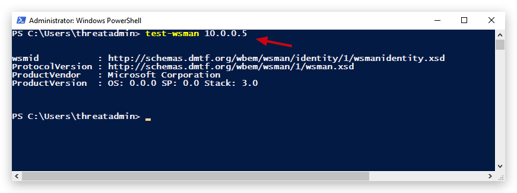

# Chapter 2.8 - Evil-WinRM

Windows Remote Management (WinRM) is highlighted as a protocol by Microsoft that enables the remote management of Windows systems through HTTP(S), leveraging SOAP in the process. It's fundamentally powered by WMI, presenting itself as an HTTP-based interface for WMI operations.

The presence of WinRM on a machine allows for straightforward remote administration via PowerShell, akin to how SSH works for other operating systems. To determine if WinRM is operational, checking for the opening of specific ports is recommended:

**5985/tcp** (HTTP) and **5986/tcp** (HTTPS)

# Initiating a WinRM Session

To configure PowerShell for WinRM, Microsoft's Enable-PSRemoting cmdlet comes into play, setting up the computer to accept remote PowerShell commands. With elevated PowerShell access, the following commands can be executed to enable this functionality and designate any host as trusted:

```
Enable-PSRemoting -Force  1

Set-Item wsman:\localhost\client\trustedhosts *  
```
This approach involves adding a wildcard to the trustedhosts configuration, a step that requires cautious consideration due to its implications. It's also noted that altering the network type from "Public" to "Work" might be necessary on the attacker's machine.

Moreover, WinRM can be activated remotely using the wmic command, demonstrated as follows:
```
wmic /node:<REMOTE_HOST> process call create "powershell enable-psremoting -force"
```
This method allows for the remote setup of WinRM, enhancing the flexibility in managing Windows machines from afar.

# Test if configured
To verify the setup of your attack machine, the Test-WSMan command is utilized to check if the target has WinRM configured properly. By executing this command, you should expect to receive details concerning the protocol version and wsmid, indicating successful configuration. Below are examples demonstrating the expected output for a configured target versus an unconfigured one:

For a target that is properly configured, the output will look similar to this:
```
Test-WSMan <target-ip>
```
The response should contain information about the protocol version and wsmid, signifying that WinRM is set up correctly.



From your Kali Linux you can simply use NMAP:

```code
nmap -p 5985,5986 10.0.0.5 
```


https://book.hacktricks.xyz/network-services-pentesting/5985-5986-pentesting-winrm
