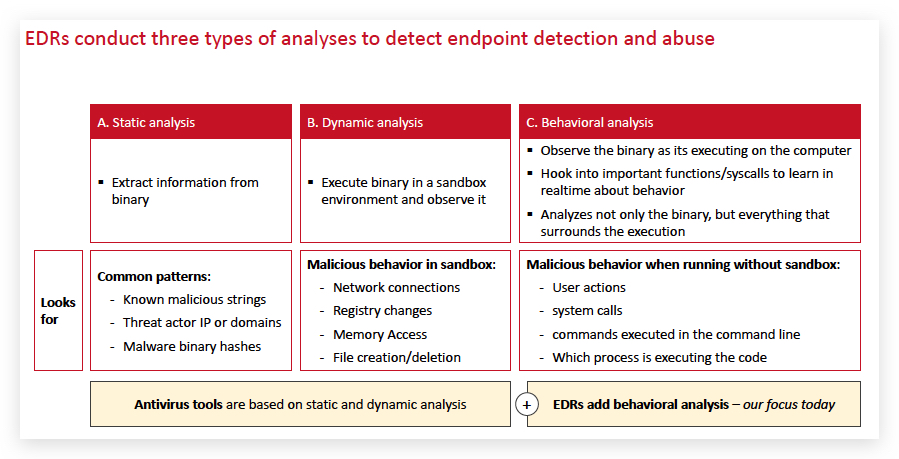
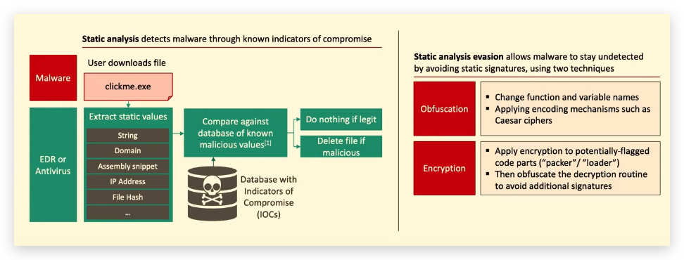
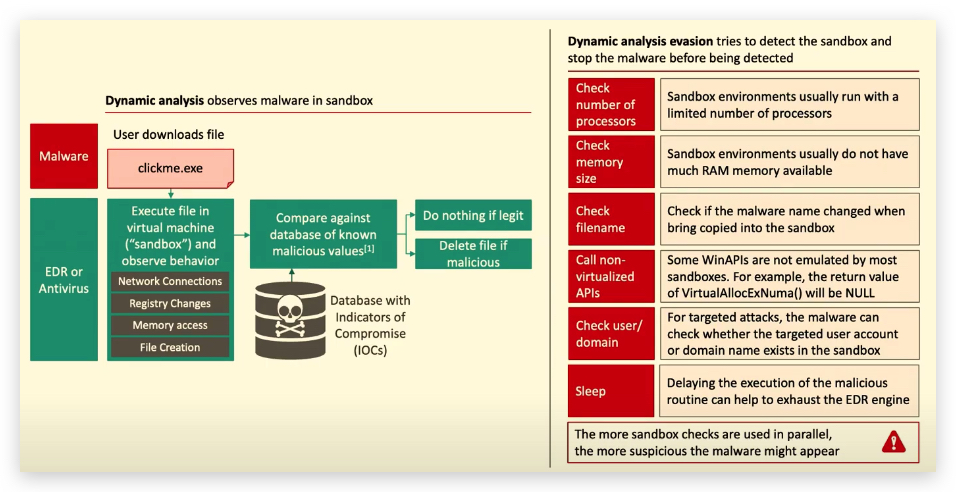
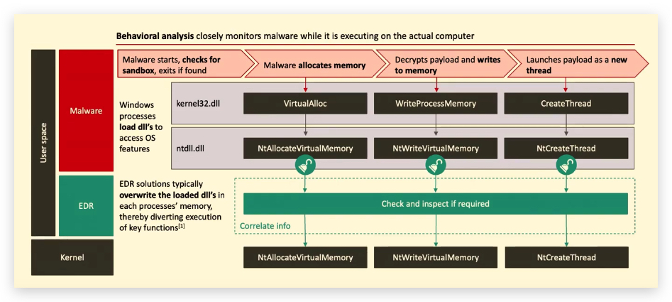

# Chapter 0.1 - Windows Defender / MDE (EDR)

> ***TL;DR :*** This chapter explains how most AV/EDR's work - in this case we'll foce on Microsoft Defender (the AV part), MDE (Microsoft Defender for Endpoint) which is the EDR component that we'll deal with later on.

### Detection Techniques Used by <mark>Microsoft Defender Antivirus</mark> (Not MDE!!!)

| **Detection Technique**       | **Description**                                                                                          |
| ----------------------------- | -------------------------------------------------------------------------------------------------------- |
| **Signature-Based Detection** | Compares files against a database of known malware signatures. Effective against known threats.          |
| **Heuristic Analysis**        | Examines the behavior and characteristics of files to identify potentially malicious activity.           |
| **Behavioral Monitoring**     | Monitors the behavior of applications and processes in real-time to detect and block malicious behavior. |
| **Machine Learning**          | Uses machine learning models to analyze and classify files based on their characteristics.               |
| **Cloud-Based Detection**     | Sends suspicious files or metadata to the cloud for further analysis using advanced algorithms.          |
| **Memory Scanning**           | Scans the system's memory to detect and remove malware that resides in memory.                           |
| **Network Inspection**        | Monitors network traffic for signs of malicious activity and blocks network-based attacks.               |

### Advanced Technologies

| **Technology**                          | **Description**                                                                                        |
| --------------------------------------- | ------------------------------------------------------------------------------------------------------ |
| **Hybrid Detection and Protection**     | Combines on-device detection with cloud-based analysis for faster and more effective threat detection. |
| **Behavior Monitoring Engine**          | Continuously monitors for potential attacks post-execution.                                            |
| **Specialized Machine Learning Models** | Uses models for different file types and behaviors to make real-time verdicts.                         |

### Differences Between Microsoft Defender Antivirus (MDA) and Microsoft Defender for Endpoint (MDE)

| **Feature**                                    | **Microsoft Defender Antivirus (MDA)** | **Microsoft Defender for Endpoint (MDE)**                                                           |
| ---------------------------------------------- | -------------------------------------- | --------------------------------------------------------------------------------------------------- |
| **Endpoint Detection and Response (EDR)**      | Not available                          | Provides advanced EDR capabilities to detect, investigate, and respond to threats.                  |
| **Threat and Vulnerability Management**        | Not available                          | Offers comprehensive threat and vulnerability management to identify and remediate vulnerabilities. |
| **Attack Surface Reduction (ASR)**             | Limited                                | Provides extensive ASR rules to reduce the attack surface and prevent exploit techniques.           |
| **Automated Investigation and Remediation**    | Not available                          | Automatically investigates and remediates threats using AI and automation.                          |
| **Advanced Threat Hunting**                    | Not available                          | Offers advanced threat hunting capabilities with detailed search queries and analytics.             |
| **Integration with Microsoft 365**             | Limited                                | Seamlessly integrates with Microsoft 365 and other enterprise security solutions.                   |
| **Sandboxing and Detonation**                  | Not available                          | Uses sandboxing to analyze and detonate suspicious files in a controlled environment.               |
| **Behavioral Analytics and Anomaly Detection** | Basic                                  | Employs advanced behavioral analytics and anomaly detection to identify sophisticated threats.      |
| **Threat Intelligence and Analytics**          | Limited                                | Leverages Microsoft's Threat Intelligence to provide real-time insights and analytics.              |
| **Centralized Management and Reporting**       | Basic                                  | Provides centralized management, reporting, and alerting for enterprise environments.               |

### Summary

- **Endpoint Detection and Response (EDR):** MDE provides advanced EDR capabilities that allow organizations to detect, investigate, and respond to threats in real-time. MDA does not offer these capabilities.
- **Threat and Vulnerability Management:** MDE offers tools to identify and remediate vulnerabilities across the organization's environment. MDA does not include this feature.
- **Attack Surface Reduction (ASR):** MDE provides comprehensive ASR rules to minimize the attack surface and prevent exploit techniques. MDA has limited ASR capabilities.
- **Automated Investigation and Remediation:** MDE uses AI and automation to automatically investigate and remediate threats. MDA does not have this capability.
- **Advanced Threat Hunting:** MDE offers advanced threat hunting capabilities, allowing security analysts to perform detailed searches and analytics. MDA does not include threat hunting features.
- **Integration with Microsoft 365:** MDE seamlessly integrates with Microsoft 365 and other enterprise security solutions, providing a unified security experience. MDA has limited integration with Microsoft 365.
- **Sandboxing and Detonation:** MDE uses sandboxing to analyze and detonate suspicious files in a controlled environment, providing detailed insights into their behavior. MDA does not offer sandboxing.
- **Behavioral Analytics and Anomaly Detection:** MDE employs advanced behavioral analytics and anomaly detection to identify sophisticated threats. MDA has basic behavioral monitoring.
- **Threat Intelligence and Analytics:** MDE leverages Microsoft's Threat Intelligence to provide real-time insights and analytics. MDA has limited threat intelligence capabilities.
- **Centralized Management and Reporting:** MDE offers centralized management, reporting, and alerting for enterprise environments, making it easier to manage security across multiple endpoints. MDA has basic management and reporting features.

These differences highlight the advanced capabilities that Microsoft Defender for Endpoint (MDE) provides, making it suitable for enterprise environments with complex security needs.

If you have any further questions or need more details, feel free to ask!

<https://www.edr-telemetry.com/windows.html>