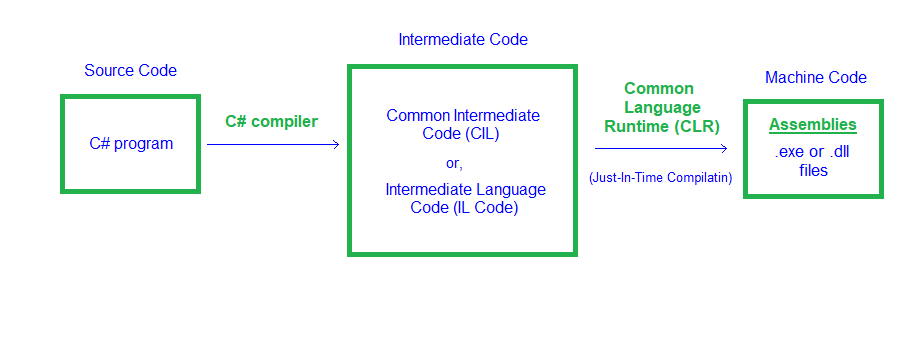

# .NET & CLR

> WARNING : Amsi.dll is loaded into every powershell.exe process, but when running dotnet (csharp) binaries, amsi integrates directly with the clr which loads AMSI on demand. Amsi Bypasses that work in powershell don't necessariy work for the CLR integration.

AmsiScanBuffer
AmsiScanString
AssemblyLoad

Show api calls made (user to kernel/syscall)

Languages
-- -
- powershell (scripting)
- vb.net (scripting)
- c# (compiled)
- f# (compiled)

Here's a simplified diagram:

| **Perspective**         | **Advantages**                                                                                                                                                                                                                                                                                                                                                                                                                                                                                                                                                          | **Disadvantages**                                                                                                                                                                                                                                                                                                                                                                                                                                                                                                                                                       |
| ----------------------- | ----------------------------------------------------------------------------------------------------------------------------------------------------------------------------------------------------------------------------------------------------------------------------------------------------------------------------------------------------------------------------------------------------------------------------------------------------------------------------------------------------------------------------------------------------------------------- | ----------------------------------------------------------------------------------------------------------------------------------------------------------------------------------------------------------------------------------------------------------------------------------------------------------------------------------------------------------------------------------------------------------------------------------------------------------------------------------------------------------------------------------------------------------------------- |
| **Detection/Forensics** | - **Fileless Execution**: Leverages .NET for in-memory execution (e.g., PowerShell, `Assembly.Load`), avoiding disk writes and evading file-based AV. - **Living Off the Land**: Uses trusted Windows tools (e.g., PowerShell, WMI), blending with legitimate activity. - **Obfuscation**: Supports runtime compilation (e.g., `CSharpCodeProvider`) to generate dynamic payloads, complicating static analysis. - **Ephemeral Artifacts**: Memory-based attacks leave transient evidence, lost on reboot, challenging forensics without live memory captures. | - **.NET Telemetry**: CLR generates logs (e.g., PowerShell Script Block Logging, Event ID 4104), detectable by EDRs like Microsoft Defender. - **Behavioral Detection**: High-level APIs (e.g., `System.Net.Http`) trigger EDR alerts for unusual process behavior. - **Memory Forensics**: .NET’s structured memory (e.g., IL code, metadata) is easier to analyze than raw shellcode using tools like Volatility. - **.NET Dependency**: Requires .NET runtime, which may be hardened or absent, increasing detectability.                                   |
| **Capabilities**        | - **Rapid Development**: High-level syntax and .NET libraries enable quick creation of complex tools (e.g., C2 clients, keyloggers). - **Windows Integration**: Seamless use of PowerShell, WMI, and Windows APIs for fileless attacks and lateral movement. - **Dynamic Payloads**: Runtime code generation (e.g., `Assembly.Load`) allows adaptive, stealthy payloads. - **Obfuscation Ecosystem**: Tools like ConfuserEx enhance payload protection against reverse-engineering.                                                                            | - **Limited Low-Level Control**: Managed environment restricts raw memory manipulation (e.g., shellcode injection) without P/Invoke, increasing complexity. - **Runtime Overhead**: .NET CLR (JIT, garbage collection) adds performance overhead, potentially noticeable in constrained environments. - **Lack of Persistence**: Fileless attacks require disk-based persistence mechanisms (e.g., registry), risking detection. - **Platform Dependency**: Primarily effective on Windows; limited portability to non-Windows systems without Mono/.NET Core. |