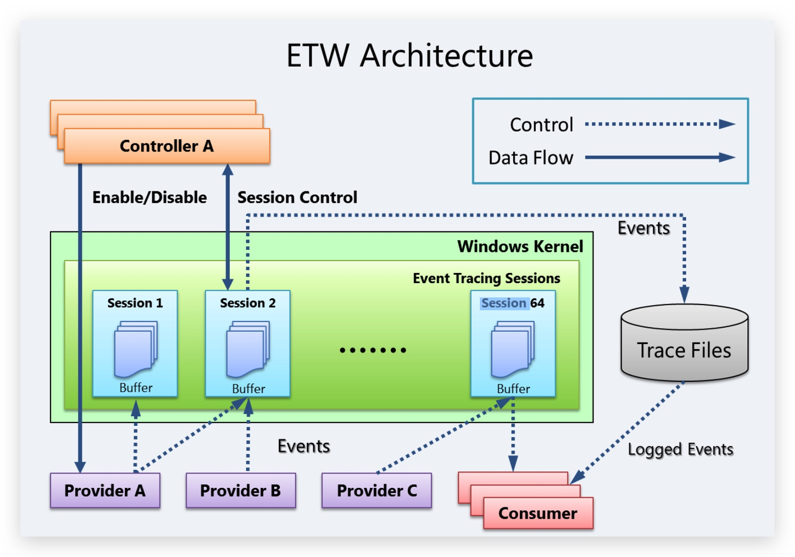

# ETW - Event Tracing for Windows (Kernel mode)

> **TL;DR** ETW basically is  a kernel level debug logging mechanism in Windows - it allows to gather advanced telemetry about functions being called. Windows Even Logs contain a subset of ETW events. Typically used by application developers to debug programs, but has found its way as a telemetry source for EDR's. 

Event Tracing for Windows (ETW) is a high speed tracing facility built into Windows. Using a buffering and logging mechanism implemented in the operating system kernel, ETW provides an infrastructure for events raised by both user mode (apps) and kernel mode components (drivers). ETW can be used for system and app diagnosis, troubleshooting, and performance monitoring.


https://learn.microsoft.com/en-us/windows-hardware/test/weg/instrumenting-your-code-with-etw

***Provider***
A provider is an instrumented component that generates events. A provider can be a user mode app, a kernel mode driver, or the Windows kernel itself. In addition to fixed event data (header), an event can carry user data.

An event is an event-based representation of data. The data can be used for in-depth analysis. An event can also be used to produce counters. Counters provide a sample-based view of data. They typically contain a small set of data to show current state, for example I/O bytes per second and interrupts per second.

A provider must register with ETW and send events by calling the ETW Logging APIs. Providers register a callback function for enable and disable notifications so that tracing can be enabled and disabled dynamically.

***Session***
The ETW session infrastructure works as an intermediate broker that relays the events from one or more providers to the consumer. A session is a kernel object that collects events into kernel buffer and sends them to a specified file or real-time consumer process. Multiple providers can be mapped to a single session, which allows users to collect data from multiple sources.

***Controller***
A controller starts, stops, or updates a trace session. A session is a unit for tracing. Providers are mapped (or enabled) to a specific session. A controller enables and disables providers so that they can start sending events to ETW. Controller functionalities can be invoked with tools provided by Microsoft or you can write your own app.

Logman.exe is an in-box controller app. Windows Performance Recorder (WPR) in the Windows Performance Toolkit is the recommended controller process.

***Consumer***
A consumer is an app that reads a logged trace file (ETL file) or captures events in an active trace session in real time, and processes events. Event Viewer and Resource Monitor are in-box ETW consumer apps.

Windows Performance Analyzer (WPA) in the Windows Performance Toolkit is the recommended consumer process.


To see which ETW providers are running on the system
```code
logman query -ets
```

logman  query providers | select-string "defender"

Notice sysmon, Windows Defender...

```code
logman query providers Microsoft-Windows-Kernel-Process
```
|Provider|                                 GUID|
|----------------------------------|---------------------------------------------|
|Microsoft-Windows-Kernel-Process|         {22FB2CD6-0E7B-422B-A0C7-2FAD1FD0E716}|

```code
logman start mysession -p {22FB2CD6-0E7B-422B-A0C7-2FAD1FD0E716} -o mytest.etl -ets
logman start mysession -p Microsoft-Windows-Kernel-Process -o mytest.etl -ets
logman stop mysession -ets
tracerpt mytest.etl
```


https://github.com/Microsoft/perfview/releases


logman create trace MyETWSession -p "Microsoft-Windows-Kernel-Process" 0x8 -o "C:\temp\kernel-process.etl" -ets

.\filebeat.exe -e -c filebeat.yml -d "*"


-----

```powershell 
logman start Microsoft-Windows-Kernel-Memory -p Microsoft-Windows-Kernel-Memory 0xffffffffffffffff win:informational -ets
logman stop Microsoft-Windows-Kernel-Memory -ets 
```

tracerpt .\Microsoft-Windows-Kernel-Memory.etl -o Microsoft-Windows-Kernel-Memory.evtx -of evtx -lr

Microsoft-Windows-DotNETRuntime
Microsoft-Windows-Threat-Intelligence


Provider                                 GUID
-------------------------------------------------------------------------------
Microsoft-Windows-Threat-Intelligence    {F4E1897C-BB5D-5668-F1D8-040F4D8DD344}

-----

| Value              | Keyword                                                        | Description                                                                                           |
| ------------------ | -------------------------------------------------------------- | ----------------------------------------------------------------------------------------------------- |
| 0x0000000000000001 | KERNEL_THREATINT_KEYWORD_ALLOCVM_LOCAL                         | Allocates virtual memory in the local process.                                                        |
| 0x0000000000000002 | KERNEL_THREATINT_KEYWORD_ALLOCVM_LOCAL_KERNEL_CALLER           | Allocates virtual memory in the local process, called from kernel mode.                               |
| 0x0000000000000004 | KERNEL_THREATINT_KEYWORD_ALLOCVM_REMOTE                        | Allocates virtual memory in a remote process.                                                         |
| 0x0000000000000008 | KERNEL_THREATINT_KEYWORD_ALLOCVM_REMOTE_KERNEL_CALLER          | Allocates virtual memory in a remote process, called from kernel mode.                                |
| 0x0000000000000010 | KERNEL_THREATINT_KEYWORD_PROTECTVM_LOCAL                       | Changes the protection on a region of virtual memory in the local process.                            |
| 0x0000000000000020 | KERNEL_THREATINT_KEYWORD_PROTECTVM_LOCAL_KERNEL_CALLER         | Changes the protection on a region of virtual memory in the local process, called from kernel mode.   |
| 0x0000000000000040 | KERNEL_THREATINT_KEYWORD_PROTECTVM_REMOTE                      | Changes the protection on a region of virtual memory in a remote process.                             |
| 0x0000000000000080 | KERNEL_THREATINT_KEYWORD_PROTECTVM_REMOTE_KERNEL_CALLER        | Changes the protection on a region of virtual memory in a remote process, called from kernel mode.    |
| 0x0000000000000100 | KERNEL_THREATINT_KEYWORD_MAPVIEW_LOCAL                         | Maps a view of a file mapping into the address space of the local process.                            |
| 0x0000000000000200 | KERNEL_THREATINT_KEYWORD_MAPVIEW_LOCAL_KERNEL_CALLER           | Maps a view of a file mapping into the address space of the local process, called from kernel mode.   |
| 0x0000000000000400 | KERNEL_THREATINT_KEYWORD_MAPVIEW_REMOTE                        | Maps a view of a file mapping into the address space of a remote process.                             |
| 0x0000000000000800 | KERNEL_THREATINT_KEYWORD_MAPVIEW_REMOTE_KERNEL_CALLER          | Maps a view of a file mapping into the address space of a remote process, called from kernel mode.    |
| 0x0000000000001000 | KERNEL_THREATINT_KEYWORD_QUEUEUSERAPC_REMOTE                   | Queues an asynchronous procedure call (APC) to a thread in a remote process.                          |
| 0x0000000000002000 | KERNEL_THREATINT_KEYWORD_QUEUEUSERAPC_REMOTE_KERNEL_CALLER     | Queues an asynchronous procedure call (APC) to a thread in a remote process, called from kernel mode. |
| 0x0000000000004000 | KERNEL_THREATINT_KEYWORD_SETTHREADCONTEXT_REMOTE               | Sets the context of a thread in a remote process.                                                     |
| 0x0000000000008000 | KERNEL_THREATINT_KEYWORD_SETTHREADCONTEXT_REMOTE_KERNEL_CALLER | Sets the context of a thread in a remote process, called from kernel mode.                            |
| 0x0000000000010000 | KERNEL_THREATINT_KEYWORD_READVM_LOCAL                          | Reads virtual memory in the local process.                                                            |
| 0x0000000000020000 | KERNEL_THREATINT_KEYWORD_READVM_REMOTE                         | Reads virtual memory in a remote process.                                                             |
| 0x0000000000040000 | KERNEL_THREATINT_KEYWORD_WRITEVM_LOCAL                         | Writes to virtual memory in the local process.                                                        |
| 0x0000000000080000 | KERNEL_THREATINT_KEYWORD_WRITEVM_REMOTE                        | Writes to virtual memory in a remote process.                                                         |
| 0x0000000000100000 | KERNEL_THREATINT_KEYWORD_SUSPEND_THREAD                        | Suspends a thread.                                                                                    |
| 0x0000000000200000 | KERNEL_THREATINT_KEYWORD_RESUME_THREAD                         | Resumes a suspended thread.                                                                           |
| 0x0000000000400000 | KERNEL_THREATINT_KEYWORD_SUSPEND_PROCESS                       | Suspends all threads in a process.                                                                    |
| 0x0000000000800000 | KERNEL_THREATINT_KEYWORD_RESUME_PROCESS                        | Resumes all threads in a suspended process.                                                           |
| 0x0000000001000000 | KERNEL_THREATINT_KEYWORD_FREEZE_PROCESS                        | Freezes a process, preventing it from executing.                                                      |
| 0x0000000002000000 | KERNEL_THREATINT_KEYWORD_THAW_PROCESS                          | Thaws a frozen process, allowing it to execute.                                                       |
| 0x0000000004000000 | KERNEL_THREATINT_KEYWORD_CONTEXT_PARSE                         | Parses the context of a process or thread.                                                            |
| 0x0000000008000000 | KERNEL_THREATINT_KEYWORD_EXECUTION_ADDRESS_VAD_PROBE           | Probes the virtual address descriptor (VAD) for an execution address.                                 |
| 0x0000000010000000 | KERNEL_THREATINT_KEYWORD_EXECUTION_ADDRESS_MMF_NAME_PROBE      | Probes the memory-mapped file (MMF) name for an execution address.                                    |
| 0x0000000020000000 | KERNEL_THREATINT_KEYWORD_READWRITEVM_NO_SIGNATURE_RESTRICTION  | Reads or writes virtual memory without signature restrictions.                                        |
| 0x0000000040000000 | KERNEL_THREATINT_KEYWORD_DRIVER_EVENTS                         | Logs events related to kernel-mode drivers.                                                           |
| 0x0000000080000000 | KERNEL_THREATINT_KEYWORD_DEVICE_EVENTS                         | Logs events related to device operations.                                                             |
| 0x8000000000000000 | Microsoft-Windows-Threat-Intelligence/Analytic                 | Logs analytic events for threat intelligence.                                                         |

| Value | Level             | Description |
| ----- | ----------------- | ----------- |
| 0x04  | win:Informational | Information |

| PID        | Image |
| ---------- | ----- |
| 0x00000000 |       |

https://github.com/Lsecqt-Sponsors/Haunt_Agent/blob/main/Payload_Type/haunt/haunt/agent_code/etw.ps1
https://github.com/MHaggis/PowerShell-Hunter
