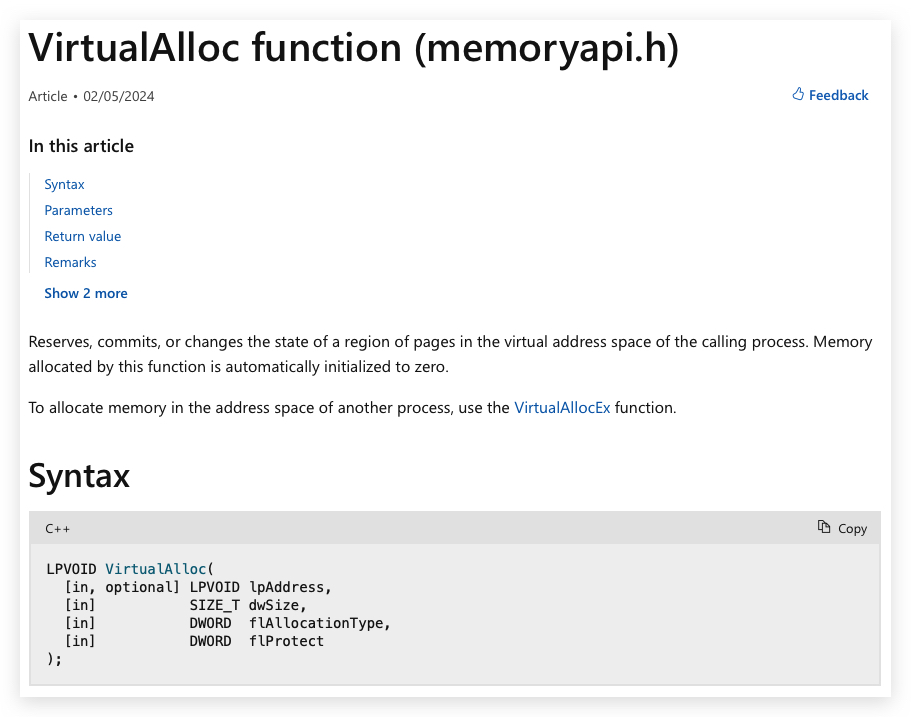

# Chapter 1.5 - "WIN32api, Functions, kernel and user mode"

Nt = Native API

Let's start with the basics, user-mode and kernel-mode:


# User Mode vs Kernel Mode in Windows

## **1. Kernel Mode**
- **What it is**: Kernel mode is the privileged mode of operation in which code has unrestricted access to all system resources, including hardware and memory. It operates at the core of the operating system.
- **Who uses it**: The Windows kernel, device drivers, and other low-level system processes operate in kernel mode.
- **Capabilities**:
  - Direct access to the hardware (e.g., CPU, memory, storage devices).
  - Ability to execute critical system-level instructions.
- **Risks**: Errors in kernel-mode processes can lead to system crashes or instability (commonly referred to as a "blue screen").

## **2. User Mode**
- **What it is**: User mode is the restricted mode in which applications and processes run. Code executed in user mode cannot directly access hardware or system resources and relies on the kernel for such operations.
- **Who uses it**: Regular applications (e.g., browsers, text editors) and user-level processes operate in user mode.
- **Capabilities**:
  - Processes in user mode interact with hardware indirectly through system calls provided by the kernel.
  - Memory and resources are isolated, minimizing the impact of an application crash.
- **Benefits**: User mode enhances system stability by isolating applications from the core system operations. If a user-mode application crashes, it typically does not affect the operating system itself.

## **Switching Between Modes**
- In Windows, switching between user mode and kernel mode happens when a user-mode application requests system resources (e.g., file I/O or network access). These requests are performed using **system calls**. The operating system processes these calls in kernel mode and returns the results to the user-mode application.

---

### **Summary**
- **Kernel mode** = Power and responsibility.
- **User mode** = Safety and isolation.

This separation is crucial for maintaining security and stability in modern operating systems.

----


learn.micorosoft.com

Explain Kernel vs user mode (ntdll.dll, kernel32.dll, kernelbase.dll)

Explain DLL's


WIN32 api functions (slides)


https://malapi.io/

Api monitor
x64dbg


<https://redops.at/en/blog/direct-syscalls-vs-indirect-syscalls>





Let's build a dummy shellcode:

hello world dialog

<https://github.com/hasherezade/pe_to_shellcode/releases/tag/v1.2>

```bash
sudo msfvenom -a x64 --platform windows -p windows/x64/messagebox TEXT="Successful Execution :)" TITLE="CrimsonCORE"  -f exe -o msg.exe
```

https://www.youtube.com/watch?v=0PUZbgcIMzg
create a dialogbox with metadata

> ***IMPORTANT:*** The closer you can work to the kernel (ntdll.dll), the least chance on detection, since kernel32 and kernelbase all eventually translate into an ntdll.dll function. NTDLL.dll is basically a wrapper for syscalls to kernel mode.


```csharp
using System;
using System.Diagnostics;
using System.Linq;

class Program
{
    static void Main()
    {

        // Buffer with our shellcode
        byte[] shellCode;
        shellCode = new byte[] 
        { 
            0xfc,0xfc 
        };
        Console.Clear();
        Console.Write("Shellcode: ");

        foreach (byte b in shellCode)
        {
            Console.Write($"0x{b:X2}, ");  // X2 formats as two-character uppercase hex
        }

        Console.WriteLine();  // To add a newline at the end
        Console.WriteLine();  // To add a newline at the end

        // Find the process with the name "explorer"
        var explorerProcess = Process.GetProcessesByName("explorer").FirstOrDefault();

        if (explorerProcess != null)
        {
            Console.WriteLine($"Process ID of explorer.exe: {explorerProcess.Id}");
        }
        else
        {
            Console.WriteLine("explorer.exe not found.");
        }
        Console.WriteLine();  // To add a newline at the end

        // Wait for any key to be pressed
        Console.WriteLine("Press any key to stop...");
        Console.ReadKey();

    }
}
```

# AV and EDR's hooking functions


Use

- DINVOKE
- SYSCALLS 
- 
To avoid hooke win32api functions

# Using PINVOKE (CSharp importing unmanaged code like c/c++)


<https://learn.microsoft.com/en-us/dotnet/framework/interop/consuming-unmanaged-dll-functions>