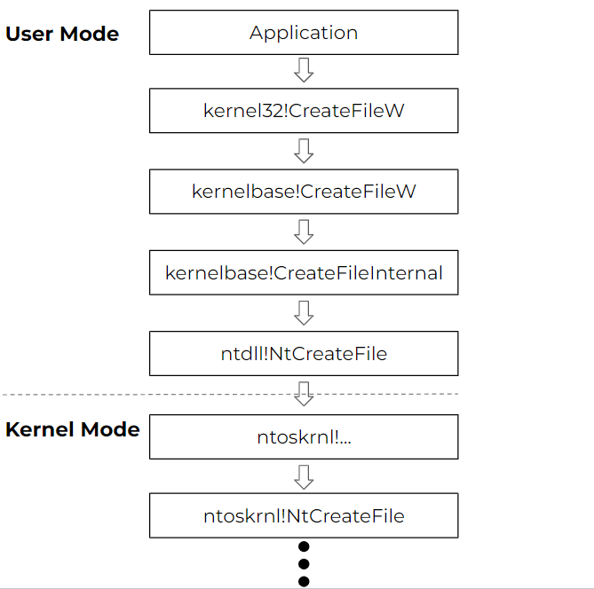

# Hooks (User land)



Explain hooking with ***FRIDA***

# SYLANTSTRIKE
<https://github.com/CCob/SylantStrike>


x64dbg

HookChecker mr. Un1c0d3r


dump exported funtions ntdll.dll kernelbase.dll kernel32.dll


```

Screenshot IDA JUMP

https://github.com/Almorabea/HookSweeper


https://github.com/Mr-Un1k0d3r/EDRs
Hook_finder64.exe

https://github.com/asaurusrex/Probatorum-EDR-Userland-Hook-Checker
compile in visual studio

Bitdefender install -> 102 fnctions hooked

windgb:
u NtOpenProcess
!chkimg ntdll
needs symbols in windbg
.sympath srv*https://msdl.microsoft.com/download/symbols
 !sym noisy;.reload /f /v


```
u NtReadVirtualMemory
ntdll!NtReadVirtualMemory:
00007ffd`3ef0dcc0 e95b331600      jmp     00007ffd`3f071020
00007ffd`3ef0dcc5 cc              int     3
00007ffd`3ef0dcc6 cc              int     3
00007ffd`3ef0dcc7 cc              int     3
00007ffd`3ef0dcc8 f604250803fe7f01 test    byte ptr [SharedUserData+0x308 (00000000`7ffe0308)],1
00007ffd`3ef0dcd0 7503            jne     ntdll!NtReadVirtualMemory+0x15 (00007ffd`3ef0dcd5)
00007ffd`3ef0dcd2 0f05            syscall
00007ffd`3ef0dcd4 c3              ret
```

then look at the jump address and disassemble:
```
u 00007ffd`3f071020
00007ffd`3f071020 36363636488da42400ffffff lea rsp,ss:[rsp-100h]
00007ffd`3f07102c 363648898c2438ffffff mov qword ptr ss:[rsp-0C8h],rcx
00007ffd`3f071036 48b9700da2cdf47d0000 mov rcx,7DF4CDA20D70h
00007ffd`3f071040 ff1522000000    call    qword ptr [00007ffd`3f071068]
00007ffd`3f071046 9c              pushfq
00007ffd`3f071047 48f78424f8feffffffffffff test qword ptr [rsp-108h],0FFFFFFFFFFFFFFFFh
00007ffd`3f071053 740a            je      00007ffd`3f07105f
00007ffd`3f071055 9d              popfq
```

**call qword ptr [00007ffd3f071068]:** This is a crucial instruction. It's acallto an address stored in memory at00007ffd3f071068.  This is almost certainly a call to the actual hook function – the code that performs the custom actions.  The address 00007ffd3f071068` is acting as a pointer to the hook function.

**Examine 00007ffd3f071068:** Usedq 00007ffd3f071068 in WinDbg to see what value is stored at that address.  This is the address of the actual hook function.

```
dq 00007ffd3f071068
00007ffd`3f071068  00007df4`cda31000 cccccccc`cccccccc
00007ffd`3f071078  cccccccc`cccccccc 24a48d48`36363636
00007ffd`3f071088  89483636`ffffff00 b948ffff`ff38248c
00007ffd`3f071098  00007df4`cda20dc0 489c0000`002215ff
00007ffd`3f0710a8  fffffffe`f82484f7 36369d0a`74ffffff
00007ffd`3f0710b8  9dfffffe`f024a4ff cccccccc`ccccccc3
00007ffd`3f0710c8  00007df4`cda31000 cccccccc`cccccccc
00007ffd`3f0710d8  cccccccc`cccccccc 24a48d48`36363636
```
The important part is 00007df4cda31000. This is the address where the *real* hook function is located. The rest of the output (cccccccc...) is just filler (oftenccrepresents anint 3` instruction, a common breakpoint or padding value).

Next step:

Now that you have the address of the actual hook function (00007df4cda31000), you need to disassemble it to understand what it's doing.

```code
u 00007df4`cda31000
00007df4`cda31000 9c              pushfq
00007df4`cda31001 48f705f4efffffffffffff test qword ptr [00007df4`cda30000],0FFFFFFFFFFFFFFFFh
00007df4`cda3100c 7515            jne     00007df4`cda31023
00007df4`cda3100e 9d              popfq
00007df4`cda3100f 488b4910        mov     rcx,qword ptr [rcx+10h]
00007df4`cda31013 48894c24f8      mov     qword ptr [rsp-8],rcx
00007df4`cda31018 488b8c2440ffffff mov     rcx,qword ptr [rsp-0C0h]
00007df4`cda31020 c20001          ret     100h
```

```code
!address 00007df4`cda30000

Usage:                  <unknown>
Base Address:           00007df4`cda30000
End Address:            00007df4`cda31000
Region Size:            00000000`00001000 (   4.000 kB)
State:                  00001000          MEM_COMMIT
Protect:                00000002          PAGE_READONLY
Type:                   00020000          MEM_PRIVATE
Allocation Base:        00007df4`cda30000
Allocation Protect:     00000002          PAGE_READONLY


Content source: 1 (target), length: 1000
```

# SylentStrike (Unhooking) custom EDR

https://ethicalchaos.dev/2020/05/27/lets-create-an-edr-and-bypass-it-part-1/

# BestEDROfTheMarket
<https://github.com/Xacone/BestEdrOfTheMarket>

Unhooking by releading ntdll.dll into memory -> some EDR's detect loading NTDLL from disk...

Bypass, create a suspended process (this will only load NTDLL, not the EDR dll) -> then copy the clean ntdll from the suspended process and overwrite it in the current process, unhooking the functions.

PROCESS HOLLOWING (Freeze)

https://hawk-eye.io/2023/06/freeze-a-payload-toolkit-for-bypassing-edrs-using-suspended-processes/

This can also be used to enumerate syscalls without touching NTDLL!

https://cymulate.com/blog/extracting-syscalls-from-a-suspended-process/
