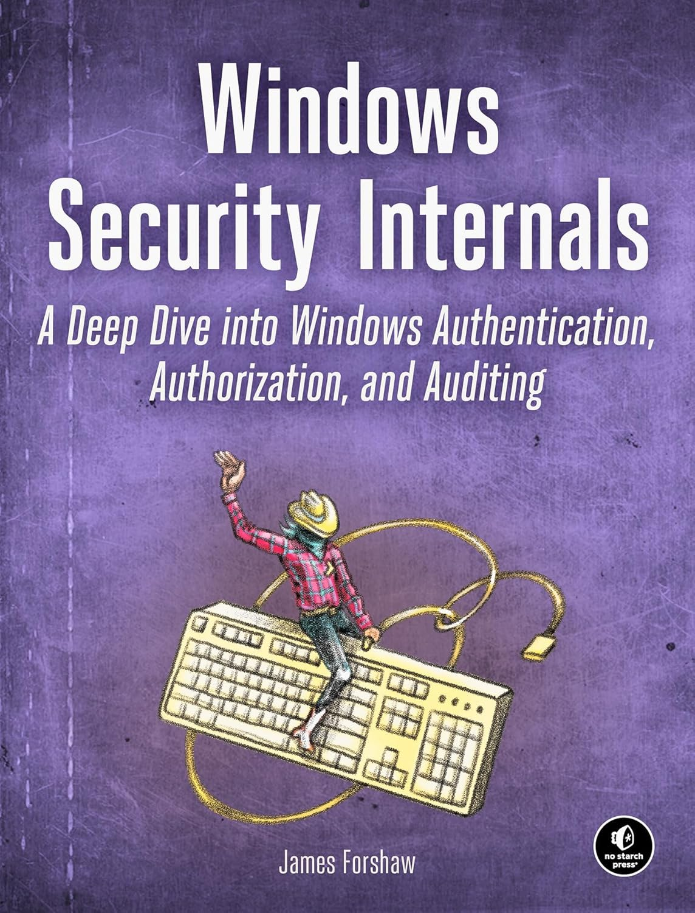
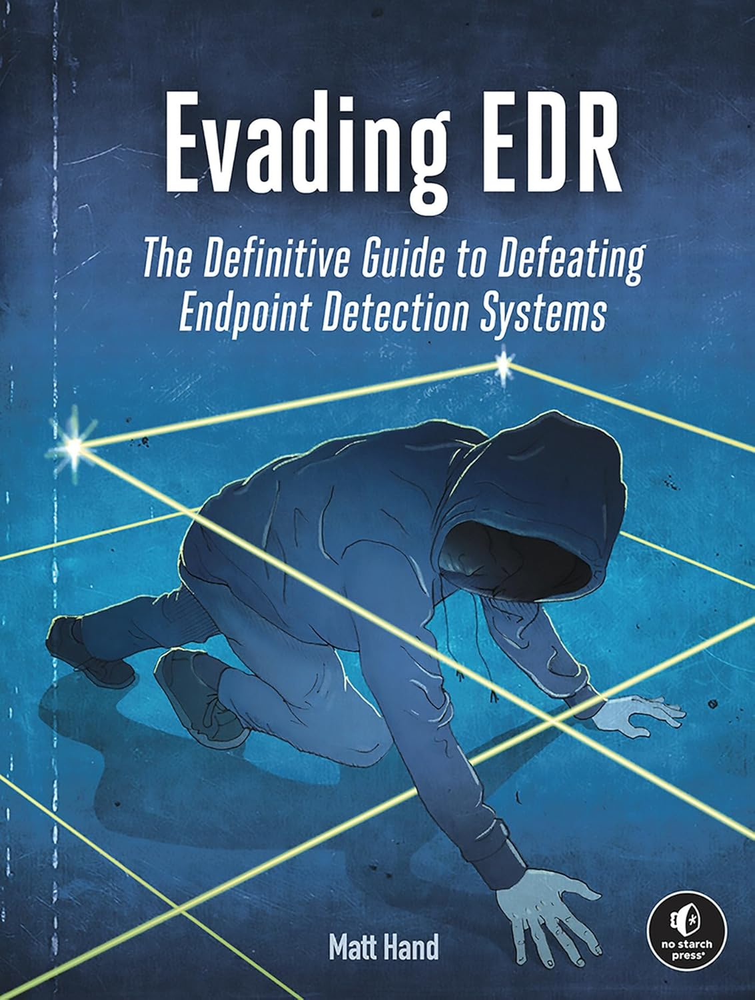

# Intro : Threathunting Academy - EVASION

Welcome to the **"Threathunting Academy - Evasion"**  this is the official lab guide that will guide you through the infrastructure. Students will all have their own **Windows 10 client machine**, a shared central `Domain Controller` and a **Kali** `Red Team server and Forensics machine`. All logs are centrally collected on and Ubuntu server running Elasticsearch and Kibana.

**What you will learn in this training:**

- How attack frameworks work
- AV and EDR internals and how to evade them
  - Windows Defender, AMSI and ETW basics and evasion
- Powershell based attacks (in-memory) 
- How signature based detection works and how to evade
- What Shellcode is, how to build and use shellcode
- Build your own evasive shellcode loader
- Build your own Forensics Lab

> In this training we'll be using an ***Administrator*** account, this training is not about privilege escalation, but to show you how you can elevate a regular user to an Admin/System user, we'll have a brief lab doing just that.

With that out of the way we'll run all other labs with and admin user.

**At the End of this training**
- You will know how to set up your own malware analysis lab
- Have learned how privilege escalation, persistence, code-execution, evasion and other tehniques work.
- Modify existing attack tools to bypass defenses
- Learn how to analyze malware (static/dynamic)
- Work with attack frameworks, customize them with your own toolset and apply evasion techniques
- Build your own evasive `shellcode loader` using memory injection, remote payloads, obfuscation, encryption and other evasion techniques
- Understand how AV/EDR solutions work, where their telemetry comes from and how to bypass

# INSERT MITRE GRAPH HERE

# Detection, Forensics and Incident Response

1. Windows Event Logs
2. Sysmon
3. ETW
4. Multiple binary forensic tools (static/dynamic)
5. Incident Responce - artifact/evidence collection

# RECOMMENDED BOOKS

|  |  |
| :-------------------------------: | :-------------------------------: |

<table>
  <tr>
    <td align="center" style="background: #fff;">
      
    </td>
    <td align="center" style="background: #fff;">
      
    </td>
  </tr>
</table>