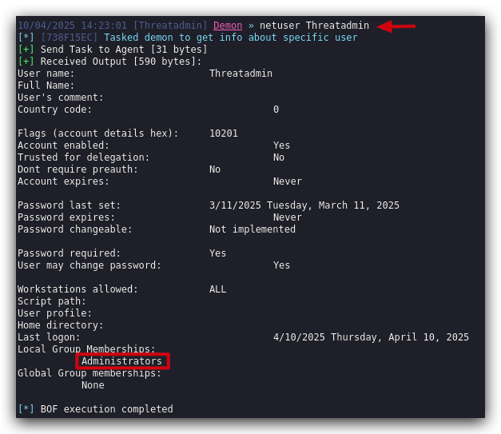
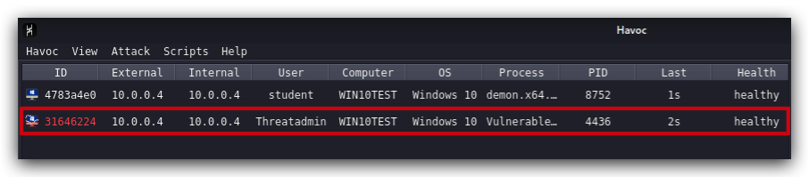

# Lab - PrivEsc


> IMPORTANT : Make sure Windows Defender is turned OFF!!!

First of all, we need to find if there are any misconfigurations on the Windows victime - we can use several tools.

- WinPeas
- SharpUp
- PowerUp 

In our Havoc client let's generate a new payload, but this time a windows service that we can drop in the directory of the vulnerable service:


```
dotnet inline-execute /opt/havoc/tools/SharpUp.exe audit UnquotedServicePath
```


We now know there's a service that we can abuse for executing a payload, but does it also run with higher privileges as the current user? Remember we want to escalate our privileges. Let's find out.

We can do this with some simple native windows commands, first check which account this service runs with.

```powershell
sc query vulnservice
```


Then let's see which privileges this `Threatadmin` user has (i.e. member of the Administrators group).

```powershell
net localgroup "Administrators" | find "Threatadmin"
```


In Havoc we can use these commands as well by using the `SHELL` command - this executes cmd.exe commands and gets the output:


and


However, HAVOC has plenty of build-in commands we can use and that are more opsec safe, these commands typically use BOF's (Beacon Object Files).

> ***DEFINITION***: 
> 
> A BOF is a `position-independent code` file, typically in the Common Object File Format (COFF), generated by a ***C*** compiler. It is not a standalone executable but rather a lightweight module that runs `within the memory` space of a Beacon process. BOFs allow developers to add new post-exploitation features or capabilities to the Beacon agent without requiring a separate process creation or injection, which can be noisy and detectable by security tools.

> ***ADVANTAGES***:
>  - BOFs have a minimal footprint (often less than 3KB, compared to larger files like Reflective DLLs or .NET assemblies), making them harder to detect by antivirus (AV) or endpoint detection and response (EDR) systems.
> - They run in-memory within the Beacon process, avoiding disk writes or process creation, which reduces their visibility. They use internal Beacon APIs and limited Windows APIs. This in-process execution contrasts with traditional methods like fork-and-run, which create new processes and are more likely to trigger security alerts.

> ***LIMITATIONS***
> - BOFs are *not* suited for `large or long-running tasks`. They lack support for complex linking (e.g., no .bss section for global variables) and are best for quick, one-off commands.

<https://hstechdocs.helpsystems.com/manuals/cobaltstrike/current/userguide/content/topics/beacon-object-files_main.htm>

We can use BOF's for enumerating the vulnerable service, just like we did before, and finding out if the service account is privieleged or not:




So now we know we have a service on the system that has an unquoted service path, the directory is writeable by regular users (in real scenarios the c:\users\username\appdata folder is a common location that unprivileged users have full access to), and the acoount being used is privileged.

Let's see what happens if we drop our havoc service payload (havoc.x64svc.exe) in the "c:\Myprograms\" directory, and rename it to Vulnerable.exe.

We can do this with HAVOC:


If we have a look on our windows machine we can see the malicious service executable was dropped in the "C:\MyPrograms" folder. Now whenever this services (re-)starts, it will execute our havoc payload instead of the actual service. 

Instead of rebooting our Windows machine, let's just start the service manually (this requires admin privileges)and see what happens, open a command prompt:

```powershell
sc start vulnservice
```



We can see a new demon spawned, under the Threatadmin account, let's check our privileges by interacting with out new session, using the command `whoami`:

```
whoami
```

We can now see that we are running a new demon, with an admin account and our process is running in `HIGH` integrity (services that run with privileged acounts always run in high integrity by the way).

