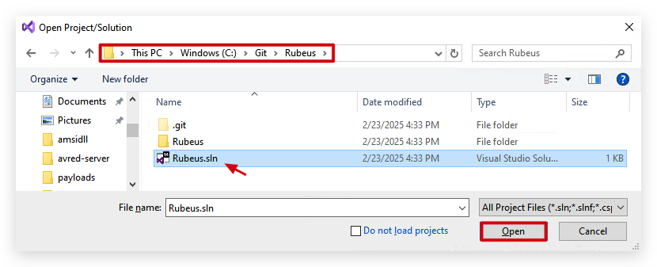
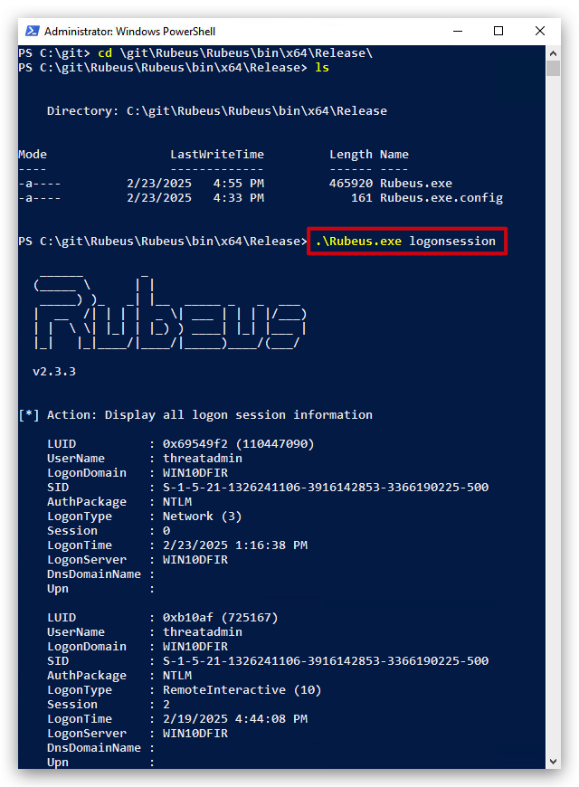
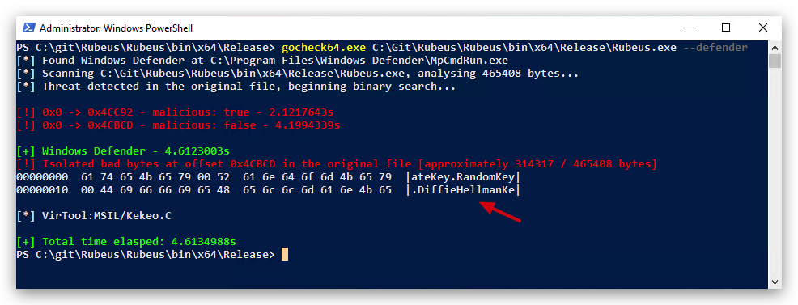
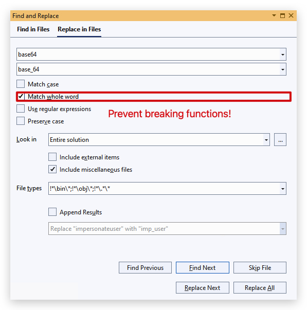

# Lab Static Analysis

<style>
r { color: Red }
o { color: Orange }
g { color: Green }
</style>

> ***IMPORTANT*** : Please do not send submit samples to <r>Virus Total</r> or any other public virus-scanning services, unless specifically instructed. We don't want to burn our payloads for this training.
> **Make sure at all times that sample submussion in Microsoft Defender is `turned off`, and if for some reason you get prompted to submit a sample, deny the request.**


Let's take a common attack tool "Rubeus", compile it and see what Defender thinks of it.

<https://www.youtube.com/watch?v=sP2XH8YI20c&t=1042s>

<https://github.com/GhostPack/Rubeus.git>

https://github.com/gatariee/gocheck/releases

On your windows machine:

```powershell
cd git
git clone https://github.com/GhostPack/Rubeus.git
```


Let's compile this with <mark>Visual Studio 2022</mark>


Browse to your Rubeus solution file (C:\git\Rubeus)



select the Program.cs file on the right side in your `Solution Explorer`


In order to compile let's change "debug" to "release" and compile as a x64 bit application. Click on "Configuration Manager", 


Save the project, and let's compile (build).


Let's see if it works by running rubeus with a simple command:



If we copy the file to our "C:\\" directory, we'll see that Defender immediately detects it as malicious!!!


> ***HINT :*** Defender didn't detect this as malicious when we compiled it since we made some ,<mark>exclusions</mark> ("C:\Git", "C:\Temp", "C:\Desktop", ...) in Defender to avoid scanning those directories, you can check the exclusions with the following powershell command:

```powershell
Get-MpPreference | Select-Object -ExpandProperty ExclusionPath
```

So now what, how did Defender exactly detect this file as malicious, as we can see it was scanned upon being written to disk - this is static (signature based detection), we'll need to make some changes to our source code to bypass these signatures.

We'll use ***GoCheck*** (based of DefenderCheck and ThreatCheck) to analyze our rubeus file.

Open a new powershell prompt and type the following command:

```powershell
gocheck64.exe C:\Git\Rubeus\Rubeus\bin\x64\Release\Rubeus.exe --defender
```


We can see exactly which strings has caused Defender to detect this as malicious, <mark>ticket</mark>. So all we have to do is go back to our Visual Studio source code and find/replace all TICKET strings by something else, i.e. "***token***".


Make sure you select the "Look in" to ***Entire Solution***, and click "Replace All".


We can see 1294 References have been renamed. Save the file and let's `REBUILD` the solution. 


And now we'll scan it with GoCheck again:

```powershell
gocheck64.exe C:\Git\Rubeus\Rubeus\bin\x64\Release\Rubeus.exe --defender
```



We can see there old detection for TICKET is gone, but we have a new one: <mark>DiffieHellmanKey</mark>, alright let's fix that one, just like we did before.

Open Find/Replace and change DiffieHellmanKey to "***dhkey***". Save the project, rebuild and let's scan again with GoCheck (it should replace 12 occurrences).


**Another hit :** <mark>impersonateuser</mark>,  we'll replace this with "***impuser***". (it should replace 7 occurrences). Save the file and let's `REBUILD` the solution, and scan again with GoCheck.

```powershell
gocheck64.exe C:\Git\Rubeus\Rubeus\bin\x64\Release\Rubeus.exe --defender
```


**Another one?** Now defender seems to dislike <mark>base64</mark>. We need to be careful with replacing this as there are functions using base64 as part of the name (i.e. Frombase64String). Let's replace this with ***base_64***, but selecting "match word" to avoid renaming functions and breaking our application. (it should replace 78 occurrences)



Save the file and let's `REBUILD` the solution, and scan again with GoCheck.


Tadaa!!!! Victory!!! No more detections, we can now drop the clean rubeus file to our "C:\\" drive and defender won't detect it. Let's try:


------

https://github.com/Matthew-IE/XObfuscator.git
add to Havoc C2


strings, threatcheck, gocheck, floss, yara

C:\Temp>gocheck64.exe C:\Git\Rubeus\Rubeus\bin\x64\Release\Rubeus.exe --defender
c:\Git\ThreatCheck\ThreatCheck\bin\x64\Release>ThreatCheck.exe -f C:\Git\Rubeus\Rubeus\bin\x64\Release\Rubeus.exe


-----
# Notes
install code 

install sdk (<https://dotnet.microsoft.com/en-us/download/dotnet/thank-you/sdk-9.0.201-windows-x64-installer>)

install C# Dev Kit and .NET Install Tool extensions from the VS Code marketplace.


How to make a new project:

```csharp
dotnet new console -n MyApp
cd MyApp
dotnet build
dotnet run
```

> INCLUDE SCREENSHOT of CLR info of sharkpatz/rubeus
> SHOW dotpeek - disadvantages of C#
>
