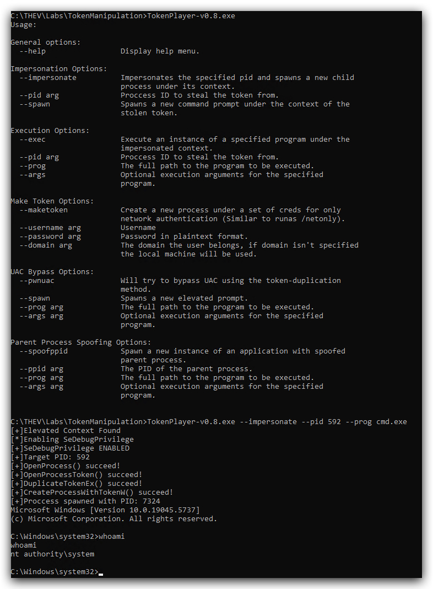
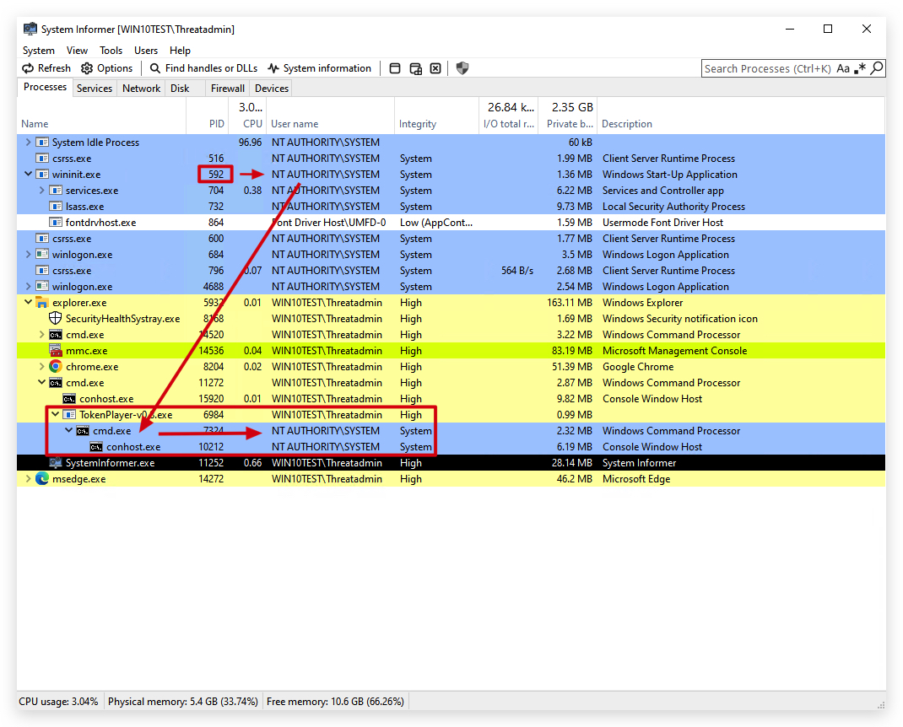

# Lab - Token theft

Adversaries may modify access tokens to operate under a different user or system security context to perform actions and bypass access controls. Windows uses access tokens to determine the ownership of a running process. A user can manipulate access tokens to make a running process appear as though it is the child of a different process or belongs to someone other than the user that started the process. When this occurs, the process also takes on the security context associated with the new token.

An adversary can use built-in Windows API functions to copy access tokens from existing processes; this is known as token stealing. These token can then be applied to an existing process (i.e. Token Impersonation/Theft) or used to spawn a new process (i.e. Create Process with Token). An adversary must already be in a privileged user context (i.e. administrator) to steal a token. However, adversaries commonly use token stealing to elevate their security context from the administrator level to the SYSTEM level. An adversary can then use a token to authenticate to a remote system as the account for that token if the account has appropriate permissions on the remote system.

Any standard user can use the runas command, and the Windows API functions, to create impersonation tokens; it does not require access to an administrator account. There are also other mechanisms, such as Active Directory fields, that can be used to modify access tokens.

> PRIVILEGES NEEDED:
> 1. High Integrity
> 2. SeDebugPrivilege
> 3. SeImpersonateUser
> 4. AdjustTokenPrivileges

1. <https://github.com/S1ckB0y1337/TokenPlayer>
2. <https://github.com/0xbadjuju/Tokenvator>

```git
git clone --recursive https://github.com/0xbadjuju/Tokenvator.git
Tokenvator.exe GetSystem /Process:3016 /command:'cmd.exe
```



