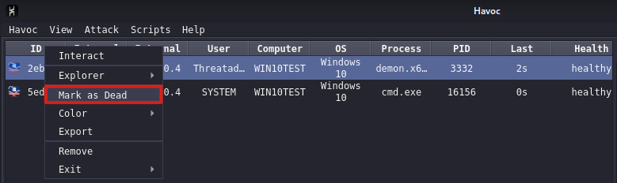
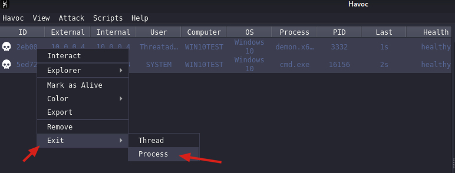
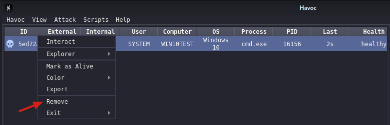
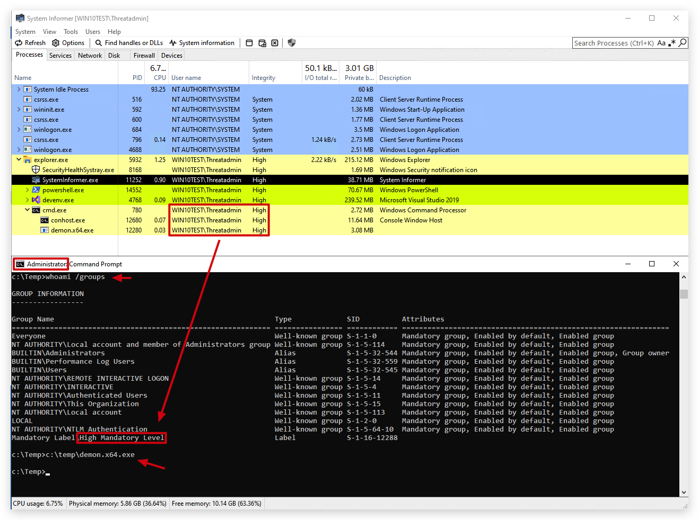
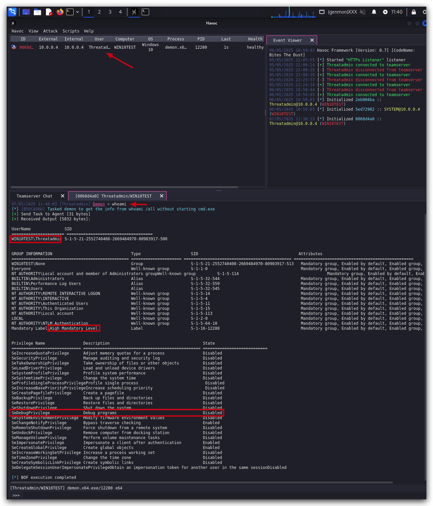
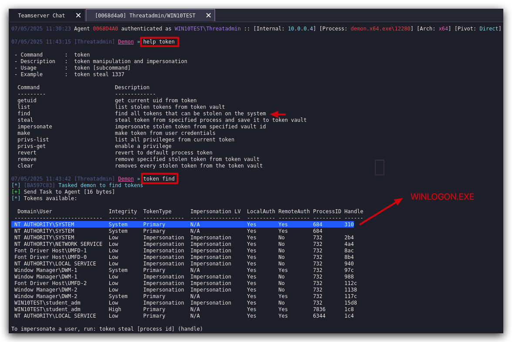
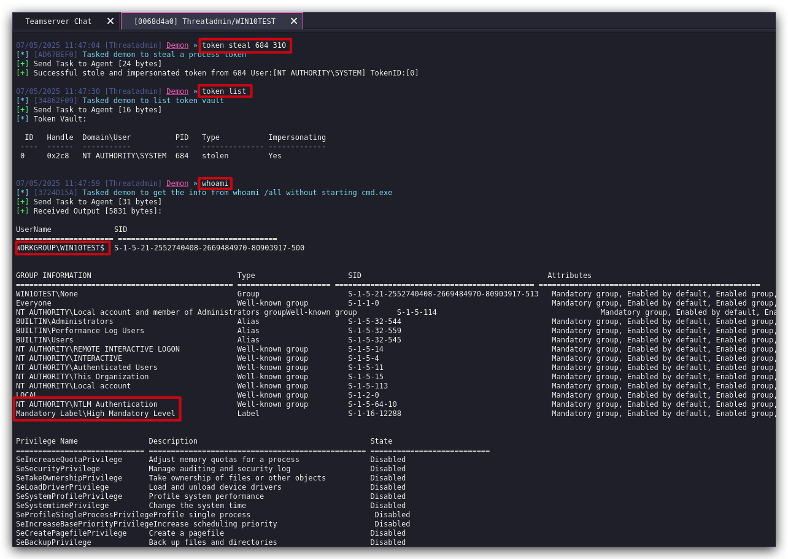
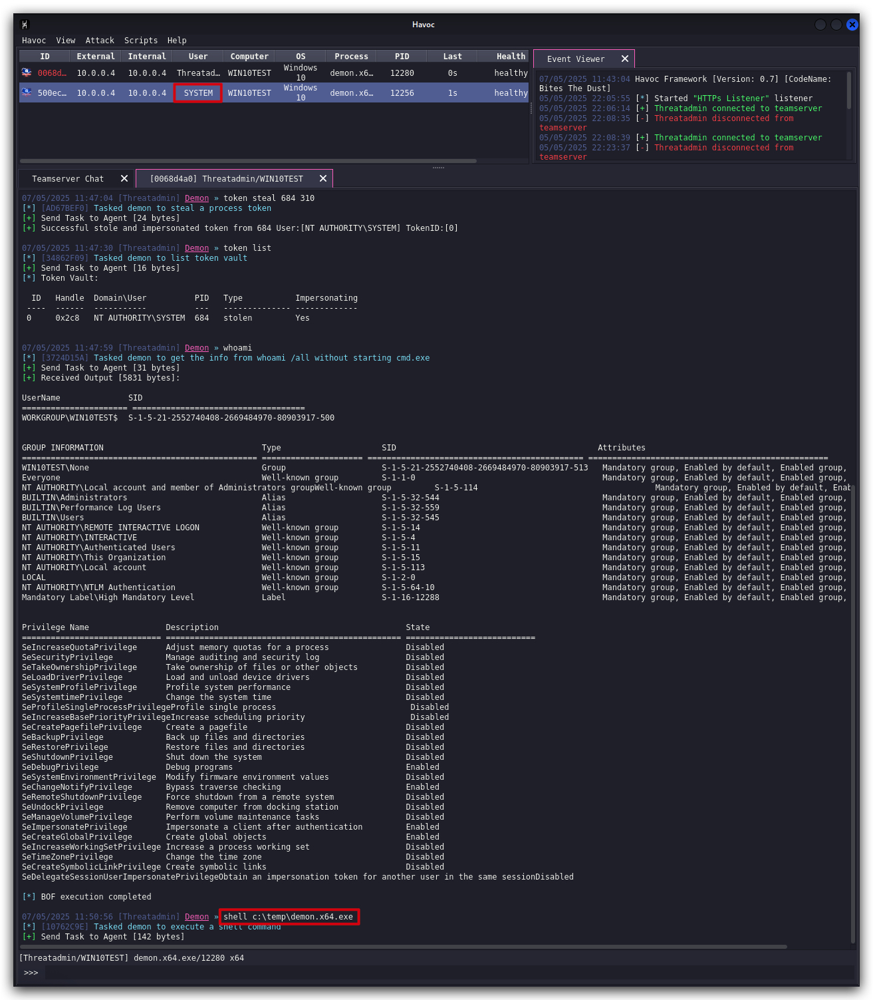

# Lab - Token theft
## Access Token Theft: Table Summary

| **Category**               | **Details**                                                                                                           |
| -------------------------- | --------------------------------------------------------------------------------------------------------------------- |
| **Threat**                 | Access token theft for privilege escalation and impersonation of SYSTEM-level accounts                                |
| **MITRE ATT&CK**           | T1134 – Access Token Manipulation                                                                                     |
| **Common APIs Used**       | `OpenProcess()`, `OpenProcessToken()`, `ImpersonateLoggedOnUser()`, `DuplicateTokenEx()`, `CreateProcessWithTokenW()` |
| **Typical Target Process** | `winlogon.exe` (commonly abused for SYSTEM token impersonation)                                                       |
| **Alternative Targets**    | `services.exe`, `lsass.exe`, `smss.exe`, `csrss.exe`                                                                  |
| **Why SYSTEM Tokens?**     | SYSTEM retains powerful privileges (e.g., `SeDebugPrivilege`) even when restricted for local admins                   |
| **Detection Challenge**    | Over-reliance on monitoring `winlogon.exe` can overlook token theft using other SYSTEM processes                      |
| **Defensive Actions**      | - Audit all SYSTEM processes<br>- Enforce least privilege<br>- Deploy security tooling<br>- Educate users             |

<https://specterops.io/wp-content/uploads/sites/3/2022/06/A_Process_is_No_One.pdf>

> ***MITIGATION***: The `SeDebugPrivilege` can be removed from the local administrator group (by using Group policies) to make it harder for an attacker to dump credentials or interact with memory of other processes. However, **privileges cannot be revoked** from the `SYSTEM account` as they are necessary for the operating system to run. This makes SYSTEM access tokens extremely valuable for attackers in hardened environments. 

> PRIVILEGES NEEDED:
> 1. `High Integrity` -> this is needed to access process running in HIGH integrity (i.e. `NT AUTHORITY/SYSTEM`)
> 2. SeDebugPrivilege
> 3. SeImpersonateUser
> 4. AdjustTokenPrivileges

1. <https://github.com/S1ckB0y1337/TokenPlayer>
2. <https://github.com/0xbadjuju/Tokenvator>

```git
git clone --recursive https://github.com/0xbadjuju/Tokenvator.git
Tokenvator.exe GetSystem /Process:3016 /command:'cmd.exe
```


---

Let's see if we can use our HAVOC demon implant to escalate our privileges from Admin (we'll start with high integrity here as we have already demonstrated how we can get there) to NT AUTHORITY. First clean up all your current implants by selecting each one and marking them as `dead` , `EXIT PROCESS` and finally `remove` the implant from our GUI.







Now let's start a new demon implant running with Threatadmin, this will automatically spawn a new session in high integrity.

Open a command prompt and type the following

```powershell
whoami /groups
c:\temp\demon.x64.exe
```


We'll see a new session spawn in our Havoc GUI, let's interact with it using the `TOKEN` module and do a `whoami` to check our privileges.









