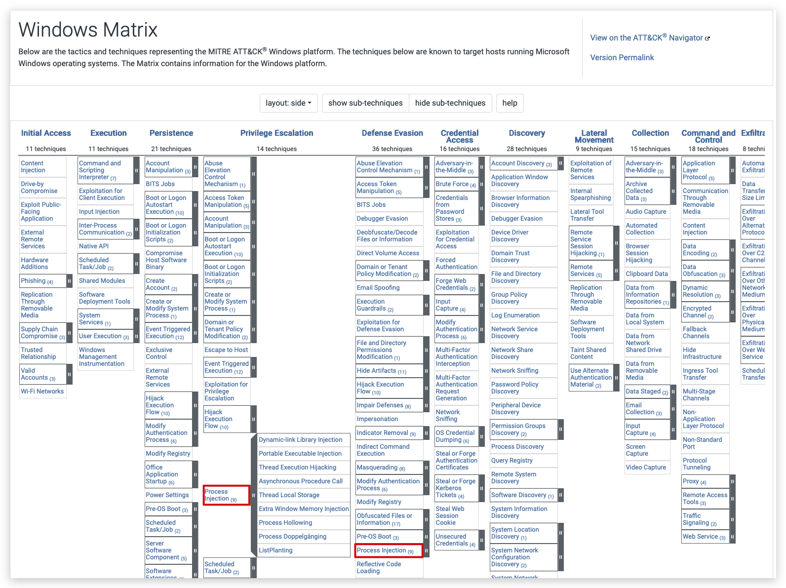

# Lab - Injection
## SUMMARY
Adversaries may inject code into processes in order to evade process-based defenses as well as possibly elevate privileges. Process injection is a method of executing arbitrary code in the address space of a separate live process. Running code in the context of another process may allow access to the process's memory, system/network resources, and possibly elevated privileges. Execution via process injection may also evade detection from security products since the execution is masked under a legitimate process.

There are many different ways to inject code into a process, many of which abuse legitimate functionalities. These implementations exist for every major OS but are typically platform specific.

More sophisticated samples may perform multiple process injections to segment modules and further evade detection, utilizing named pipes or other inter-process communication (IPC) mechanisms as a communication channel.

## MITRE


```powershell
shellcode inject x64 <PID with System privs> /opt/havoc/payloads/demon.x64.bin
```