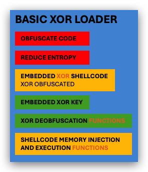
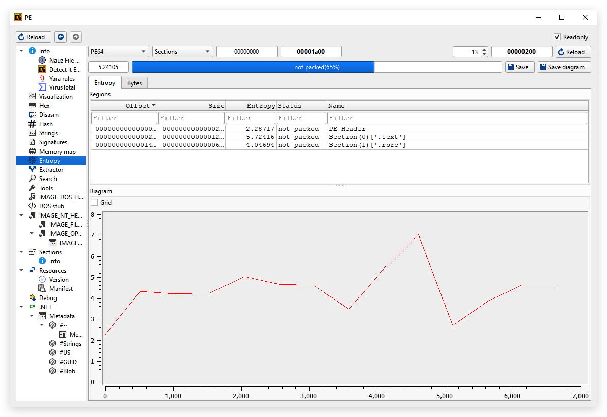
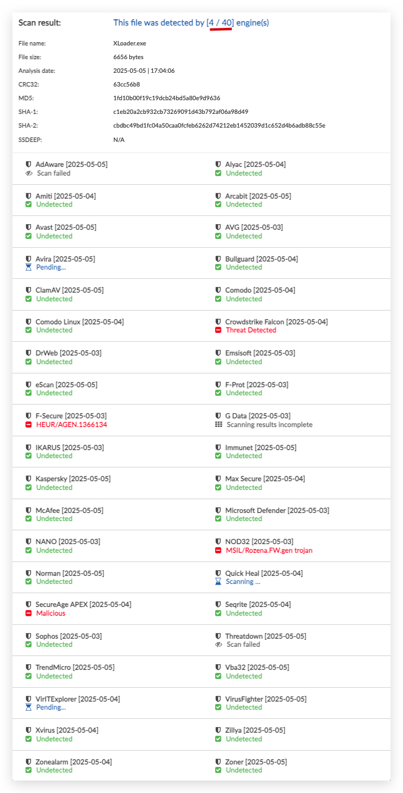

# Lab - XOR Loader

<style>
r { color: Red }
o { color: Orange }
g { color: Green }
</style>

> ***IMPORTANT*** : Please do not send submit samples to <r>Virus Total</r> or any other public virus-scanning services, unless specifically instructed. We don't want to burn our payloads for this training.
> **Make sure at all times that sample submussion in Microsoft Defender is `turned off`, and if for some reason you get prompted to submit a sample, deny the request.**

Let's make our loader more evasive by encoding our payload with XOR.

1. Create a raw payload that pops up a messagebox, and host it on our kali machine.

```bash
cd /opt/msf/payloads
msfvenom -a x64 --platform windows -p windows/x64/messagebox TEXT="Successful Execution :)" TITLE="CrimsonCORE"  -f raw -b '\x00\x0a\x0d\x20' -o rawmsgbox.bin
updog2
```

2. Let's download the payload and encode it XOR, and convert it to a csharp array we can use in our loader


# ENTROPY

> ***ENTROPY*** 
> *DEFINITION*: Entropy indicates the randomness within a data set. Higher entropy inidcates higher randomness.
> Files with high entropy (>7.5) are typically blocked by AV/EDR when touching the disk.



Let's check the entropy of our XORLoader. We can use sigcheck from the `systeminternals suite`.

```powershell
sigcheck64.exe -a -h .\XLoader.exe
```

or 

```powershell
sigcheck64.exe -a XLoader.exe | FINDSTR /I entropy
```


Our Entropy here is "5" - which is pretty low and shouldn't flag AV/EDR.




- LOGIC.NET / BABEL

# Fixing Entropy
- <https://github.com/gmh5225/shellcode-EntropyFix>
- <https://github.com/AnErrupTion/LoGiC.NET>
-<https://www.youtube.com/watch?v=Q2vazB6SYfg&t=4042s>


# KLEENSCAN
<https://kleenscan.com/scan_result/f76da10390c0a2c03755cde6f26a242c525589e15534c60d612a62aa27d2c9d9>




# LAZYSIGN + TIMESTOMP
<https://captmeelo.com//redteam/maldev/2022/11/07/cloning-signing.html>
