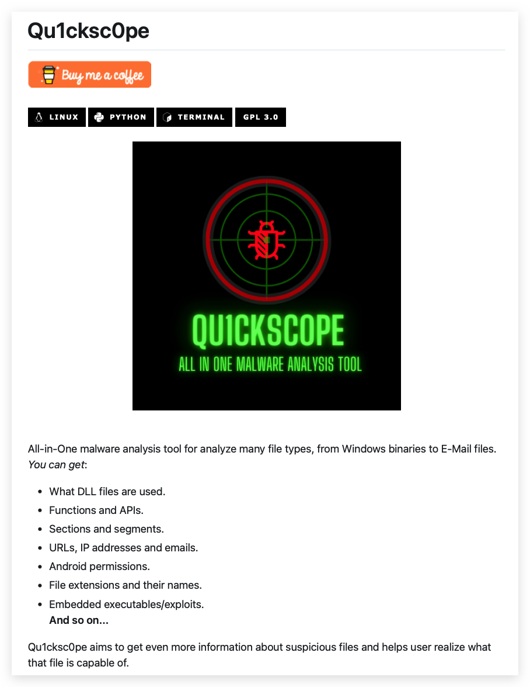
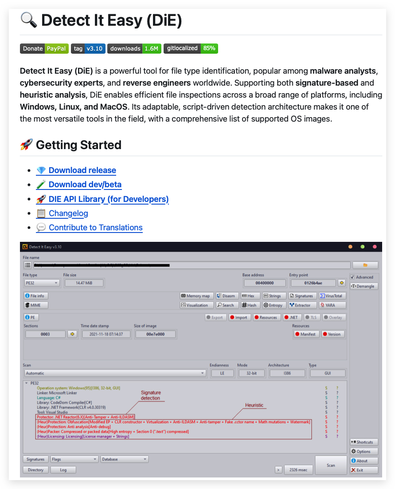
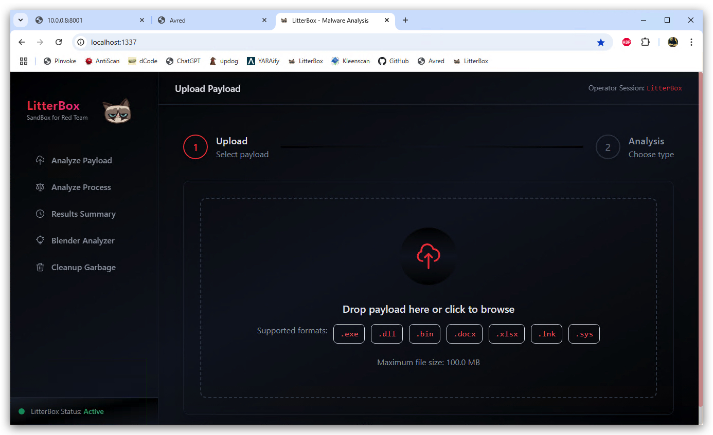

# Litterbox / Avred (Forensics)

## 1. Qu1ckSc0pe
<https://github.com/CYB3RMX/Qu1cksc0pe>



## 2. Detect it Easy

<https://github.com/horsicq/Detect-It-Easy/>



## 3. Litterbox

Install Python 3.x

```powershell
cd git
git clone https://github.com/BlackSnufkin/LitterBox.git
cd LitterBox
pip install -r requirements.txt
```

Run the server manually:

```powershell
python litterbox.py
```
Browse to the server GUI (from windows or Kali)
<http:\\localhost:1337>



Or install as a service:

```
nssm install Litterbox "C:\\Users\\threatadmin\\AppData\\Local\\Programs\\Python\\Python312\\python.exe" "C:\\git\\litterbox\\litterbox.py"
nssm set Litterbox AppDirectory "C:\\git\\litterbox\\"
nssm.exe start litterbox
```

----

## 4. Procdump

```powershell
procdump -ma [Name or PID]
```

## 5. AUTORUNS (SYSINTERNALS)
<https://learn.microsoft.com/en-us/sysinternals/downloads/autoruns>

## DNSpy / Dotpeek
<https://dnspy.org>

<https://www.jetbrains.com/decompiler/download/#section=web-installer>

## Strings, dumpbin, Elex, Yara, PEStudio

## Velociraptor