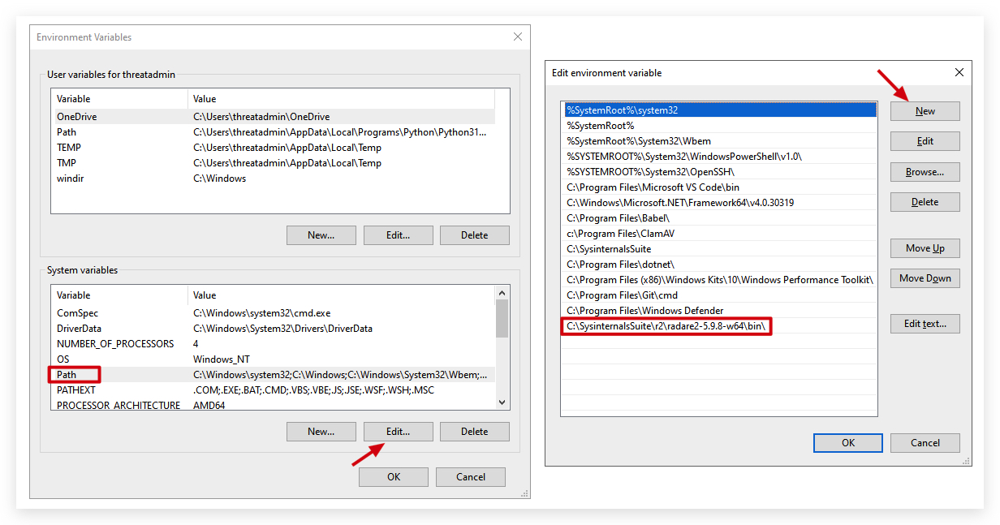
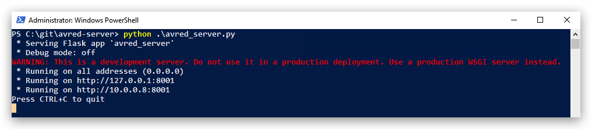
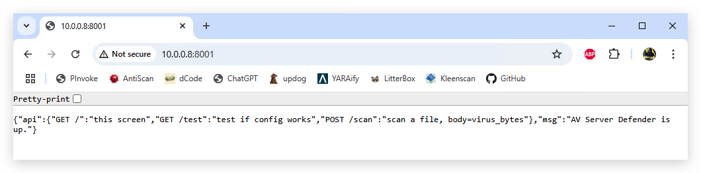
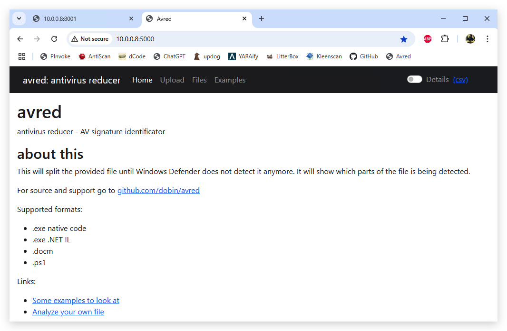

# Litterbox / Avred (Forensics)

## 0. Qu1ckSc0pe

## 1. AVRed-Server
> This is the scanning engine that sends requests to the antivirus API configured, in our training that is "Defender".

Pre-requisites : AVRed uses Radare2 so let's first install that on our windows machine and add it to the path.

<https://github.com/radareorg/radare2/releases/download/5.9.8/radare2-5.9.8-w64.zip>



***On windows:***

```powershell
cd c:\git
git clone hhttps://github.com/dobin/avred-server.git
cd avred-server
pip install  -r requirements.txt
```

Edit the config.yaml file

```yaml
{
	"bind_ip": "0.0.0.",
	"port": 8001,
	"engine": "Amsi"
}
```



On your windows machine browse to the link:

<http:\\localhost:8001>




OPTIONALLY - Install as service with NSSM

<https://nssm.cc/ci/nssm-2.24-103-gdee49fc.zip>

```powershell
where python.exe
C:\Users\threatadmin\AppData\Local\Programs\Python\Python312\python.exe
C:\Users\threatadmin\AppData\Local\Microsoft\WindowsApps\python.exe
```

```powershell
nssm install AvredServer"C:\\Users\\threatadmin\\AppData\\Local\\Programs\\Python\\Python312\\python.exe" "C:\\git\\avred-server\\avred_server.py"
nssm set AvredTest AppDirectory "C:\\git\\avred-server\\"
nssm.exe start AvredServer
```
## 2. AVred

> AVRed is the webgui that allows us to submit samples to the AVRed-Server, that then talks to the configured Antivirus API.

```powershell
cd git
git clone https://github.com/dobin/avred.git
pip install -R requirements.txt
```

Edit the config.yaml

```yaml
server:
  Amsi: "http://localhost:8001/"
password: ""
hashCache: True
WebMaxFileSizeMb: 50
```

run a scan from commandline
```powershell
python3 avred.py -f app/upload/meterpreter.exe 
```


Run the (GUI) server (this is running on your KALI machine)
```bash
python3 avredweb.py
```

Browse to the server GUI (from windows or Kali)
<http:\\localhost:5000>



Install as a service with NSSM

```
nssm install AvredWeb "C:\\Users\\threatadmin\\AppData\\Local\\Programs\\Python\\Python312\\python.exe" "C:\\git\\avred\\avredweb.py"
nssm set AvredWeb AppDirectory "C:\\git\\avred\\"
nssm.exe start AvredWeb
```

-----

# Litterbox

```powershell
cd git
git clone https://github.com/BlackSnufkin/LitterBox.git
cd LitterBox
pip install -r requirements.txt
```

Run the server manually:

```powershell
python litterbox.py
```
Browse to the server GUI (from windows or Kali)
<http:\\localhost:1337>


Or install as a service:

```
nssm install Litterbox "C:\\Users\\threatadmin\\AppData\\Local\\Programs\\Python\\Python312\\python.exe" "C:\\git\\litterbox\\litterbox.py"
nssm set Litterbox AppDirectory "C:\\git\\litterbox\\"
nssm.exe start litterbox
```

----
# BestEDROfTheMarket
<https://github.com/Xacone/BestEdrOfTheMarket>