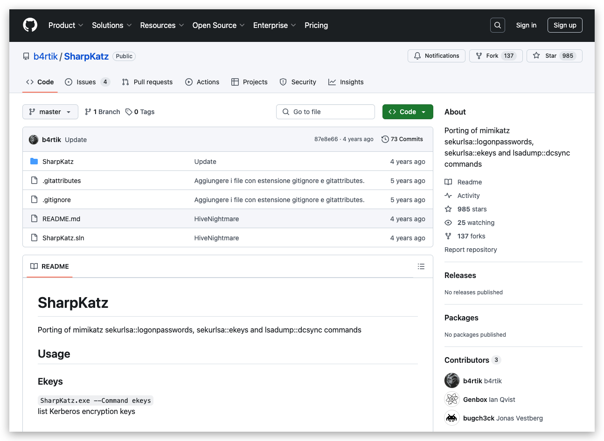

# Chapter 0.0 - LSASS Dumping

One of the most common techniques used by adversaries is LSASS dumping, blahblah

Local Security Authority (LSA) is protected subsystem that authenticates and logs users onto the local system. In previous versions of Windows (before Windows 10 and Server 2016), LSA stored secrets used by the operating system in its process memory. As discussed above, when hackers compromise operating system, they can get access to process memory leading to credential theft and lateral theft.

Mitre: T1003.001 - "OS Credential Dumping: LSASS Memory" 
--
- source: ***[https://attack.mitre.org/techniques/T1003/](https://attack.mitre.org/techniques/T1003/)***

>Credential dumping is the process of obtaining account login and password information, normally in the form of a hash or a clear text password, from the operating system and software. Credentials can then be used to perform Lateral Movement and access restricted information.


# CredentialGuard

Credential guard uses virtualization-based security and creates a new component LSA Isolated to store all secrets that the operating system cannot access directly so that even if hackers compromise the system, they cannot do credential theft. Once Credential guard is configured,  LSA process (LSASS) runs in the operating system, and additional instance of LSA (LSAIso – which stands for LSA Isolated) is created. LSA connects to LSA Isolated using RPC. This is to allow all of the standard calls to LSA to still succeed, offering backwards compatibility for services or applications that require direct communication with LSA.


# CredentialGuard - things to know

Credential Guard requirement

Operating System – Windows 10 Enterprise, Windows 10 Education, Windows Server 2016, and Windows 10 IoT Enterprise.

Credential Guard is supported for Hyper-V virtual machine.

Enabling Credential Guard on `domain controllers` is ***not supported***.


# Mimikatz/SharpKatz

Most heavily signatured binary in the world.

https://github.com/gentilkiwi/


  >**LSASS** [Memory] : The Local Security Authority Subsystem Service (LSASS) handles the enforcement of security policy in a Windows host. In Windows environments from 2000 to Server 2008 the memory of the LSASS process was storing passwords in clear-text to support WDigest and SSP authentication. 

Credentials are stored in LSASS when:

1. a user logs on locally to the system
2. you use runas and provide credentials
3. an RDP connection is established

Microsoft from Windows 8.1 and Windows Server 2012 enhanced security by **preventing LSASS from storing passwords in clear-text**. However in a system that has been already compromised with elevated credentials a minor registry modification can instruct LSASS process to store clear-text passwords in its memory in the next login of the user


```code
reg add "HKEY_LOCAL_MACHINE\SYSTEM\CurrentControlSet\Control\SecurityProviders\WDigest" /v UseLogonCredential /t REG_DWORD /d 00000001 /f
```

>Don't forget to log out and in again.

 

If you now run Mimikatz.exe, you'll see clear-text credentials in memory again. Even on Windows 10 - maybe that's a registry key we want to keep an eye on with Sysmon ;-) ?

 


***SHARPKATZ***

.net implementation of Mimikatz.




strings
lazysign
yara
threatcheck (clamav/MS Defender) folder exceptions (AMSI?)
KleenScan
IAT (pebear?)
DNSpy netpeek

Hexview/Visual Studio

NativeDump


