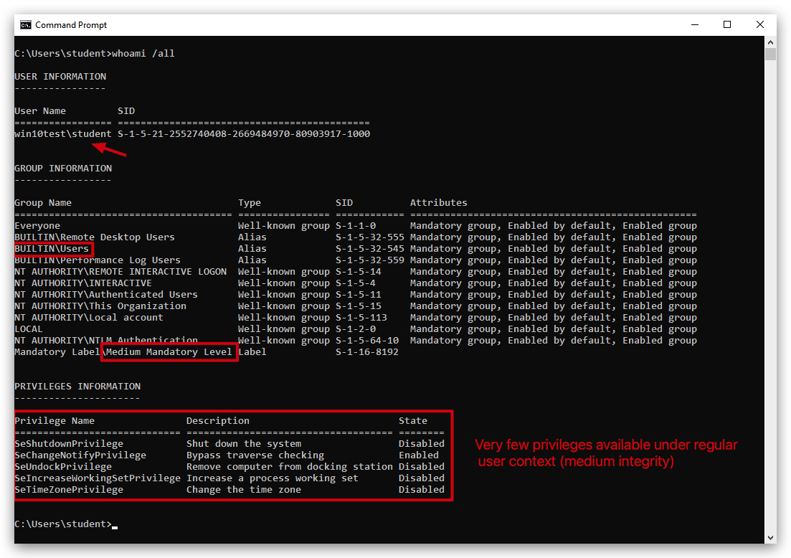
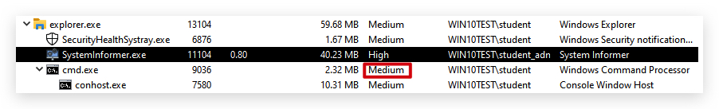
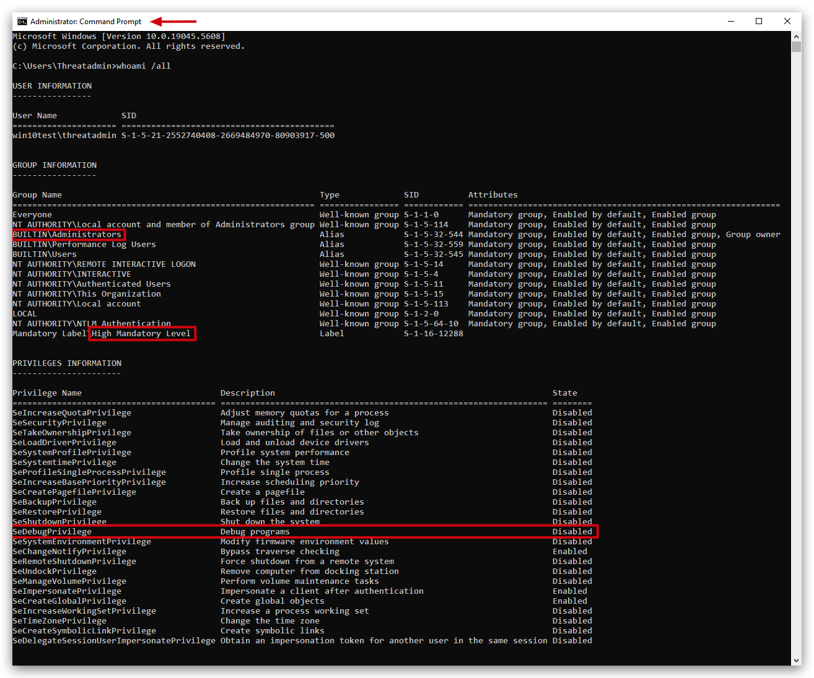
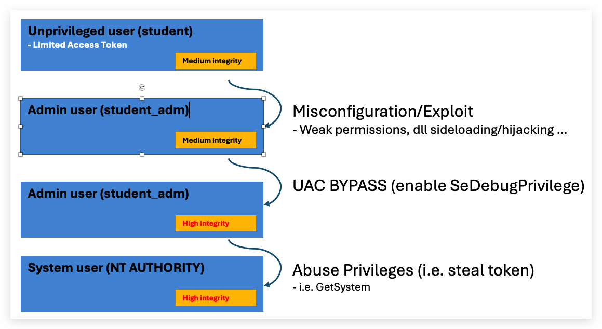

# Privilege Escalation / Persistence

In order to escalate privilege from a regular user to a higher level account (Administrator/System Authority), you need either a `misconfiguration` (typically permission issues on services, scheduled tasks etc...) or an `exploit` (Remote/Rogue/Sweet/Rotten/Juicy/God Potato etc..) - a properly patched and configured system will provide challenges to escalte privileges from a standard user to a administrator user. 

That being said, there are numerous techniques to obtain hashes/passwords, that don't requite administrator privileges - such as `kerberoasting`, `ntlm relaying` and `password spraying`.

Running as a regular unprivileged user:

Running as an administrator:

# What is SeDebugPrivilege?

SeDebugPrivilege is a special privilege in Windows that allows a user or process to debug other processes, even those running under different security contexts or with higher privileges, such as system services. This privilege is part of Windows' security model, which uses privileges to control what actions a user or process can perform on the system.

## Key Points About SeDebugPrivilege

### Purpose:
- By default, users can only debug processes they own (i.e., processes they started or are running under their user account).
- SeDebugPrivilege extends this capability, allowing a process or user with this privilege to:
  - Attach a debugger to,
  - Inspect, or
  - Modify any process on the system, including those running as other users or as the SYSTEM account (a highly privileged account in Windows).

### How It Works:
- The privilege is managed through Windows security policies and can be assigned or revoked by an administrator.
- It is typically enabled for members of the Administrators group by default on many Windows systems, but this can be changed via Group Policy Objects (GPOs) or local security policies.
- To use SeDebugPrivilege, a process must explicitly request it using Windows API functions like `LookupPrivilegeValue` and `AdjustTokenPrivileges`. This involves:
  - Obtaining a handle to the process token.
  - Enabling the privilege.

> **Default Settings**: On many Windows versions (e.g., Windows 10), it’s assigned to the `Administrators group by default`, which can be risky if not properly managed. Even with SeDebugPrivilege, some actions (like injecting into a SYSTEM process) may still fail if other security mechanisms, such as ***User Account Control (UAC)*** or additional restrictions, are in place.
> 
> **Note**: Administrators can control SeDebugPrivilege through the Local Security Policy editor (secpol.msc) or Group Policy Management Editor. It is listed under "User Rights Assignment" as "Debug programs". To enable or disable it, an administrator can modify the security policy to add or remove user groups (e.g., Administrators) from having this privilege.

Escalating from unprivileged user to ***SYSTEM*** in 3 steps:

