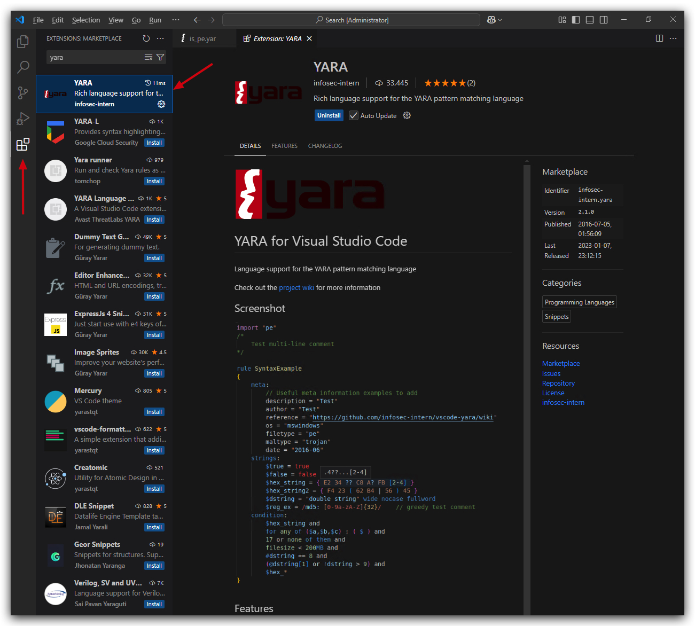

# Static Analysis

Let's take a common attack tool "Rubeus", compile it and see what Defender thinks of it.

<https://www.youtube.com/watch?v=sP2XH8YI20c&t=1042s>

<https://github.com/GhostPack/Rubeus.git>

https://github.com/gatariee/gocheck/releases

Open Visual studio and replace `ticket` by `token`


strings, threatcheck, gocheck, floss, yara

C:\Temp>gocheck64.exe C:\Git\Rubeus\Rubeus\bin\x64\Release\Rubeus.exe --defender
c:\Git\ThreatCheck\ThreatCheck\bin\x64\Release>ThreatCheck.exe -f C:\Git\Rubeus\Rubeus\bin\x64\Release\Rubeus.exe

# YARA


Let's first install YARA support in VSCODE



```yara
rule PE_Detected
{
    meta:
        description = "Detects 'MZ header'"
        author = "Peter Girnus"
            web = "https://www.petergirnus.com/blog"

    condition:
        uint16(0) == 0x5a4d
}
```

<mark>Marked text</mark>

Run strings on NativeDump
HxD or XXD on NativeDump.exe

LitterBox

threatcheck/GoCheck on rubeus (make sure defender execption is off for the folder both files are located)

Check output threatcheck/gocheck

erase with 0x00's

use visual studio find all/replace all (match word)