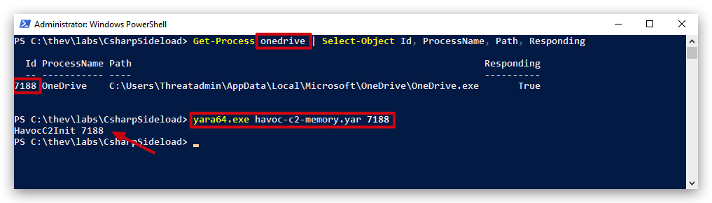
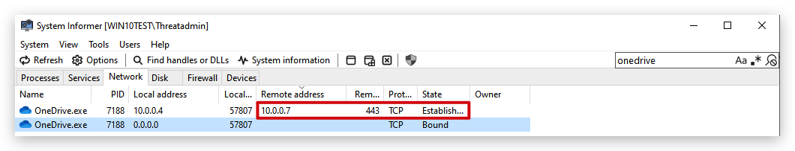
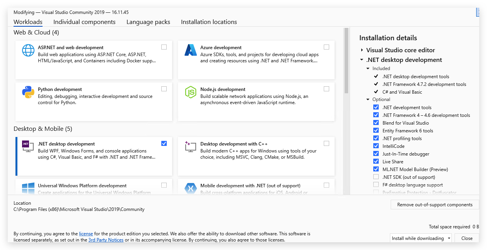

# Static Analysis


> **TL;DR** In this chapter we'll have a look at basic signature based AV evasion techniques. We'll use `strings.exe` and `yara` to explain the basic principles of pattern matching and modify existing malicious tools to bypass signature based detections.
 
## 1. Strings
---
### **What are Strings?**
- Human-readable text sequences in binary files (e.g., executables, memory dumps).
- May include URLs, IPs, commands, or error messages.

### **Forensic Uses**
1. **Malware Analysis**: Identify behavior, networks, or obfuscated text.
2. **Evidence Extraction**: Recover passwords, filenames, or memory fragments.
3. **Correlations**: Match artifacts across files/systems.
4. **Reverse Engineering**: Understand program logic or libraries used.

### **Tools**
- **Basic**: `strings.exe` command (extract text from binaries). -> Part of SysinternalsSuite
- **Advanced**: Volatility, IDA Pro, Ghidra for deeper analysis.

### **Challenges**
- **False Positives**: Some strings are irrelevant.
- **Obfuscation**: Text may be encrypted or encoded by attackers.

---

### MINI-LAB on Strings

Run strings on NativeDump
HxD or XXD on NativeDump.exe

----

## 2. YARA: A Tool for Forensics and Malware Detection

**YARA** (Yet Another Recursive Acronym) is a powerful tool used in cybersecurity to detect and classify malware by creating rules to identify patterns in files, memory, or network traffic.

### **Key Features**
- **Pattern Matching**: Scans for specific strings, hex sequences, or behaviors in files.
- **Rules-Based**: Allows defining conditions to identify malware traits.
- **Versatility**: Works on files, running processes, or memory dumps.

### **Applications**
- **Malware Detection**: Identify known malware by their unique signatures.
- **Incident Response**: Scan systems for malicious artifacts during investigations.
- **Threat Hunting**: Monitor for emerging threats across files and traffic.
- **Reverse Engineering**: Assist in analyzing malware samples and libraries.

### **Why YARA Matters**
- Highly customizable for different security needs.
- Essential for proactive threat detection and forensic investigations.

---

### MINI-LAB on YARA

Let's first install YARA support in VSCODE


```yaml
rule PE_Detected
{
    meta:
        description = "Detects 'MZ header'"
        author = "Peter Girnus"
            web = "https://www.petergirnus.com/blog"

    condition:
        uint16(0) == 0x5a4d
}
```
```powershell
yara64.exe PE_Detected.yar <target exe>
```
<mark>Marked text</mark>

### Detect Havoc C2 Payload in MEMORY

<https://www.immersivelabs.com/resources/blog/havoc-c2-framework-a-defensive-operators-guide>

```yaml
rule HavocC2Init
{

    meta:
        description = "Detects Havoc C2 Demon Init requests in memory"
        reference = "https://immersivelabs.com"
        author = "@kevthehermit"
        date = "2024-02-07"
        
    strings:
        $DEMON_INIT = { 00 00 ?? ?? de ad be ef ?? ?? ?? ?? 00 00 00 63 00 00 00 00 }

    condition:
        $DEMON_INIT
}
```


```powershell
yara64.exe havoc-c2-memory.yar 7188
```



Using System Informer we can see OneNote talking over HTTPS (TCP 443) to our Kali host (Havoc C2 Teamserver).



> TIP: We could use VELOCIRAPTOR to run a yara scan on certain files and processes!

---

LitterBox

threatcheck/GoCheck on rubeus (make sure defender execption is off for the folder both files are located)

Check output threatcheck/gocheck

erase with 0x00's

use visual studio find all/replace all (match word)


> Visual Studio `2019` Components:





> SysinternalsSuite (<https://learn.microsoft.com/en-us/sysinternals/downloads/sysinternals-suite>)
>
> GoCheck (<https://github.com/gatariee/gocheck/releases/tag/v1.5.0>)
> Move GoCheck to C:\Sysinternals
> Add c:\SysinternalsSuite to PATH
>
> Install Python3x ?
> Install Yara ? (<https://github.com/VirusTotal/yara/releases/download/v4.5.2/yara-v4.5.2-2326-win64.zip>)
> Install Yara and Hex editor plugin *VS CODE*?

```code
For Yara Download and Install Visual C++ Redistributable:
Go to the official Microsoft download page for the Visual C++ Redistributable
(,https://learn.microsoft.com/en-us/cpp/windows/latest-supported-vc-redist?view=msvc-170>)
Download and install the Visual C++ Redistributable for Visual Studio 2015, 2017, 2019, and 2022:
Visual C++ Redistributable x64
```

How to make a new project:

```csharp
dotnet new console -n MyApp
cd MyApp
dotnet build
dotnet run
```

