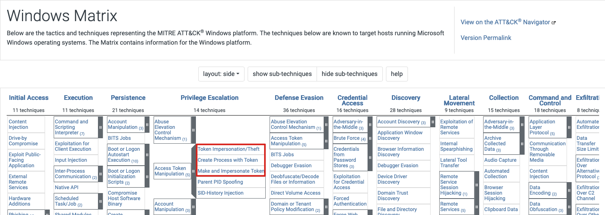
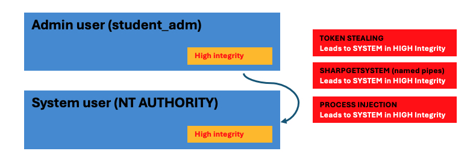
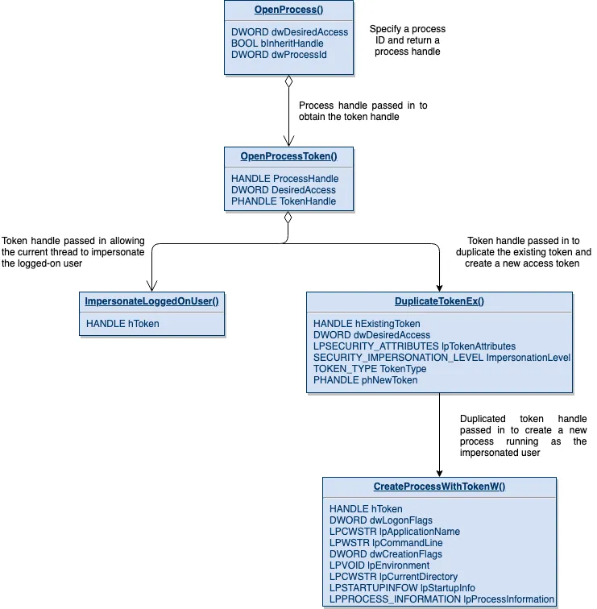

# STEALING TOKENS
<https://posts.specterops.io/understanding-and-defending-against-access-token-theft-finding-alternatives-to-winlogon-exe-80696c8a73b>
<https://gist.github.com/vector-sec/a049bf12da619d9af8f9c7dbd28d3b56>

---
# SUMMARY
Adversaries may modify access tokens to operate under a different user or system security context to perform actions and bypass access controls. Windows uses access tokens to determine the ownership of a running process. A user can manipulate access tokens to make a running process appear as though it is the child of a different process or belongs to someone other than the user that started the process. When this occurs, the process also takes on the security context associated with the new token.

An adversary can use built-in Windows API functions to copy access tokens from existing processes; this is known as token stealing. These token can then be applied to an existing process (i.e. Token Impersonation/Theft) or used to spawn a new process (i.e. Create Process with Token). An adversary must already be in a privileged user context (i.e. administrator) to steal a token. However, adversaries commonly use token stealing to elevate their security context from the administrator level to the SYSTEM level. An adversary can then use a token to authenticate to a remote system as the account for that token if the account has appropriate permissions on the remote system.

Any standard user can use the runas command, and the Windows API functions, to create impersonation tokens; it does not require access to an administrator account.

# MITRE



## Overview

Access token theft is a critical attack vector in Windows environments, allowing adversaries to impersonate high-privilege accounts such as `NT AUTHORITY\SYSTEM`. This tactic is aligned with MITRE ATT&CK technique T1134 (Access Token Manipulation). While `winlogon.exe` is a common target, focusing only on it can limit detection capabilities.



---
##  Stealing Access Tokens

Attackers use several Windows API functions to steal and manipulate access tokens:

- `OpenProcess()` – Opens a handle to a target process.
- `OpenProcessToken()` – Retrieves the access token from the process.
- `ImpersonateLoggedOnUser()` – Impersonates another user’s security context.
- `DuplicateTokenEx()` – Duplicates an existing token.
- `CreateProcessWithTokenW()` – Launches a new process with a token.

These functions enable privilege escalation and lateral movement.

---
##  Elevating to SYSTEM Privileges

Even if local admins have restricted privileges (e.g., no `SeDebugPrivilege`), SYSTEM processes retain them. By impersonating SYSTEM tokens, attackers bypass security restrictions and gain full system control.

---
##  Detection Challenges

Most defenses focus on `winlogon.exe` as the source of SYSTEM tokens. This narrow focus can miss other viable SYSTEM processes that attackers may target. Broadening monitoring scope improves detection efficacy.

---
##  Alternative SYSTEM Processes

Other SYSTEM processes that can be targeted include:

- `services.exe` – Manages system services.
- `lsass.exe` – Handles authentication.
- `smss.exe` – Session manager.
- `csrss.exe` – Manages user-mode side of the Win32 subsystem.

Monitoring these increases resilience to token theft.

---
##  Defensive Measures

- **Audit SYSTEM Processes** – Monitor for token misuse.
- **Enforce Least Privilege** – Restrict unnecessary privileges.
- **Security Tools** – Use tools that detect token-related anomalies.
- **User Education** – Train users against phishing and social engineering.

---
By understanding access token theft techniques and expanding detection beyond `winlogon.exe`, defenders can significantly improve Windows environment security.


Get-Token

The following Windows API calls can be used to steal and abuse access tokens: OpenProcess(), OpenProcessToken(), ImpersonateLoggedOnUser() , DuplicateTokenEx(), CreateProcessWithTokenW().




```
TokenPlayer-v0.8.exe --impersonate --pid 4536 --spawn
```

needs sedebugprivilege!
Admin in high integrity (UAC Bypass)

----
accesschk.exe -p -f -v 3356
---
https://github.com/fashionproof/EnableAllTokenPrivs/blob/master/EnableAllTokenPrivs.ps1

POWERSPLOIT

```powershell
git clone https://github.com/PowerShellMafia/PowerSploit.git
cd .\PowerSploit\Privesc\
import-module .\Privesc.psd1
get-command -module Privesc
Get-ProcessTokenPrivilege
```

login as student
powershell
Start-Process -FilePath "powershell.exe" -Verb RunAs