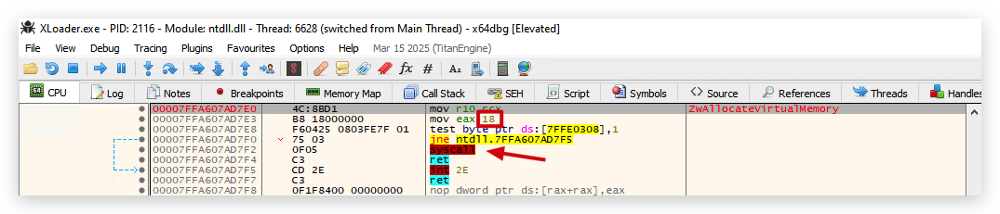
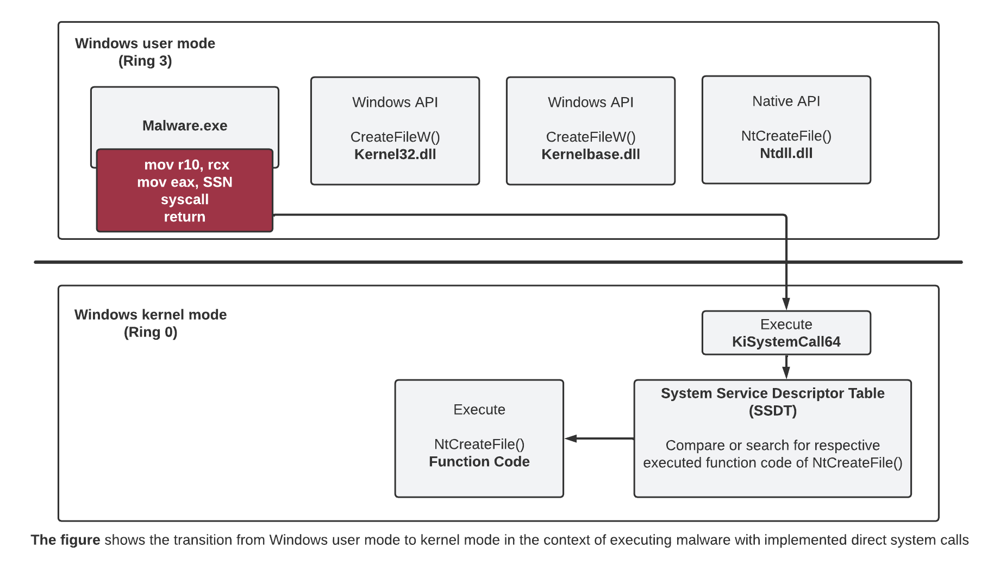
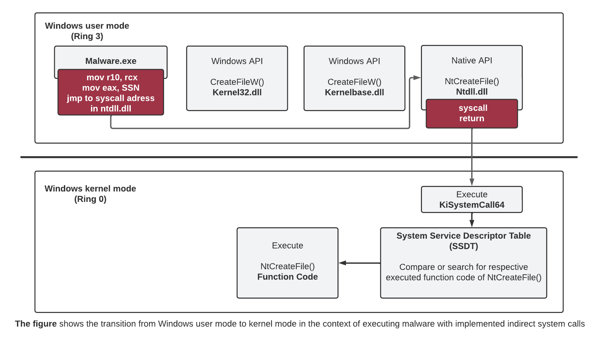

# SYSCALLS (Kernel mode)

<https://hfiref0x.github.io/X86_64/NT10_syscalls.html>

| System Call            | Windows 10 | Description                                                                                 |
| ------------------------- | ------ | ------------------------------------------------------------------------------------------- |
| `NtCreateThread`          | 0x004e | Creates a thread to execute within the virtual address space of the calling process.        |
| `NtAllocateVirtualMemory` | 0x0018 | Allocates memory in the virtual address space of the calling process.    |
| `NtWriteVirtualMemory`    | 0x003a ||
| `NtWaitForSingleObject`   | 0x0004 | Waits until the specified object is in the signaled state or the time-out interval elapses. |



https://github.com/joshfinley/SyscallDumper

https://passthehashbrowns.github.io/hiding-your-syscalls

https://github.com/fin3ss3g0d/HookFinder
```powershell
PS C:\git\EDRs> .\hook_finder64.exe C:\windows\system32\ntdll.dll
```

https://www.secunnix.com/en/blog/cat-and-mouse-game
# A. Direct Syscall

In its simplest form, the direct system calls technique can be said to implement the APIs to be used in the malware with assembly commands in the code instead of getting them through ntdll.dll, in order to prevent EDR sensors from hooking.

In this way, the program does not refer to ntdll.dll and uses the APIs it needs directly. Since ntdll.dll is not called, the EDR sensors will be blind because they do not inject themselves into the process. There are many PoCs for this technique, For example, Hells Gate, Halo's Gate, Syswhispers2 and 3 are successful studies that prove the application of direct syscall.

> Call stack spoofing : making it look like the syscall cam from ntdll (or 2 other dll's that normally uses syscalls)
> with memory forensics (i.e. volatilty) this can be detected, EDR's are in a tough spot since they need to do this in real time!

<https://www.youtube.com/watch?v=PmqvBe1LSZc&t=2286s>



Unfortunately, this method, which was quite effective at first, can be detected by some EDR solutions through kernel callbacks, since the system calls are executed outside of ntdll.dll and the RET command is located directly in the memory area of the program to which the direct syscall is applied. Because normal programs do not behave like this. As you can see, it comes back to what we explained under the heading of normalization and reputation.

# B. Indirect Syscall
Indirect system calls are similar to the direct system calls technique in terms of their working logic. But beyond that, they have a few minor differences in the processing of system calls.

In the direct syscall technique, while the process belonging to ntdll.dll is completely outside the event and the RET commands are in the program itself instead of this DLL, in the case of indirect syscall, since `the calls are executed through ntdll.dll`, they are perceived as normal by EDR processes. Okay. So, if you ask how EDR cannot perform the hook operation, the logic is actually simple. During the execution of the malicious code, `the JMP command goes to the block where the system call is located`, instead of pointing to the entry point (starting point) of `ntdll.dll`. 
Thus, a device unaware of ntdll.dll It is a little more difficult to detect since there is no execution process.



Although both techniques still work, the indirect syscall method can help develop less detectable malware. Note that these are methods to avoid user mode hooking. If you are dealing with a security solution that does kernel mode hooking, this techniques can be identified.
In addition, the Event Tracing for Windows (ETW) structure offered by Microsoft for Windows systems can be used by some EDRs to control the stack structures where calls are made. If you want to see a very clean implementation of both techniques, read the article below. We can recommend it.

https://redops.at/en/blog/direct-syscalls-vs-indirect-syscalls
https://github.com/Maldev-Academy/HellHall

----

regular virtualAlloc through win32api vs. direct syscall using SSN.

--- 

Syswhispers2 -> import in visual studio project to enumerate syscalls

