# Velcoriraptor

> Velociraptor is already installed on your kali host (you're welcome) - below you can find the installation instructions - `DON'T` run these again, it's only for reference.

<https://docs.velociraptor.app/docs/deployment/quickstart/>

```bash
mkdir ~/velociraptor_setup && cd ~/velociraptor_setup
wget -O velociraptor https://github.com/Velocidex/velociraptor/releases/download/v0.74/velociraptor-v0.74.1-linux-amd64
chmod +x velociraptor
./velociraptor config generate -i
./velociraptor debian server --config ./server.config.yaml
sudo dpkg -i velociraptor_server_0.74.1_amd64.deb
systemctl status velociraptor_server.service
sudo nano /etc/velociraptor/server.config.yaml
systemctl restart velociraptor_server.service
systemctl status velociraptor_server.service
```

> Velociraptor server config : /etc/velociraptor/server.config.yaml

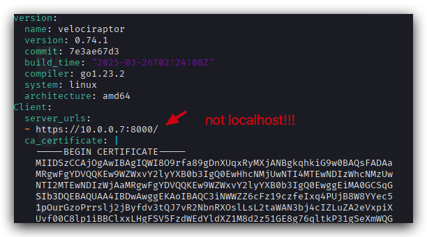

From your windows machine you can connect to your Velociraptor server, using Chrome at the following address: <https://kali:8889/app/index.html#/>

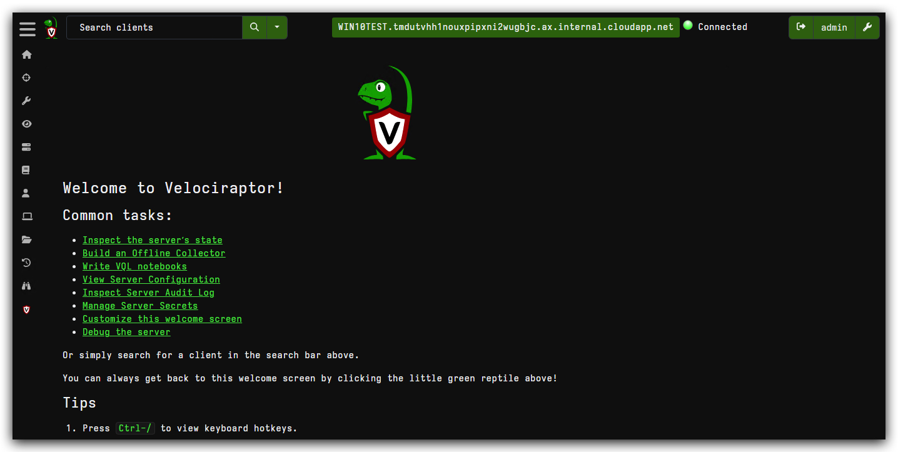

Creating a service client (MSI)
<https://docs.velociraptor.app/docs/deployment/clients/#option-1-obtaining-the-client-config-from-the-gui>

On windows client : check yaml config under `c:\program files\velociraptor`


# Collect powershell logs
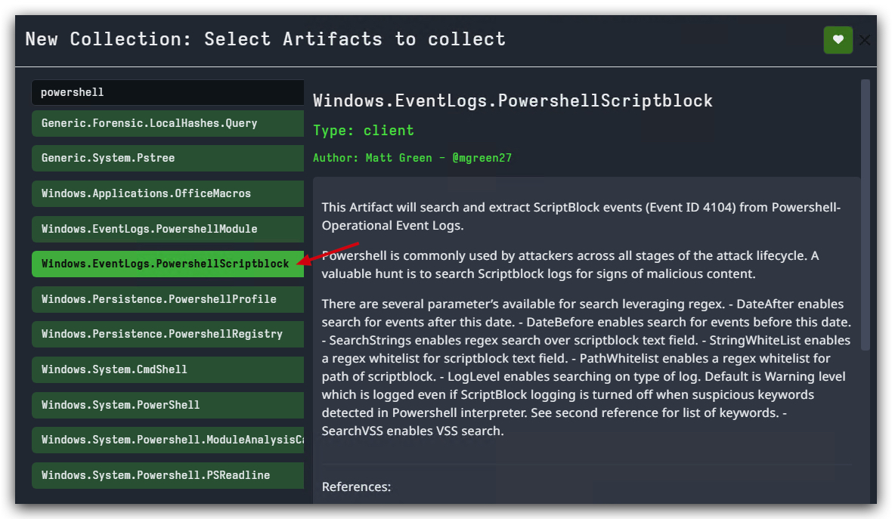
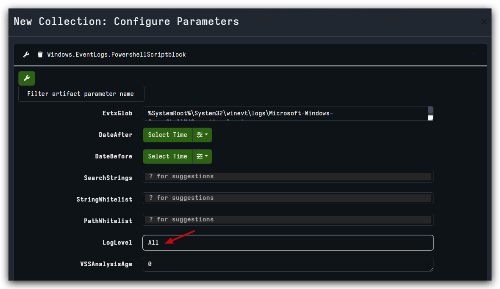
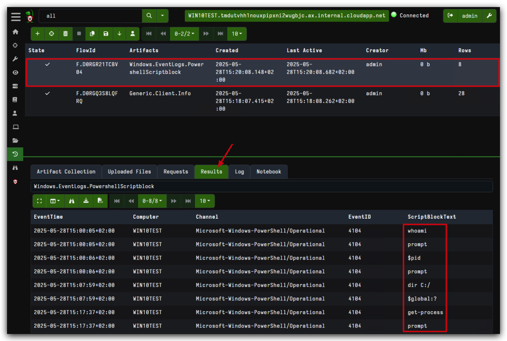

# Find files
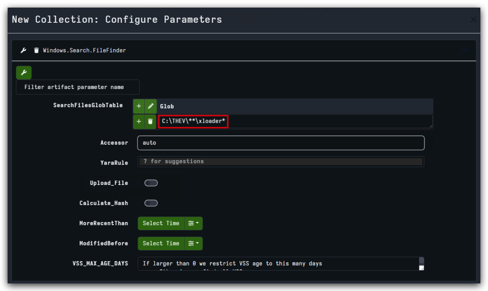
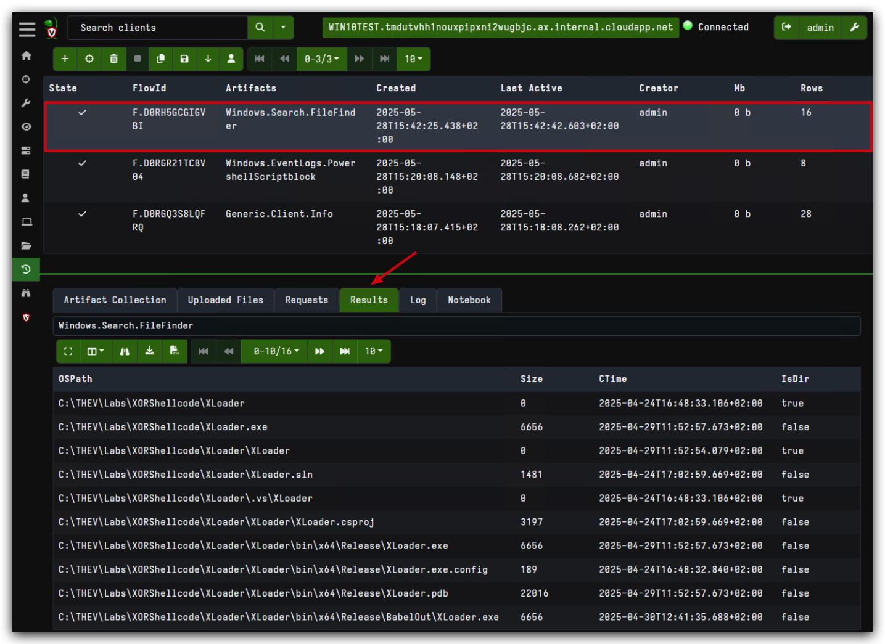

# Fetch files
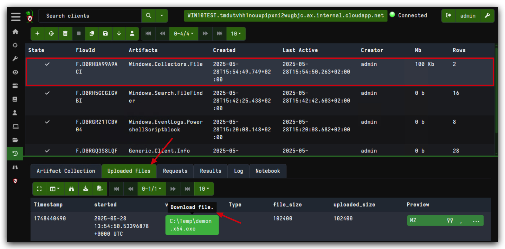
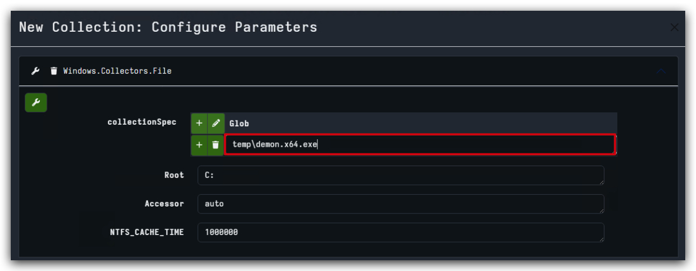

# Hunting Eventlogs

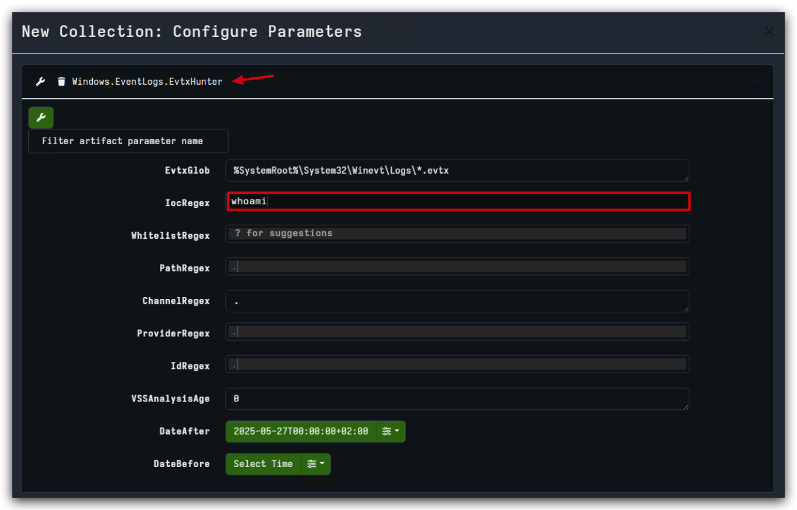
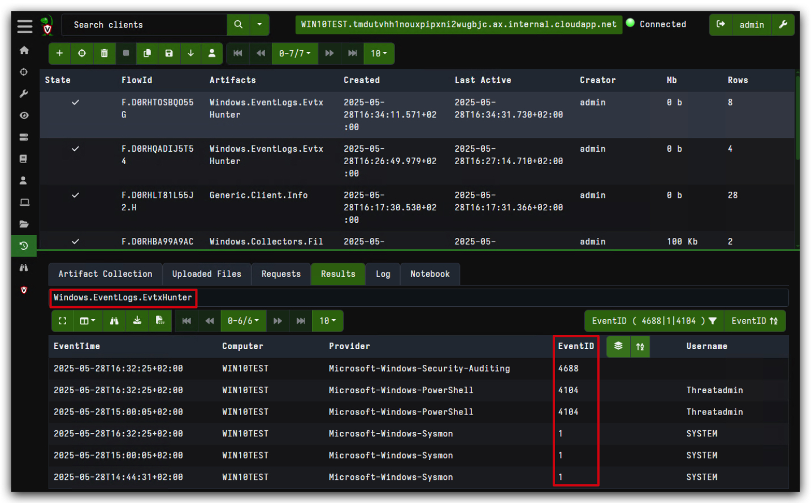

# Save your hunts (Favorites)

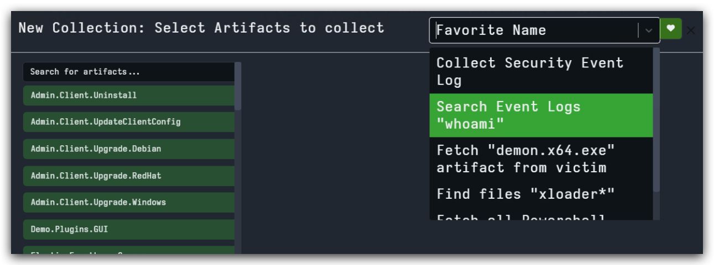

# Create a Standalone Artifact collector


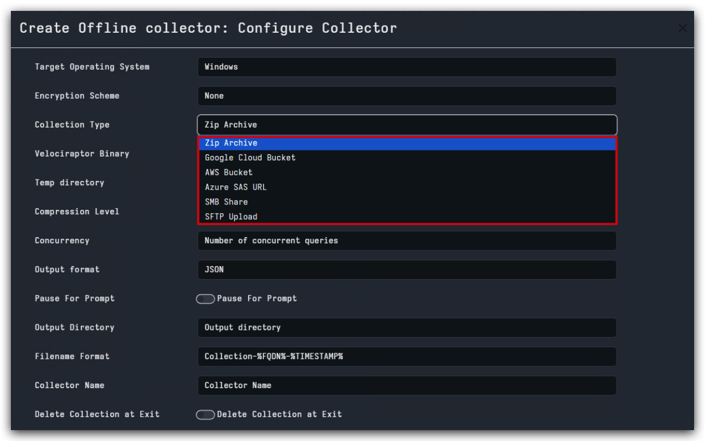